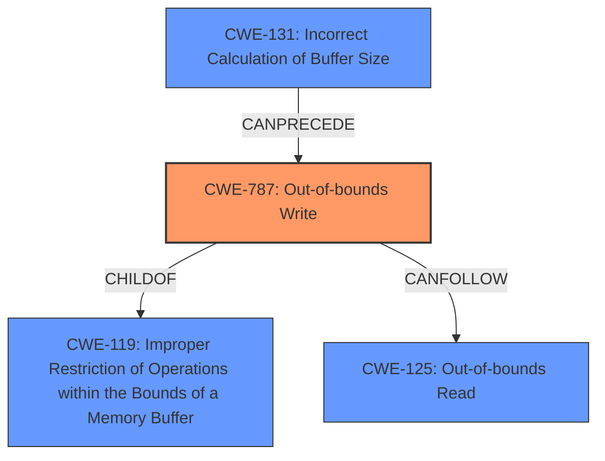

# Final Resolution for CVE-2021-40792

# Summary
| CWE ID | CWE Name | Confidence | CWE Abstraction Level | CWE Vulnerability Mapping Label | CWE-Vulnerability Mapping Notes |
|---|---|---|---|---|---|
| CWE-787 | Out-of-bounds Write | 0.95 | Base | Allowed | Primary CWE. More encompassing than CWE-788. While likely a heap overflow, CWE-787 is most accurate. Requires user interaction to load a malicious file. |
| CWE-125 | Out-of-bounds Read | 0.60 | Base | Allowed | Secondary Candidate.  Potential for out-of-bounds read *if* information disclosure is confirmed. Otherwise, consider removing. Requires user interaction to load a malicious file. |

## Evidence and Confidence

*   **Confidence Score:** 0.85
*   **Evidence Strength:** MEDIUM

## Relationship Analysis
The primary relationship that influenced the decision was the parent-child relationship between CWE-787 **(Out-of-bounds Write)** and CWE-119 **(Improper Restriction of Operations within the Bounds of a Memory Buffer)**. Although CWE-119 is a parent of CWE-787, CWE-787 is a more specific **WEAKNESS** and is therefore a more appropriate classification. Another important relationship to consider is the potential for CWE-787 to be preceded by other weaknesses, such as CWE-131 **(Incorrect Calculation of Buffer Size)**, forming a vulnerability chain. The abstraction levels were also considered, favoring the Base level CWE-787 over the Class level CWE-119.

## Vulnerability Chain
The vulnerability chain starts with the **ROOTCAUSE** of insecure handling of a malicious file. This could lead to CWE-131 **(Incorrect Calculation of Buffer Size)** if the file's size isn't properly validated. This then results in CWE-787 **(Out-of-bounds Write)**, causing memory corruption. The potential consequence is arbitrary code execution. A possible subsequent **WEAKNESS** could be CWE-125 **(Out-of-bounds Read)** if the corrupted memory is later read.

## Summary of Analysis
The initial analysis correctly identified CWE-787 **(Out-of-bounds Write)** as the primary **WEAKNESS** due to the memory corruption and potential for arbitrary code execution described in the vulnerability. The criticism suggested strengthening the justification for CWE-787 by explaining why CWE-122 **(Heap-based Buffer Overflow)** isn't chosen as the primary, even though the heap is likely involved. I agree with this suggestion, adding that while the heap is likely involved because of the mention of memory corruption and a malicious file, the core issue remains the out-of-bounds write, making CWE-787 the most accurate. "Adobe Premiere Pro version 15.4.1 (and earlier) is affected by a memory corruption vulnerability due to insecure handling of a malicious file, potentially resulting in arbitrary code execution in the context of the current user."

The initial analysis also considered CWE-125 **(Out-of-bounds Read)** as a secondary candidate. The criticism suggested strengthening the justification for CWE-125 by determining if information disclosure is part of the vulnerability's impact. I agree with this point and have lowered the confidence score for CWE-125 as the description only mentions memory corruption and arbitrary code execution, not information disclosure. If there was any indication of sensitive information being leaked due to the **WEAKNESS**, then CWE-125 would be more appropriate.

The graph relationships influenced the final selection by highlighting the importance of choosing the most specific CWE. While CWE-119 is a parent of CWE-787, CWE-787 provides a more precise description of the vulnerability. The selected CWEs are at the optimal level of specificity because they are Base level CWEs that accurately reflect the **ROOTCAUSE** and potential consequences of the vulnerability, based on the available evidence.