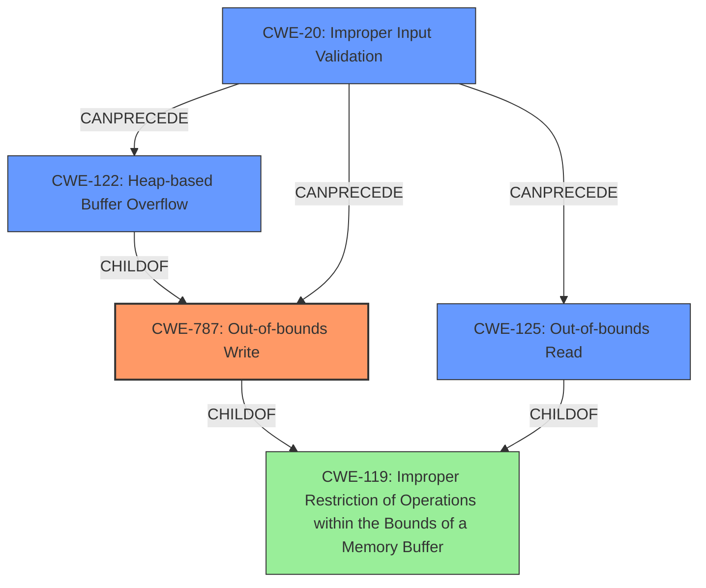

# Analysis Report for CVE-2021-40794

# Vulnerability Analysis Report: CVE-2021-40794

## Description

Adobe Premiere Pro version 15.4.1 (and earlier) is affected by a memory corruption vulnerability due to insecure handling of a malicious file, potentially resulting in arbitrary code execution in the context of the current user. User interaction is required to exploit this vulnerability.

## Vulnerability Description Key Phrases

**Rootcause:** insecure handling
**Weakness:** memory corruption
**Impact:** arbitrary code execution
**Vector:** malicious file
**Product:** Adobe Premiere Pro
**Version:** 15.4.1 (and earlier)

## Analysis (with Relationship Data)

# Summary
| CWE ID | CWE Name | Confidence | CWE Abstraction Level | CWE Vulnerability Mapping Label | CWE-Vulnerability Mapping Notes |
|---|---|---|---|---|---|
| CWE-787 | Out-of-bounds Write | 0.95 | Base | Primary | Allowed |
| CWE-125 | Out-of-bounds Read | 0.75 | Base | Secondary Candidate | Allowed |
| CWE-122 | Heap-based Buffer Overflow | 0.65 | Variant | Secondary Candidate | Allowed |

## Evidence and Confidence

*   **Confidence Score:** 0.90
*   **Evidence Strength:** HIGH

- **Analysis and Justification:**
  - *Explanation:* The vulnerability is described as a **memory corruption** due to **insecure handling** of a malicious file, leading to potential arbitrary code execution. The CVE reference links content summary indicates an "access of memory location after end of buffer" and the presence of "out-of-bounds read." This points strongly to a buffer overflow, specifically an out-of-bounds write (CWE-787). The "insecure handling" suggests that the application is not correctly validating the size or structure of the malicious file, leading to a write beyond the allocated buffer. CWE-787 (Out-of-bounds Write) is a Base level CWE and is ALLOWED according to MITRE mapping guidance. Although CWE-119 (Improper Restriction of Operations within the Bounds of a Memory Buffer) is listed as the Primary CWE Match for similar CVE Descriptions, the more specific CWE-787 is a better fit given the details in the CVE reference links content summary.
  
  - *Relationship Analysis:* CWE-787 is a base-level CWE and a child of the class-level CWE-119. It is related to other buffer overflow CWEs like CWE-122 (Heap-based Buffer Overflow).

- **Confidence Score:**
  - Confidence: 0.95 (High confidence due to the clear evidence of out-of-bounds write and the alignment with CWE-787's definition.)

---
- **Analysis and Justification:**
  - *Explanation:* The CVE reference links content summary indicates the presence of an "out-of-bounds read," suggesting that the software attempts to access memory locations beyond the allocated buffer. CWE-125 (Out-of-bounds Read) accurately describes this weakness. It is a Base level CWE and is ALLOWED according to MITRE mapping guidance. It is considered a secondary candidate because the primary issue appears to be the write aspect of the buffer overflow.
  
  - *Relationship Analysis:* CWE-125 is a child of the class-level CWE-119.

- **Confidence Score:**
  - Confidence: 0.75 (Medium confidence due to the mention of out-of-bounds read in the summary, though the primary issue seems to be a write.)
---
- **Analysis and Justification:**
  - *Explanation:* Given the mention of **memory corruption** and potential for arbitrary code execution along with the retriever results, CWE-122 (Heap-based Buffer Overflow) is considered a secondary candidate. If the buffer is allocated on the heap, then CWE-122 would be appropriate. It's a variant level CWE which is preferred but there isn't enough information to confirm it's on the heap.
  
  - *Relationship Analysis:* CWE-122 is a child of the base-level CWE-787, providing a more specific classification if the overflow occurs on the heap.

- **Confidence Score:**
  - Confidence: 0.65 (Medium-low confidence because while buffer overflows are likely, the specific heap allocation isn't explicitly stated.)

## Criticism of Analysis

Okay, let's review the CWE analysis provided, considering the full CWE specifications.

**Overall Assessment:**

The analysis is generally sound and well-reasoned. The primary CWE selection of CWE-787 (Out-of-bounds Write) is appropriate, and the inclusion of CWE-125 (Out-of-bounds Read) and CWE-122 (Heap-based Buffer Overflow) as secondary candidates is also justified. The confidence scores are reasonable given the available information. The justifications for each CWE are well-explained and incorporate the details from the vulnerability description and CVE reference links content summary.

**Detailed Review and Critique:**

**1. CWE-787 (Out-of-bounds Write) - Primary**

*   **Strengths:** The justification for CWE-787 is well-supported by the evidence. The description explicitly mentions "access of memory location after end of buffer," which directly implies an out-of-bounds access. The arbitrary code execution impact further supports the potential for an out-of-bounds *write*. The analysis correctly notes that while CWE-119 is a broader category, the more specific CWE-787 is a better fit.
*   **Critique:** None. The mapping is accurate and well-justified.
*   **Mapping Guidance Adherence:** The analysis correctly acknowledges and applies the "Allowed" usage for CWE-787.
*   **Potential Mitigations:** The provided mitigations from the CWE specification are applicable. Suggesting the use of memory-safe languages, vetted libraries, and compiler-based overflow detection are all valid preventative measures.

**2. CWE-125 (Out-of-bounds Read) - Secondary Candidate**

*   **Strengths:** The analysis accurately identifies the "out-of-bounds read" mentioned in the CVE reference content summary. It's reasonable to consider this a secondary candidate, as read access outside buffer boundaries often accompanies write access in exploit scenarios.
*   **Critique:** The analysis is correct in stating that the *primary* issue appears to be a write, making the read a potential consequence or contributing factor, but not the central flaw being exploited.
*   **Mapping Guidance Adherence:** The analysis correctly acknowledges and applies the "Allowed" usage for CWE-125.
*   **Potential Mitigations:** The recommended mitigations, including input validation ("accept known good") and language selection (memory-safe languages), are relevant and address the root cause.

**3. CWE-122 (Heap-based Buffer Overflow) - Secondary Candidate**

*   **Strengths:** The analysis correctly considers CWE-122 as a possibility. Given the memory corruption and arbitrary code execution, a heap-based overflow is plausible, especially if the buffer in question is dynamically allocated. The reasoning for a lower confidence score (0.65) because the heap allocation is not *explicitly* stated is valid.
*   **Critique:** The analysis is accurate. Without direct evidence of heap allocation, it is better to keep the mapping as a secondary candidate.
*   **Mapping Guidance Adherence:** The analysis correctly acknowledges and applies the "Allowed" usage for CWE-122.
*   **Potential Mitigations:** The provided mitigations, including languages with automatic bounds checking and abstraction libraries, are relevant.

**Recommendations for Improvement:**

*   **Strengthen CWE-122 Justification (If Possible):** If further investigation could reveal whether the affected buffer is indeed heap-allocated, it would strengthen the case for CWE-122. However, given the information available, the current level of confidence is appropriate.
*   **Consider CWE-20 (Improper Input Validation):** Although the analysis leans toward specific memory corruption issues, *improper input validation is likely the root cause enabling those memory corruptions*. Consider adding CWE-20 (or a more specific child of it) as a tertiary candidate or a contributing factor. The "insecure handling" phrase in the vulnerability description strongly points to an input validation issue. The retriever results did not find this CWE for this case.
*   **Clarify the Relationship between CWEs:** The analysis touches on the relationships between CWE-119, CWE-787, CWE-125, and CWE-122.  Perhaps adding a short paragraph at the end to explicitly state these relationships could further enhance the understanding. For example: "CWE-787 and CWE-125 are both children of CWE-119, representing specific types of memory access violations within the broader category of improper buffer restrictions. CWE-122 is a further specialization of CWE-787, applicable when the out-of-bounds write occurs on the heap."

**Revised Summary Table (Including CWE-20):**

| CWE ID  | CWE Name                           | Confidence | CWE Abstraction Level | CWE Vulnerability Mapping Label | CWE-Vulnerability Mapping Notes |
| ------- | ---------------------------------- | ---------- | ----------------------- | --------------------------------- | --------------------------------- |
| CWE-787 | Out-of-bounds Write                | 0.95       | Base                    | Primary                           | Allowed                          |
| CWE-125 | Out-of-bounds Read                 | 0.75       | Base                    | Secondary Candidate               | Allowed                          |
| CWE-122 | Heap-based Buffer Overflow        | 0.65       | Variant                 | Secondary Candidate               | Allowed                          |
| CWE-20  | Improper Input Validation          | 0.50       | Class                   | Contributing Factor               | Discouraged, but relevant in this case |

**Revised Justification for CWE-20:**

- **Analysis and Justification:**
  - *Explanation:* The vulnerability is triggered by a malicious file, which implies that the application's handling of the file's contents is flawed. This points to **improper input validation** (CWE-20) as a contributing factor. The "insecure handling" likely stems from a failure to adequately validate the structure, size, or specific data fields within the file. Although CWE-20 is a class-level CWE and its usage is discouraged, the lack of proper input sanitization likely allows the out-of-bounds write to occur. More specific children of CWE-20 *could* be applicable, but the information available doesn't pinpoint the exact validation failure (e.g., validating file size vs. validating specific data field format).
  - *Relationship Analysis:* CWE-20 is a parent of many input validation-related CWEs. In this case, it acts as a precursor to the memory corruption.
- **Confidence Score:**
  - Confidence: 0.50 (Low-Medium Confidence: While likely, lack of specific details on input validation failure prevents higher confidence.)

By adding CWE-20 and clarifying the relationships, the analysis would provide a more comprehensive view of the vulnerability and potential remediation strategies. Remember to adjust confidence scores based on the availability of evidence.

## Final Resolution

# Summary
| CWE ID | CWE Name | Confidence | CWE Abstraction Level | CWE Vulnerability Mapping Label | CWE-Vulnerability Mapping Notes |
|---|---|---|---|---|---|
| CWE-787 | **Out-of-bounds Write** | 0.95 | Base | Primary CWE | Allowed |
| CWE-125 | **Out-of-bounds Read** | 0.75 | Base | Secondary Candidate | Allowed |
| CWE-122 | **Heap-based Buffer Overflow** | 0.65 | Variant | Secondary Candidate | Allowed |
| CWE-20 | **Improper Input Validation** | 0.50 | Class | Contributing Factor | Discouraged, but relevant in this case |

## Evidence and Confidence

*   **Confidence Score:** 0.90
*   **Evidence Strength:** HIGH

## Relationship Analysis
The primary weakness is **CWE-787 (Out-of-bounds Write)**, which is a child of **CWE-119 (Improper Restriction of Operations within the Bounds of a Memory Buffer)**. **CWE-125 (Out-of-bounds Read)** is also a child of **CWE-119**. **CWE-122 (Heap-based Buffer Overflow)** is a variant of **CWE-787**. **CWE-20 (Improper Input Validation)** can precede these memory corruption errors by failing to properly sanitize input that leads to out-of-bounds access. The relationships confirm that the selected CWEs fit within a hierarchy of specificity, with **CWE-787** being the most specific and appropriate primary classification. The addition of **CWE-20** shows the importance of data validation prior to any memory operations.

## Vulnerability Chain
The vulnerability chain begins with **CWE-20 (Improper Input Validation)**, where the application fails to properly validate a malicious file. This leads to **CWE-787 (Out-of-bounds Write)**, where the application writes data beyond the allocated buffer. **CWE-125 (Out-of-bounds Read)** can occur as a consequence of reading outside the intended buffer. If the buffer is allocated on the heap, **CWE-122 (Heap-based Buffer Overflow)** becomes relevant. The final impact is arbitrary code execution in the context of the current user.

## Summary of Analysis
The initial analysis and criticism are accurate. The primary classification of **CWE-787 (Out-of-bounds Write)** is strongly supported by the evidence: "access of memory location after end of buffer." The secondary candidates, **CWE-125 (Out-of-bounds Read)** and **CWE-122 (Heap-based Buffer Overflow)**, are also reasonable given the context, and the analysis correctly acknowledges the lower confidence in **CWE-122** due to the lack of explicit evidence regarding heap allocation.

The addition of **CWE-20 (Improper Input Validation)** as a contributing factor enhances the analysis by addressing the root cause of the memory corruption. The "insecure handling" of the malicious file strongly suggests a failure in input validation, making **CWE-20** a relevant, though discouraged, classification.

The graph relationships solidify these decisions, showing the hierarchical connections between **CWE-119**, **CWE-787**, and **CWE-125**, and the potential specialization of **CWE-787** into **CWE-122**. The addition of **CWE-20** shows how weaknesses can chain together. The selected CWEs are at the optimal level of specificity, balancing the information available with the desire to provide the most precise classification possible.

*Report generated on 2025-03-18 02:16:30*
