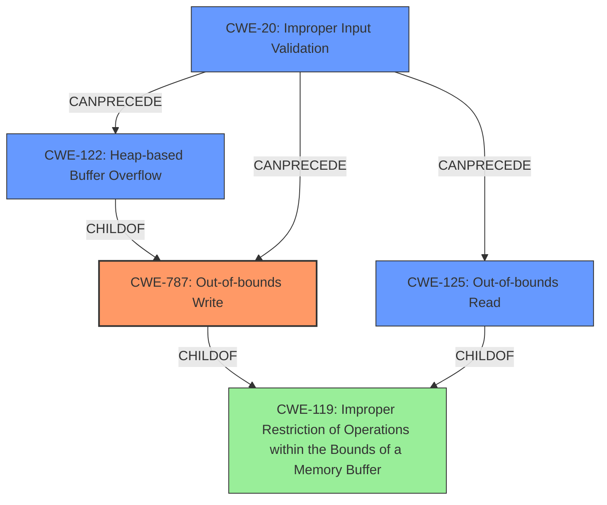

# Final Resolution for CVE-2021-40794

# Summary
| CWE ID | CWE Name | Confidence | CWE Abstraction Level | CWE Vulnerability Mapping Label | CWE-Vulnerability Mapping Notes |
|---|---|---|---|---|---|
| CWE-787 | **Out-of-bounds Write** | 0.95 | Base | Primary CWE | Allowed |
| CWE-125 | **Out-of-bounds Read** | 0.75 | Base | Secondary Candidate | Allowed |
| CWE-122 | **Heap-based Buffer Overflow** | 0.65 | Variant | Secondary Candidate | Allowed |
| CWE-20 | **Improper Input Validation** | 0.50 | Class | Contributing Factor | Discouraged, but relevant in this case |

## Evidence and Confidence

*   **Confidence Score:** 0.90
*   **Evidence Strength:** HIGH

## Relationship Analysis
The primary weakness is **CWE-787 (Out-of-bounds Write)**, which is a child of **CWE-119 (Improper Restriction of Operations within the Bounds of a Memory Buffer)**. **CWE-125 (Out-of-bounds Read)** is also a child of **CWE-119**. **CWE-122 (Heap-based Buffer Overflow)** is a variant of **CWE-787**. **CWE-20 (Improper Input Validation)** can precede these memory corruption errors by failing to properly sanitize input that leads to out-of-bounds access. The relationships confirm that the selected CWEs fit within a hierarchy of specificity, with **CWE-787** being the most specific and appropriate primary classification. The addition of **CWE-20** shows the importance of data validation prior to any memory operations.

## Vulnerability Chain
The vulnerability chain begins with **CWE-20 (Improper Input Validation)**, where the application fails to properly validate a malicious file. This leads to **CWE-787 (Out-of-bounds Write)**, where the application writes data beyond the allocated buffer. **CWE-125 (Out-of-bounds Read)** can occur as a consequence of reading outside the intended buffer. If the buffer is allocated on the heap, **CWE-122 (Heap-based Buffer Overflow)** becomes relevant. The final impact is arbitrary code execution in the context of the current user.

## Summary of Analysis
The initial analysis and criticism are accurate. The primary classification of **CWE-787 (Out-of-bounds Write)** is strongly supported by the evidence: "access of memory location after end of buffer." The secondary candidates, **CWE-125 (Out-of-bounds Read)** and **CWE-122 (Heap-based Buffer Overflow)**, are also reasonable given the context, and the analysis correctly acknowledges the lower confidence in **CWE-122** due to the lack of explicit evidence regarding heap allocation.

The addition of **CWE-20 (Improper Input Validation)** as a contributing factor enhances the analysis by addressing the root cause of the memory corruption. The "insecure handling" of the malicious file strongly suggests a failure in input validation, making **CWE-20** a relevant, though discouraged, classification.

The graph relationships solidify these decisions, showing the hierarchical connections between **CWE-119**, **CWE-787**, and **CWE-125**, and the potential specialization of **CWE-787** into **CWE-122**. The addition of **CWE-20** shows how weaknesses can chain together. The selected CWEs are at the optimal level of specificity, balancing the information available with the desire to provide the most precise classification possible.