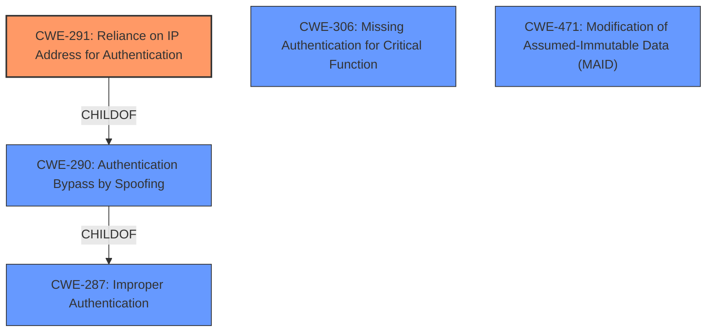

# Final Resolution for CVE-2021-40867

# Summary
| CWE ID | CWE Name | Confidence | CWE Abstraction Level | CWE Vulnerability Mapping Label | CWE-Vulnerability Mapping Notes |
|---|---|---|---|---|---|
| CWE-291 | Reliance on IP Address for Authentication | 0.95 | Variant | Allowed | Primary CWE |
| CWE-306 | Missing Authentication for Critical Function | 0.75 | Base | Allowed | Secondary Candidate |
| CWE-471 | Modification of Assumed-Immutable Data (MAID) | 0.50 | Base | Allowed | Additional Consideration |

## Evidence and Confidence

*   **Confidence Score:** 0.92
*   **Evidence Strength:** HIGH

## Relationship Analysis
The primary weakness is **CWE-291 (Reliance on IP Address for Authentication)**. This is a variant of **CWE-290 (Authentication Bypass by Spoofing)**, which is a child of **CWE-287 (Improper Authentication)**. This hierarchy illustrates the increasingly general nature of authentication weaknesses. While **CWE-290** and **CWE-287** are related, **CWE-291** is chosen due to its specificity to the reliance on IP addresses for authentication. **CWE-306 (Missing Authentication for Critical Function)** is also related as it describes the lack of proper authentication, but it's secondary because the authentication exists, it's just flawed in its reliance on IP. **CWE-471** is considered because once an IP is associated with a logged in session, it should be immutable, and this immutability is not enforced.

## Vulnerability Chain
The vulnerability chain starts with the **ROOTCAUSE** which is the **reliance on IP address for authentication (CWE-291)**. This leads to a **weak authentication mechanism**, where an attacker with the same IP address as an admin can hijack the authentication process. The lack of proper authentication for critical functions (**CWE-306**) further exacerbates the issue. Because the IP address *should be* immutable once associated with a logged in session, the lack of immutability enforcement is **CWE-471**. The end result is an unauthenticated attacker gaining unauthorized access to the NETGEAR switch.

## Summary of Analysis
The initial analysis correctly identified **CWE-291** as the primary weakness, supported by the CVE description which states that the authentication process is effectively tied only to the source IP address. The fact that the `get.cgi` handler relies solely on the client IP and a guessable browser type number for verification confirms the use of IP address for authentication. While **CWE-306** and **CWE-290** are relevant, **CWE-291** is the most specific because it directly addresses the **reliance on IP address** as the **ROOTCAUSE**. The suggested fix, using a cryptographically secure random value as a token, further supports the need for proper authentication mechanisms.

The criticism provided valuable points, particularly regarding potential mitigations and additional CWE considerations. Specifically, the inclusion of **CWE-471** highlights that the IP address is an assumed immutable element.

The graph relationships influenced the decision by illustrating the hierarchical nature of authentication weaknesses, confirming that **CWE-291** is the most specific and appropriate choice.

The selected CWEs are at the optimal level of specificity because **CWE-291** directly reflects the vulnerability, while the secondary CWEs (**CWE-306**, **CWE-471**) provide additional context to the vulnerability chain.