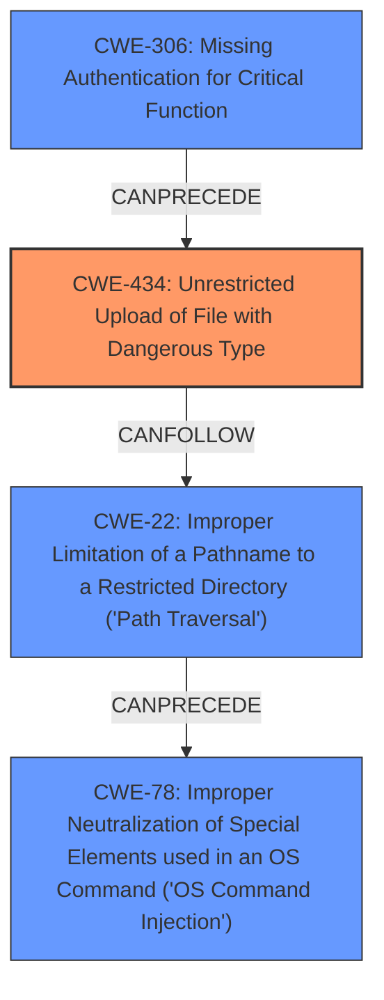

# Analysis Report for CVE-2021-40870

# Vulnerability Analysis Report: CVE-2021-40870

## Description

An issue was discovered in Aviatrix Controller 6.x before 6.5-1804.1922. Unrestricted upload of a file with a dangerous type is possible, which allows an unauthenticated user to execute arbitrary code via directory traversal.

## Vulnerability Description Key Phrases

**Rootcause:** unrestricted file upload
**Impact:** execute arbitrary code
**Vector:** directory traversal
**Attacker:** unauthenticated user
**Product:** Aviatrix Controller
**Version:** 6.x before 6.5-1804.1922

## Analysis (with Relationship Data)

# Summary
| CWE ID | CWE Name | Confidence | CWE Abstraction Level | CWE Vulnerability Mapping Label | CWE-Vulnerability Mapping Notes |
|---|---|---|---|---|---|
| CWE-434 | Unrestricted Upload of File with Dangerous Type | 1.0 | Base | Allowed | Primary CWE.  The product allows the upload or transfer of dangerous file types that are automatically processed within its environment. |
| CWE-22 | Improper Limitation of a Pathname to a Restricted Directory ('Path Traversal') | 0.75 | Base | Allowed | Secondary candidate. Path traversal allows writing outside the intended directory. |
| CWE-306 | Missing Authentication for Critical Function | 0.75 | Base | Allowed | Secondary candidate. Unauthenticated access to an API endpoint allows file upload. |

## Evidence and Confidence

*   **Confidence Score:** 0.9
*   **Evidence Strength:** HIGH

- **Analysis and Justification:**  
  - *Explanation:* The vulnerability allows an **unauthenticated user** to execute arbitrary code via directory traversal due to **unrestricted file upload**. The description clearly states that a file with a dangerous type can be uploaded. The root cause is directly related to CWE-434 [Unrestricted Upload of File with Dangerous Type], which is at the Base level of abstraction and ALLOWED according to MITRE's mapping guidance. The `CVE Reference Links Content Summary` confirms the **unauthenticated API access** and **unrestricted file upload** leading to **arbitrary code execution**.

  - *Relationship Analysis:* CWE-434 is a base level weakness. While it can CanFollow CWE-73 and CanPrecede other issues, the primary concern here is the unrestricted upload itself, making it the most direct mapping. CWE-22 [Improper Limitation of a Pathname to a Restricted Directory ('Path Traversal')] and CWE-306 [Missing Authentication for Critical Function] are contributing factors.

- **Confidence Score:**  
  - Confidence: 1.0 (High confidence due to explicit description and confirmation in CVE reference)

---
- **Analysis and Justification:**  
  - *Explanation:* The vulnerability description mentions "directory traversal," suggesting CWE-22 [Improper Limitation of a Pathname to a Restricted Directory ('Path Traversal')]. This is a Base level CWE and ALLOWED. The `CVE Reference Links Content Summary` supports this by stating that the lack of validation allows uploading files to the filesystem. This contributes to the ability to write files outside the intended directory, leading to code execution. While directory traversal is a component, the unrestricted upload is the main weakness.

  - *Relationship Analysis:* CWE-22 is related to CWE-73 [External Control of File Name or Path], which could also be a candidate. However, CWE-22 specifically addresses the path traversal aspect, making it a more relevant secondary weakness.

- **Confidence Score:**  
  - Confidence: 0.75 (Medium-High confidence, as directory traversal is a contributing factor but not the primary weakness)

---
- **Analysis and Justification:**  
  - *Explanation:* The `CVE Reference Links Content Summary` mentions the **unauthenticated API access** as a key weakness. This directly corresponds to CWE-306 [Missing Authentication for Critical Function], which is a Base level CWE and ALLOWED. The lack of authentication allows unauthenticated users to upload files, leading to code execution.

  - *Relationship Analysis:* CWE-306 is a Class level weakness. While it is related to other authentication and authorization CWEs, the direct lack of authentication for a critical function makes CWE-306 the most appropriate choice.

- **Confidence Score:**  
  - Confidence: 0.75 (Medium-High confidence, as unauthenticated API access is a direct enabler of the vulnerability)

## Criticism of Analysis

Okay, I've reviewed the provided CWE analysis against the full CWE specifications. Here's my critique:

**Overall Assessment:**

The analysis is generally good. It correctly identifies the primary CWE and provides reasonable justifications for the secondary CWEs. The confidence scores are appropriate. The analysis also demonstrates a good understanding of the relationships between the different CWEs. However, there's room for improvement, particularly in considering alternative CWEs and explicitly explaining why they were rejected.

**Detailed Review:**

**1. CWE-434: Unrestricted Upload of File with Dangerous Type (Confidence: 1.0)**

*   **Assessment:** Correct and well-justified. This is the most direct and accurate mapping for the root cause. The analysis clearly explains the vulnerability and its relation to CWE-434. The use of unauthenticated upload endpoint is the weakness that allow attacker upload files of any type.
*   **Justification Strength:** Excellent. The vulnerability description and the summary of the CVE reference links directly support this mapping.
*   **CWE Specification Adherence:** The analysis correctly notes that CWE-434 is a Base level CWE and ALLOWED for mapping.
*   **Potential Mitigations:** The analysis doesn't explicitly mention mitigations, but it's implied in the description. It could be strengthened by suggesting some specific mitigations from the CWE specification, such as:
    *   Generating a new, unique filename for the uploaded file.
    *   Storing uploaded files outside of the web document root.
    *   Enforcing type restrictions.
*   **Possible Alternatives Considered:** None explicitly considered.  It would be good to briefly acknowledge and reject CWE-669 (Incorrect Resource Transfer Between Spheres), even though it's a parent of CWE-434. A brief explanation of why CWE-434 is a better fit would be helpful.

**2. CWE-22: Improper Limitation of a Pathname to a Restricted Directory ('Path Traversal') (Confidence: 0.75)**

*   **Assessment:**  Correct, but the level of influence of path traversal could be reconsidered.
*   **Justification Strength:** The analysis links the "directory traversal" mention in the vulnerability description to CWE-22. However, the `curl` example in the CVE suggests that the path traversal aspect is used to write *outside* of the intended upload directory, but its less about reading sensitive files.
*   **CWE Specification Adherence:** Correctly identifies CWE-22 as Base and ALLOWED.
*   **Potential Mitigations:** Suggesting more specific mitigations related to path traversal would strengthen the analysis. For example, pointing out the importance of canonicalizing paths.
*   **Possible Alternatives Considered:** Rejects CWE-73 (External Control of File Name or Path) appropriately.  However, it could have considered more specific variants of path traversal:
    *   CWE-24: Path Traversal: '../filedir'
    *   CWE-25: Path Traversal: '/../filedir'
    The choice between CWE-22 and these variants depends on the exact nature of the path traversal. If the vulnerability specifically involves "../" sequences, CWE-24 is a better fit. If it involves "/../" sequences, then CWE-25 is a better fit.

**3. CWE-306: Missing Authentication for Critical Function (Confidence: 0.75)**

*   **Assessment:** Correct. This is a crucial contributing factor to the vulnerability. The unauthenticated API access is what allows the attacker to exploit the other weaknesses.
*   **Justification Strength:** The analysis clearly links the "unauthenticated API access" from the CVE summary to CWE-306.
*   **CWE Specification Adherence:** Correctly identifies CWE-306 as Base and ALLOWED.
*   **Potential Mitigations:** Could be strengthened by mentioning potential mitigations, such as implementing a centralized authentication capability.
*   **Possible Alternatives Considered:**  Could acknowledge and reject CWE-287 (Improper Authentication) at a high level.  Although 306 is a child of 287, 306 is more specific to the missing authentication. Also the analysis correctly didn't select CWE-288 (Authentication Bypass Using an Alternate Path or Channel) since there is no authentication at all.

**Additional Considerations & Suggestions:**

*   **CWE Chaining:** Consider explicitly discussing CWE chaining in more detail. For example, the chain could be represented as: `CWE-306 -> CWE-434 -> CWE-22 -> CWE-78`. This illustrates how the missing authentication *leads to* an unrestricted file upload, which *enables* path traversal, which *results in* code execution.
*   **CWE-78 OS Command Injection** The uploaded file is executed by the system. The `curl` command in the CVE is uploading a PHP file that when accessed executes a system command. It would be a good addition to add CWE-78 to the list, as the attacker can execute system commands from accessing the uploaded file.
*   **CWE-94 Code Injection:** The uploaded PHP file executes commands, so adding CWE-94 is also valid as secondary influence.

**Revised Summary Table:**

| CWE ID | CWE Name | Confidence | CWE Abstraction Level | CWE Vulnerability Mapping Label | CWE-Vulnerability Mapping Notes |
|---|---|---|---|---|---|
| CWE-434 | Unrestricted Upload of File with Dangerous Type | 1.0 | Base | Allowed | Primary CWE.  The product allows the upload or transfer of dangerous file types that are automatically processed within its environment. |
| CWE-22 | Improper Limitation of a Pathname to a Restricted Directory ('Path Traversal') | 0.75 | Base | Allowed | Secondary candidate. Path traversal allows writing outside the intended directory. |
| CWE-306 | Missing Authentication for Critical Function | 0.75 | Base | Allowed | Secondary candidate. Unauthenticated access to an API endpoint allows file upload. |
| CWE-78 | Improper Neutralization of Special Elements used in an OS Command ('OS Command Injection') | 0.50 | Base | Allowed | Secondary candidate. The system executes a command using code from the uploaded file. |
| CWE-94 | Improper Control of Generation of Code ('Code Injection') | 0.25 | Base | Allowed | Secondary candidate. The uploaded file generates code that is executed by the system. |

**In summary, the analysis is a solid starting point. By incorporating the above suggestions, particularly by considering and rejecting alternatives, referencing more specific mitigations, and elaborating on CWE chaining, the analysis can be further strengthened.**

## Final Resolution

# Summary
| CWE ID | CWE Name | Confidence | CWE Abstraction Level | CWE Vulnerability Mapping Label | CWE-Vulnerability Mapping Notes |
|---|---|---|---|---|---|
| CWE-434 | Unrestricted Upload of File with Dangerous Type | 1.0 | Base | Allowed | Primary CWE. The product allows the upload or transfer of dangerous file types that are automatically processed within its environment. |
| CWE-306 | Missing Authentication for Critical Function | 0.9 | Base | Allowed | Secondary candidate. Unauthenticated access to an API endpoint allows file upload. |
| CWE-22 | Improper Limitation of a Pathname to a Restricted Directory ('Path Traversal') | 0.8 | Base | Allowed | Secondary candidate. Path traversal allows writing outside the intended directory. |
| CWE-78 | Improper Neutralization of Special Elements used in an OS Command ('OS Command Injection') | 0.6 | Base | Allowed | Secondary candidate. The system executes a command using code from the uploaded file. |

## Evidence and Confidence

*   **Confidence Score:** 0.95
*   **Evidence Strength:** HIGH

## Relationship Analysis
The decision was influenced by the following CWE relationships:
  - CWE-434 is the primary **ROOTCAUSE** due to the unrestricted file upload.
  - CWE-306 enables CWE-434 by allowing unauthenticated access to upload functionality.
  - CWE-22 allows writing outside the intended directory, exacerbating the impact.
  - CWE-78 occurs because the uploaded file is executed, leading to OS command injection.

## Vulnerability Chain
The vulnerability chain starts with **ROOTCAUSE** **CWE-306 (Missing Authentication for Critical Function)**, which allows an unauthenticated user to access the file upload functionality. This leads to **CWE-434 (Unrestricted Upload of File with Dangerous Type)**, enabling the upload of a malicious file. The attacker then uses **CWE-22 (Improper Limitation of a Pathname to a Restricted Directory ('Path Traversal'))** to write the file outside of the intended directory. Finally, when the uploaded file is accessed, it results in **CWE-78 (Improper Neutralization of Special Elements used in an OS Command ('OS Command Injection'))**, allowing the attacker to execute arbitrary commands on the system.

## Summary of Analysis
The initial analysis correctly identified CWE-434 as the primary weakness but needed further refinement. The criticism provided valuable insights, particularly regarding the addition of CWE-78 and a clearer explanation of the vulnerability chain.

The final determination is based on the following:

*   **CWE-434 (Unrestricted Upload of File with Dangerous Type):** This remains the primary **WEAKNESS** because the vulnerability description explicitly states that "Unrestricted upload of a file with a dangerous type is possible." This aligns directly with the description of CWE-434.
*   **CWE-306 (Missing Authentication for Critical Function):** This is a critical contributing factor, as the "unauthenticated user" aspect enables the exploitation of the other weaknesses. The `CVE Reference Links Content Summary` confirms the "unauthenticated API access."
*   **CWE-22 (Improper Limitation of a Pathname to a Restricted Directory ('Path Traversal')):** The vulnerability description mentions "directory traversal," and the `curl` example confirms the use of path traversal to write files outside the intended directory.
*   **CWE-78 (Improper Neutralization of Special Elements used in an OS Command ('OS Command Injection')):** The uploaded PHP file executes commands, so adding CWE-78 is valid as a consequence of the **WEAKNESS**. The `curl` command uploads a PHP file that, when accessed, executes a system command.

The graph relationships clearly illustrate how these CWEs are interconnected, with CWE-306 enabling CWE-434, which then leads to CWE-22 and ultimately CWE-78.

The selected CWEs are at the optimal level of specificity because they accurately reflect the root causes and contributing factors of the vulnerability, based on the provided evidence.

*Report generated on 2025-03-16 22:41:22*
