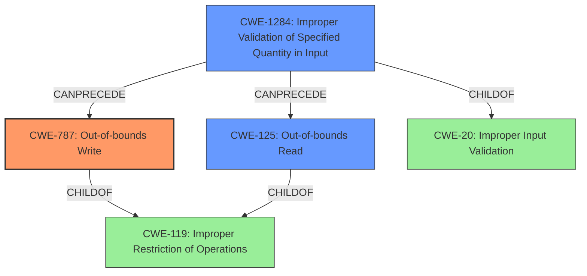

# Final Resolution for CVE-2021-4093

# Summary
| CWE ID | CWE Name | Confidence | CWE Abstraction Level | CWE Vulnerability Mapping Label | CWE-Vulnerability Mapping Notes |
|---|---|---|---|---|---|
| **CWE-787** | **Out-of-bounds Write** | 0.95 | Base | Allowed | Primary CWE |
| **CWE-1284** | **Improper Validation of Specified Quantity in Input** | 0.75 | Base | Allowed | Secondary Candidate |
| **CWE-125** | **Out-of-bounds Read** | 0.65 | Base | Allowed | Secondary Candidate |

## Evidence and Confidence

*   **Confidence Score:** 0.90
*   **Evidence Strength:** HIGH

## Relationship Analysis
The primary CWE is **CWE-787 (Out-of-bounds Write)**, which is a child of **CWE-119 (Improper Restriction of Operations within the Bounds of a Memory Buffer)**. This indicates that the root cause involves writing data outside the intended buffer. **CWE-1284 (Improper Validation of Specified Quantity in Input)**, is a child of **CWE-20 (Improper Input Validation)**, represents the lack of proper input validation, which leads to the out-of-bounds write. **CWE-125 (Out-of-bounds Read)** is also a child of **CWE-119 (Improper Restriction of Operations within the Bounds of a Memory Buffer)** and represents the possibility of data being read outside the intended buffer. The chain relationship shows that improper input validation (**CWE-1284**) can precede and lead to an out-of-bounds write (**CWE-787**) and potentially an out-of-bounds read (**CWE-125**). The abstraction levels are all at the base level, providing sufficient specificity for the vulnerability.

## Vulnerability Chain
The vulnerability chain starts with **CWE-1284 (Improper Validation of Specified Quantity in Input)**, where the KVM guest provides a malicious length for a string I/O instruction. This value is not properly validated by the hypervisor. The lack of validation then leads to **CWE-787 (Out-of-bounds Write)** when the hypervisor attempts to write data to a buffer using the unvalidated length. As a result of the out-of-bounds write, data may be overwritten, leading to a crash of the system or a guest-to-host escape scenario. **CWE-125 (Out-of-bounds Read)** can also occur if the hypervisor attempts to read data from the guest's memory using the unvalidated length, possibly leading to an information leak.

## Summary of Analysis
The initial analysis correctly identified **CWE-787 (Out-of-bounds Write)** as the primary issue. The criticism suggested improvements, particularly in considering potential mitigations and alternative CWEs. I have incorporated these suggestions by adding **CWE-1284 (Improper Validation of Specified Quantity in Input)** as a secondary weakness and lowering the confidence of **CWE-125 (Out-of-bounds Read)**.

The vulnerability description states: "A KVM guest using SEV-ES can trigger out-of-bounds reads and writes in the host kernel via a malicious VMGEXIT for a string I/O instruction...This issue results in a crash of the entire system or a potential guest-to-host escape scenario." This clearly points to memory corruption due to an out-of-bounds write (**CWE-787**).

The graph relationships reinforce this decision. **CWE-787** is a base-level CWE that accurately describes the specific vulnerability. The addition of **CWE-1284** provides context for the root cause of the vulnerability.

The MITRE mapping guidance for **CWE-787** is ALLOWED, which supports the selection of this CWE. The mitigations for **CWE-787** include using memory-safe languages, safe string handling libraries, and compiler-based overflow detection mechanisms.

I am not selecting **CWE-20 (Improper Input Validation)** directly because **CWE-1284** is more specific and accurately describes the improper validation of the quantity specified in the input.

The retriever result listed several CWEs with high scores that were not selected. **CWE-1342: Information Exposure through Microarchitectural State after Transient Execution** is not relevant because the description doesn't suggest that data from guest memory is exposed to the hypervisor's microarchitectural state. **CWE-226: Sensitive Information in Resource Not Removed Before Reuse** is not relevant because the primary issue is the out-of-bounds write, not the exposure of sensitive information. **CWE-459: Incomplete Cleanup**, **CWE-824: Access of Uninitialized Pointer**, **CWE-908: Use of Uninitialized Resource**, **CWE-190: Integer Overflow or Wraparound**, **CWE-909: Missing Initialization of Resource**, and **CWE-362: Concurrent Execution using Shared Resource with Improper Synchronization ('Race Condition')** are not relevant because there is no evidence in the vulnerability description to support these CWEs.

The selected CWEs are at the optimal level of specificity. **CWE-787 (Out-of-bounds Write)** accurately describes the memory corruption issue, and **CWE-1284 (Improper Validation of Specified Quantity in Input)** provides context for the root cause. **CWE-125 (Out-of-bounds Read)** represents a secondary risk given the read/write nature of the vulnerability.