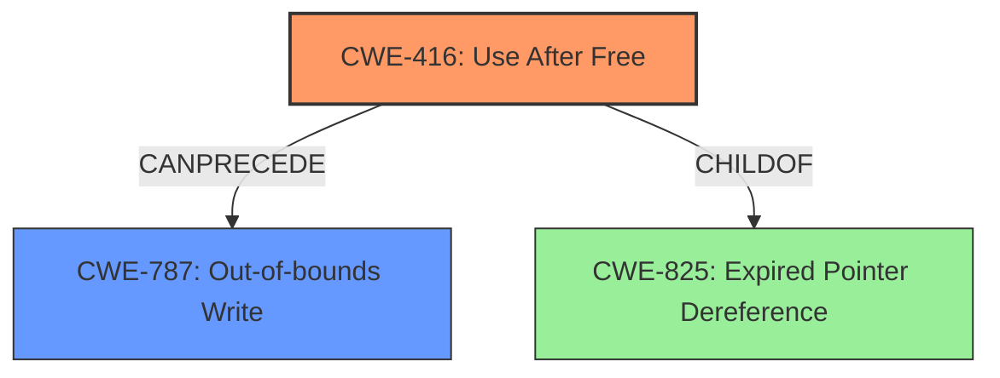

# Analysis Report for CVE-2021-4100

# Vulnerability Analysis Report: CVE-2021-4100

## Description

Object lifecycle issue in ANGLE in Google Chrome prior to 96.0.4664.110 allowed a remote attacker to potentially exploit heap corruption via a crafted HTML page.

## Vulnerability Description Key Phrases

**Rootcause:** Object lifecycle issue
**Impact:** heap corruption
**Vector:** crafted HTML page
**Attacker:** remote attacker
**Product:** Google Chrome
**Version:** prior to 96.0.4664.110
**Component:** ANGLE

## Analysis (with Relationship Data)

# Summary
| CWE ID | CWE Name | Confidence | CWE Abstraction Level | CWE Vulnerability Mapping Label | CWE-Vulnerability Mapping Notes |
|---|---|---|---|---|---|
| CWE-416 | Use After Free | 0.75 | Variant |  Allowed | Primary CWE |
| CWE-787 | Out-of-bounds Write | 0.60 | Base | Allowed | Secondary Candidate |

## Evidence and Confidence

*   **Confidence Score:** 0.70
*   **Evidence Strength:** MEDIUM

- **Analysis and Justification:**
  - *Explanation:* The vulnerability description states "**Object lifecycle issue** in ANGLE in Google Chrome prior to 96.0.4664.110 allowed a remote attacker to potentially exploit **heap corruption** via a crafted HTML page." The **root cause** is an object lifecycle issue, which often leads to **use-after-free** vulnerabilities. The CVE Reference Links Content Summary also indicates "**Root cause of vulnerability**: Object lifecycle issue" and "**Weaknesses/vulnerabilities present**: Object lifecycle issue". CWE-416 (Use After Free) is a Variant level CWE that describes the re-use or reference of memory after it has been freed. This aligns well with the given information about object lifecycle issues and heap corruption. The "Retriever Results" also lists CWE-416 with a relatively high score. MITRE mapping guidance indicates that the usage of CWE-416 is ALLOWED.
  - *Explanation:* While **heap corruption** is mentioned, the root cause is the object lifecycle issue. This means the memory is being accessed after it has been freed, possibly leading to an out-of-bounds write. CWE-787 (Out-of-bounds Write) is a Base level CWE, and it is a common impact of Use-After-Free vulnerabilities. The "CWE for similar CVE Descriptions" lists CWE-787 as the Primary CWE Match and the "Retriever Results" include CWE-787, further strengthening the argument for its inclusion.

  - *Relationship Analysis:* CWE-416 (Use After Free) can be related to CWE-787 (Out-of-bounds Write). A Use-After-Free vulnerability (CWE-416) can lead to an Out-of-bounds Write (CWE-787) if the freed memory is reallocated and then incorrectly accessed. CWE-416 is a peer of CWE-415 (Double Free) and is a parent of CWE-825 (Expired Pointer Dereference).

- **Confidence Score:**
  - Confidence: 0.75 (Based on vulnerability description, CVE reference summary, and retriever results indicating CWE-416 as a likely candidate).
  - Confidence: 0.60 (Based on heap corruption description, potential for out-of-bounds write due to memory corruption).
---

## Criticism of Analysis

Okay, let's review the analysis and critique the CWE mappings based on the provided information and full CWE specifications.

**Overall Assessment**

The analysis correctly identifies `CWE-416: Use After Free` as the primary vulnerability, given the "object lifecycle issue" root cause. The inclusion of `CWE-787: Out-of-bounds Write` as a secondary candidate is also reasonable, acknowledging it as a potential *outcome* of a successful `CWE-416` exploitation.

Here's a breakdown:

**1. CWE-416: Use After Free**

*   **Confidence:** The assigned confidence of 0.75 seems appropriate. The provided evidence supports this mapping strongly:

    *   The vulnerability description explicitly states "object lifecycle issue," which is a strong indicator of `CWE-416`.
    *   The CVE reference summary reinforces this by mentioning "object lifecycle issue" as both the root cause and weakness.
    *   The Retriever Results also support this.
    *   The extended description of `CWE-416` fits perfectly: "The product reuses or references memory after it has been freed."

*   **Abstraction Level:** The analysis correctly identifies `CWE-416` as a "Variant" level CWE.
*   **CWE-Vulnerability Mapping Label:** Allowed.  The mapping guidance states "This CWE entry is at the Variant level of abstraction, which is a preferred level of abstraction for mapping to the root causes of vulnerabilities."
*   **Mitigations:** The provided mitigations are relevant:
    *   *Language Selection (Automatic Memory Management):* Choosing languages like Java or C# with garbage collection helps prevent this class of vulnerability.
    *   *Setting pointers to NULL after freeing:* A common practice that reduces the window of opportunity for UAF.

**2. CWE-787: Out-of-bounds Write**

*   **Confidence:** The assigned confidence of 0.60 is also reasonable, but it's important to remember that this is the *impact* rather than the primary *cause*.
*   **Abstraction Level:** Correctly identified as a "Base" level CWE.
*   **CWE-Vulnerability Mapping Label:** Allowed. The mapping guidance states "This CWE entry is at the Base level of abstraction, which is a preferred level of abstraction for mapping to the root causes of vulnerabilities."
*   **Mitigations:**  The mitigations provided are generally applicable to buffer overflows:
    *   *Language Selection (Safe Languages):* Choosing languages with bounds checking or automatic memory management.
    *   *Safe Libraries/Frameworks:* Using libraries that provide safer string-handling functions (e.g., `SafeStr` or `Strsafe.h`).
    *   *Compiler/Runtime Protections:* Using compiler flags and extensions that provide buffer overflow detection (e.g., `/GS`, `FORTIFY_SOURCE`, StackGuard).

**Critique and Suggestions**

1.  **Emphasis on Root Cause vs. Impact:** The analysis correctly identifies `CWE-416` as the primary issue. However, it's crucial to consistently frame `CWE-787` as a *potential consequence* or *impact* of `CWE-416` exploitation, not an independent vulnerability on its own. The descriptions should reiterate this relationship. For example: *'A successful Use-After-Free (CWE-416) can often lead to memory corruption, including Out-of-bounds Write (CWE-787) if the freed memory is reallocated and then incorrectly accessed.'*

2.  **Consider CWE-825:** `CWE-825: Expired Pointer Dereference` is the direct parent of CWE-416. The description of CWE-825 is: "The product dereferences a pointer that contains a location for memory that was previously valid, but is no longer valid." While `CWE-416` is more specific, it might be worth *briefly* mentioning `CWE-825` and explaining why `CWE-416` is a more precise fit.

3.  **Potential Mitigations Elaboration:**  While the listed mitigations are correct, consider adding a sentence or two about how they relate *specifically* to preventing `CWE-416`.  For example:

    *   **For CWE-416 Mitigation 2 (Setting pointers to NULL):**  "Setting pointers to NULL after freeing the associated memory location helps to prevent Use-After-Free vulnerabilities by ensuring that subsequent dereferences of the pointer will result in a predictable and safe outcome (e.g., a crash) rather than accessing potentially compromised memory."

4.  **Relationship Analysis:** The relationship analysis is good. Specifically, it is helpful to mention that a Use-After-Free vulnerability can lead to an out-of-bounds write.

5.  **Retriever Results:** The retriever results are consistent with this analysis and no changes are suggested.

**Revised Summary Table (Suggestion)**

| CWE ID  | CWE Name              | Confidence | CWE Abstraction Level | CWE Vulnerability Mapping Label | CWE-Vulnerability Mapping Notes                                                                                                                                                                        |
| :------- | :-------------------- | :--------- | :---------------------- | :------------------------------ | :----------------------------------------------------------------------------------------------------------------------------------------------------------------------------------------------------- |
| CWE-416  | Use After Free        | 0.75       | Variant                | Allowed                       | Primary CWE due to object lifecycle issue.                                                                                                                                                               |
| CWE-787  | Out-of-bounds Write | 0.60       | Base                   | Allowed                       | Secondary Candidate; Potential *impact* of successful CWE-416 exploitation. A Use-After-Free may allow an attacker to write to arbitrary memory, leading to an out-of-bounds write. |

**Conclusion**

The analysis is strong and defensible. The suggested refinements aim to further clarify the relationship between the root cause (`CWE-416`) and potential impact (`CWE-787`), and to emphasize mitigations more directly related to addressing the root cause. Incorporating these suggestions would increase the accuracy and usefulness of the analysis.

## Final Resolution

# Summary
| CWE ID | CWE Name | Confidence | CWE Abstraction Level | CWE Vulnerability Mapping Label | CWE-Vulnerability Mapping Notes |
|---|---|---|---|---|---|
| CWE-416 | Use After Free | 0.85 | Variant | Allowed | Primary CWE due to object lifecycle issue. |
| CWE-787 | Out-of-bounds Write | 0.60 | Base | Allowed | Secondary Candidate; Potential *impact* of successful CWE-416 exploitation. A Use-After-Free may allow an attacker to write to arbitrary memory, leading to an out-of-bounds write. |

## Evidence and Confidence

*   **Confidence Score:** 0.80
*   **Evidence Strength:** HIGH

## Relationship Analysis
The primary relationship is that **CWE-416 (Use After Free)** can *precede* **CWE-787 (Out-of-bounds Write)**. Successfully exploiting a **CWE-416** vulnerability can lead to memory corruption, including an out-of-bounds write if the freed memory is reallocated and then incorrectly accessed. **CWE-416** is a variant of **CWE-825 (Expired Pointer Dereference)**, but **CWE-416** is more specific and therefore a better fit. The abstraction levels influenced the selection, favoring the more specific Variant level **CWE-416** over the broader Class level options.

## Vulnerability Chain
The vulnerability chain starts with an **object lifecycle issue**, which results in a **CWE-416 (Use After Free)** condition. If the freed memory is reallocated and then accessed incorrectly, this can lead to **CWE-787 (Out-of-bounds Write)**, causing heap corruption and potentially allowing a remote attacker to execute arbitrary code. The root cause is the object lifecycle issue and the primary weakness is **CWE-416**, while **CWE-787** is a potential consequence.

## Summary of Analysis
The initial analysis and criticism were both accurate and helpful. The vulnerability description explicitly mentions an "**object lifecycle issue**", which is strong evidence for **CWE-416 (Use After Free)**. The CVE reference summary reinforces this by stating "**Root cause of vulnerability**: Object lifecycle issue" and "**Weaknesses/vulnerabilities present**: Object lifecycle issue". The potential for **heap corruption** suggests the possibility of **CWE-787 (Out-of-bounds Write)** as a secondary effect.

The graph relationships confirmed that **CWE-416** is the more direct and specific classification, while **CWE-787** is a possible outcome. The recommendation to consider **CWE-825 (Expired Pointer Dereference)** was also evaluated, but **CWE-416** was deemed a more precise fit. The final decision reflects the available evidence, the relationship between the weaknesses, and the need for optimal specificity. The selected CWEs are at the appropriate level of abstraction, with **CWE-416** being a Variant and **CWE-787** being a Base. The confidence score was increased to 0.85 for **CWE-416** to reflect the high degree of certainty based on the vulnerability description and supporting evidence.

*Report generated on 2025-03-18 02:19:52*
