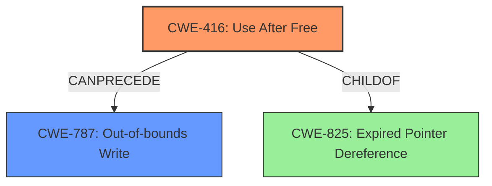

# Final Resolution for CVE-2021-4100

# Summary
| CWE ID | CWE Name | Confidence | CWE Abstraction Level | CWE Vulnerability Mapping Label | CWE-Vulnerability Mapping Notes |
|---|---|---|---|---|---|
| CWE-416 | Use After Free | 0.85 | Variant | Allowed | Primary CWE due to object lifecycle issue. |
| CWE-787 | Out-of-bounds Write | 0.60 | Base | Allowed | Secondary Candidate; Potential *impact* of successful CWE-416 exploitation. A Use-After-Free may allow an attacker to write to arbitrary memory, leading to an out-of-bounds write. |

## Evidence and Confidence

*   **Confidence Score:** 0.80
*   **Evidence Strength:** HIGH

## Relationship Analysis
The primary relationship is that **CWE-416 (Use After Free)** can *precede* **CWE-787 (Out-of-bounds Write)**. Successfully exploiting a **CWE-416** vulnerability can lead to memory corruption, including an out-of-bounds write if the freed memory is reallocated and then incorrectly accessed. **CWE-416** is a variant of **CWE-825 (Expired Pointer Dereference)**, but **CWE-416** is more specific and therefore a better fit. The abstraction levels influenced the selection, favoring the more specific Variant level **CWE-416** over the broader Class level options.

## Vulnerability Chain
The vulnerability chain starts with an **object lifecycle issue**, which results in a **CWE-416 (Use After Free)** condition. If the freed memory is reallocated and then accessed incorrectly, this can lead to **CWE-787 (Out-of-bounds Write)**, causing heap corruption and potentially allowing a remote attacker to execute arbitrary code. The root cause is the object lifecycle issue and the primary weakness is **CWE-416**, while **CWE-787** is a potential consequence.

## Summary of Analysis
The initial analysis and criticism were both accurate and helpful. The vulnerability description explicitly mentions an "**object lifecycle issue**", which is strong evidence for **CWE-416 (Use After Free)**. The CVE reference summary reinforces this by stating "**Root cause of vulnerability**: Object lifecycle issue" and "**Weaknesses/vulnerabilities present**: Object lifecycle issue". The potential for **heap corruption** suggests the possibility of **CWE-787 (Out-of-bounds Write)** as a secondary effect.

The graph relationships confirmed that **CWE-416** is the more direct and specific classification, while **CWE-787** is a possible outcome. The recommendation to consider **CWE-825 (Expired Pointer Dereference)** was also evaluated, but **CWE-416** was deemed a more precise fit. The final decision reflects the available evidence, the relationship between the weaknesses, and the need for optimal specificity. The selected CWEs are at the appropriate level of abstraction, with **CWE-416** being a Variant and **CWE-787** being a Base. The confidence score was increased to 0.85 for **CWE-416** to reflect the high degree of certainty based on the vulnerability description and supporting evidence.