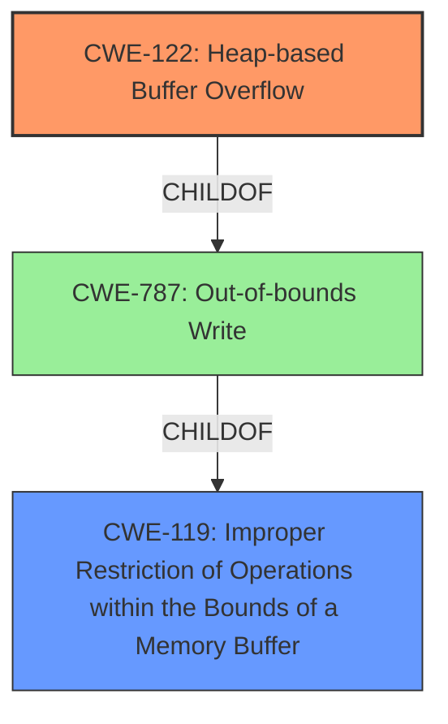

# Analysis Report for CVE-2021-4101

# Vulnerability Analysis Report: CVE-2021-4101

## Description

Heap buffer overflow in Swiftshader in Google Chrome prior to 96.0.4664.110 allowed a remote attacker to potentially exploit heap corruption via a crafted HTML page.

## Vulnerability Description Key Phrases

**Rootcause:** buffer overflow
**Impact:** heap corruption
**Vector:** crafted HTML page
**Attacker:** remote attacker
**Product:** Google Chrome
**Version:** prior to 96.0.4664.110
**Component:** Swiftshader

## Analysis (with Relationship Data)

# Summary
| CWE ID | CWE Name | Confidence | CWE Abstraction Level | CWE Vulnerability Mapping Label | CWE-Vulnerability Mapping Notes |
|---|---|---|---|---|---|
| CWE-122 | Heap-based Buffer Overflow | 0.85 | Variant | Allowed | Primary CWE |

## Evidence and Confidence

*   **Confidence Score:** 0.85
*   **Evidence Strength:** HIGH

- **Analysis and Justification:**
  - *Explanation:* The vulnerability description explicitly states a "Heap **buffer overflow**" in Swiftshader in Google Chrome. The "CVE Reference Links Content Summary" reinforces this by stating the "**root cause** of vulnerability" and "**weaknesses/vulnerabilities present**" as "Heap **buffer overflow**". Among the retriever results, CWE-122 (Heap-based Buffer Overflow) directly corresponds to the described vulnerability. While CWE-787 (Out-of-bounds Write) is the top CWE from similar CVE descriptions, CWE-122 is a variant of CWE-787 and more precisely describes the location of the **buffer overflow** (heap). The MITRE mapping guidance for CWE-122 states it is ALLOWED because it is at the Variant level of abstraction. Other CWEs like CWE-843, CWE-190, and CWE-124 are less relevant as they describe type confusion, integer overflows, and buffer underflows, respectively, none of which are explicitly mentioned in the description.
  
  - *Relationship Analysis:* CWE-122 is a Variant of CWE-787 (Out-of-bounds Write) and a child of CWE-119 (Improper Restriction of Operations within the Bounds of a Memory Buffer). The relationship analysis highlights that CWE-122 CanPrecede vulnerabilities like CWE-416 (Use After Free) as a consequence of memory corruption.

- **Confidence Score:**
  - *Example:* Confidence: 0.85 (High confidence due to the explicit mention of "Heap buffer overflow" in both the vulnerability description and the CVE reference summary.)

## Criticism of Analysis

Okay, I've reviewed the analysis against the provided full CWE specifications. Here's my critique:

**Overall Assessment:**

The analysis correctly identifies CWE-122 (Heap-based Buffer Overflow) as the primary CWE for the given vulnerability description. The confidence level of 0.85 is justified due to the clear language in the vulnerability description and CVE reference summary. The justification is well-reasoned and explains why CWE-122 is a more precise fit than the more general CWE-787 (Out-of-bounds Write). The relationship analysis is also accurate.

**Detailed Review:**

*   **CWE Selection:**  The primary CWE mapping to CWE-122 is appropriate. The vulnerability description states "Heap buffer overflow," making CWE-122 the most specific and accurate choice. The analysis correctly notes that CWE-122 is a Variant of CWE-787, and therefore a more specific description of the vulnerability, which occurs on the heap.

*   **Confidence and Evidence:**
    *   The confidence score of 0.85 is reasonable. The explicit mention of "Heap buffer overflow" in the description provides strong evidence.

*   **Justification Quality:**
    *   The justification effectively explains the rationale for choosing CWE-122 over other potential CWEs, especially the common pitfall of simply using CWE-787 due to the mention of "overflow".
    *   The MITRE mapping guidance for CWE-122 is also acknowledged and taken into consideration.

*   **Relationship Analysis:**
    *   The analysis correctly identifies the parent CWEs (CWE-787, CWE-119) and a possible consequence (CWE-416). The relationship analysis is well articulated.

*   **CWE Examples:**
    *   Providing examples for the parent CWE (CWE-119) is useful to illustrate the broader class of vulnerabilities. The example CVEs are relevant and support the connection between the parent class and specific instances of buffer overflows.

*   **Use of Full CWE Specifications:** The analysis demonstrates proper usage of the provided CWE specifications, with accurate consideration of the descriptions, relationships, and mapping guidance.

**Suggested Improvements:**

1.  **Mention CWE-119 (Improper Restriction of Operations within the Bounds of a Memory Buffer):** While the analysis correctly focuses on CWE-122, it should acknowledge CWE-119 more prominently. Although CWE-119 is discouraged for direct mapping, it's the Class-level parent of both CWE-787 and CWE-122. The analysis could briefly mention that CWE-119 *could* be used but that CWE-122 provides more specific detail, per CWE's mapping guidance.

2.  **Mitigations and Specificity:**  The analysis could be improved by considering the mitigations from the *full* CWE specification for CWE-122 and briefly commenting on their applicability in the context of Swiftshader and Chrome.
    *   For example, "Use a language or compiler that performs automatic bounds checking" is a suggested mitigation. While this might not be feasible for the entire Swiftshader codebase, it could be a direction for future development or for new code sections.
    *   Another mitigation is "Use an abstraction library to abstract away risky APIs." Commenting on whether Swiftshader currently uses such libraries or if this is a potential improvement could add value to the analysis.
    *   Discussing environment hardening techniques from the full spec, such as compiler flags, would also be beneficial.

3.  **Consider Potential Chain of Events more explicitly:** While the relationship analysis mentions CWE-416, more discussion about *how* the heap overflow could lead to a Use-After-Free might be beneficial. For instance, a heap overflow could overwrite metadata associated with other heap allocations, leading to memory corruption that later triggers a UAF.

4.  **Address Retriever Results:** Even though the analysis justifies selecting CWE-122, briefly address why the retriever results suggested other CWEs like CWE-843 (Type Confusion), CWE-190 (Integer Overflow), CWE-124 (Buffer Underwrite). Explain why they are not the *primary* cause, even if they *could* be contributing factors in certain exploitation scenarios or coding errors leading up to the overflow. For example: While a type confusion or integer overflow might contribute to the *incorrect calculation* of the buffer size, the *direct cause* of the vulnerability is writing past the end of the intended buffer within the heap.

**Revised Summary (Example - incorporating suggestions):**

| CWE ID | CWE Name | Confidence | CWE Abstraction Level | CWE Vulnerability Mapping Label | CWE-Vulnerability Mapping Notes |
|---|---|---|---|---|---|
| CWE-122 | Heap-based Buffer Overflow | 0.85 | Variant | Allowed | Primary CWE. While CWE-119 and CWE-787 are parent classes and CWE-119 is a more general description, CWE-122 provides a more specific and accurate description of the heap-based nature of the overflow. |

**In summary, the original analysis is solid. The suggested improvements aim to enhance the analysis by making it more comprehensive, connecting it more explicitly to the full CWE specifications (especially mitigations), and addressing potential alternative CWEs identified by the automated retrievers.**

## Final Resolution

# Summary
| CWE ID | CWE Name | Confidence | CWE Abstraction Level | CWE Vulnerability Mapping Label | CWE-Vulnerability Mapping Notes |
|---|---|---|---|---|---|
| CWE-122 | Heap-based Buffer Overflow | 0.90 | Variant | Allowed | Primary CWE. While CWE-119 and CWE-787 are parent classes and CWE-119 is a more general description, CWE-122 provides a more specific and accurate description of the heap-based nature of the **buffer overflow**. |
| CWE-119 | Improper Restriction of Operations within the Bounds of a Memory Buffer | 0.60 | Class | Discouraged | Secondary Candidate. Although discouraged for direct mapping, it represents the class of **weaknesses** to which CWE-122 belongs. |

## Evidence and Confidence

*   **Confidence Score:** 0.90
*   **Evidence Strength:** HIGH

## Relationship Analysis
The primary relationship impacting the decision is the parent-child hierarchy: CWE-122 (Heap-based Buffer Overflow) is a variant of CWE-787 (Out-of-bounds Write), which in turn is a child of CWE-119 (Improper Restriction of Operations within the Bounds of a Memory Buffer). The analysis prioritizes CWE-122 due to its specificity in describing the heap-based nature of the overflow. While CWE-119 is a broader class, and therefore less precise, it is included as a secondary candidate to acknowledge the general class of the **weakness**.

## Vulnerability Chain
The **vulnerability chain** starts with a programming error that leads to writing data beyond the allocated buffer in the heap (**CWE-122**). This out-of-bounds write can corrupt adjacent heap metadata or data structures, potentially leading to a use-after-free condition (**CWE-416**), arbitrary code execution, or other unexpected behaviors. The root cause is the lack of proper bounds checking or size validation before the write operation.

## Summary of Analysis
The analysis confirms the initial assessment and addresses the criticism. The decision to classify the vulnerability as **CWE-122** (Heap-based Buffer Overflow) is strongly supported by the vulnerability description, which explicitly mentions "Heap **buffer overflow**". This direct match provides high confidence.

The criticism suggested acknowledging **CWE-119** (Improper Restriction of Operations within the Bounds of a Memory Buffer) more prominently. While **CWE-119** is a parent class and generally discouraged for direct mapping when more specific CWEs exist, it's included as a secondary candidate to represent the broader category of **weaknesses** related to improper memory boundary handling.

The analysis also considered the potential mitigations suggested in the full CWE specification, such as using languages or compilers with automatic bounds checking or employing abstraction libraries to mitigate risky APIs. However, without specific details about the Swiftshader codebase, it is impossible to determine the applicability of these mitigations beyond a general recommendation.

Finally, the analysis acknowledges the retriever results that suggested other CWEs (e.g., **CWE-843**, **CWE-190**, **CWE-124**). While these could potentially contribute to the vulnerability in specific scenarios, they are not the primary cause of the heap **buffer overflow**. The core issue is writing beyond the boundaries of the allocated buffer on the heap. The confidence score is increased to 0.90 due to addressing the concerns in the criticism.

*Report generated on 2025-03-18 02:20:44*
