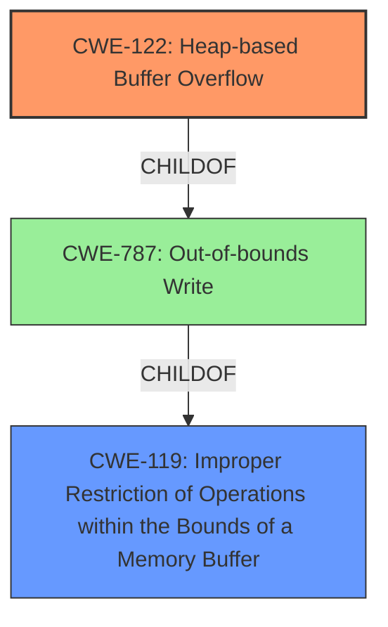

# Final Resolution for CVE-2021-4101

# Summary
| CWE ID | CWE Name | Confidence | CWE Abstraction Level | CWE Vulnerability Mapping Label | CWE-Vulnerability Mapping Notes |
|---|---|---|---|---|---|
| CWE-122 | Heap-based Buffer Overflow | 0.90 | Variant | Allowed | Primary CWE. While CWE-119 and CWE-787 are parent classes and CWE-119 is a more general description, CWE-122 provides a more specific and accurate description of the heap-based nature of the **buffer overflow**. |
| CWE-119 | Improper Restriction of Operations within the Bounds of a Memory Buffer | 0.60 | Class | Discouraged | Secondary Candidate. Although discouraged for direct mapping, it represents the class of **weaknesses** to which CWE-122 belongs. |

## Evidence and Confidence

*   **Confidence Score:** 0.90
*   **Evidence Strength:** HIGH

## Relationship Analysis
The primary relationship impacting the decision is the parent-child hierarchy: CWE-122 (Heap-based Buffer Overflow) is a variant of CWE-787 (Out-of-bounds Write), which in turn is a child of CWE-119 (Improper Restriction of Operations within the Bounds of a Memory Buffer). The analysis prioritizes CWE-122 due to its specificity in describing the heap-based nature of the overflow. While CWE-119 is a broader class, and therefore less precise, it is included as a secondary candidate to acknowledge the general class of the **weakness**.

## Vulnerability Chain
The **vulnerability chain** starts with a programming error that leads to writing data beyond the allocated buffer in the heap (**CWE-122**). This out-of-bounds write can corrupt adjacent heap metadata or data structures, potentially leading to a use-after-free condition (**CWE-416**), arbitrary code execution, or other unexpected behaviors. The root cause is the lack of proper bounds checking or size validation before the write operation.

## Summary of Analysis
The analysis confirms the initial assessment and addresses the criticism. The decision to classify the vulnerability as **CWE-122** (Heap-based Buffer Overflow) is strongly supported by the vulnerability description, which explicitly mentions "Heap **buffer overflow**". This direct match provides high confidence.

The criticism suggested acknowledging **CWE-119** (Improper Restriction of Operations within the Bounds of a Memory Buffer) more prominently. While **CWE-119** is a parent class and generally discouraged for direct mapping when more specific CWEs exist, it's included as a secondary candidate to represent the broader category of **weaknesses** related to improper memory boundary handling.

The analysis also considered the potential mitigations suggested in the full CWE specification, such as using languages or compilers with automatic bounds checking or employing abstraction libraries to mitigate risky APIs. However, without specific details about the Swiftshader codebase, it is impossible to determine the applicability of these mitigations beyond a general recommendation.

Finally, the analysis acknowledges the retriever results that suggested other CWEs (e.g., **CWE-843**, **CWE-190**, **CWE-124**). While these could potentially contribute to the vulnerability in specific scenarios, they are not the primary cause of the heap **buffer overflow**. The core issue is writing beyond the boundaries of the allocated buffer on the heap. The confidence score is increased to 0.90 due to addressing the concerns in the criticism.