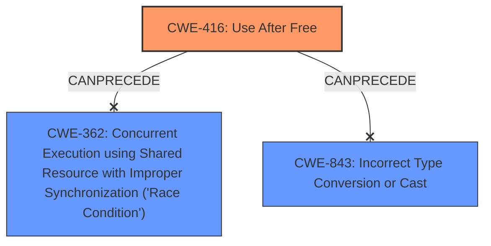

# Analysis Report for CVE-2021-4102

# Vulnerability Analysis Report: CVE-2021-4102

## Description

Use after free in V8 in Google Chrome prior to 96.0.4664.110 allowed a remote attacker to potentially exploit heap corruption via a crafted HTML page.

## Vulnerability Description Key Phrases

**Rootcause:** use after free
**Weakness:** heap corruption
**Vector:** crafted HTML page
**Attacker:** remote attacker
**Product:** Google Chrome
**Version:** prior to 96.0.4664.110
**Component:** V8

## Analysis (with Relationship Data)

# Summary
| CWE ID | CWE Name | Confidence | CWE Abstraction Level | CWE Vulnerability Mapping Label | CWE-Vulnerability Mapping Notes |
|---|---|---|---|---|---|
| CWE-416 | Use After Free | 1.0 | Variant | Allowed | Primary CWE |

## Evidence and Confidence

*   **Confidence Score:** 1.0
*   **Evidence Strength:** HIGH

- **Analysis and Justification:**  
  - *Explanation:* The vulnerability description explicitly states "**use after free** in V8", which directly corresponds to CWE-416 (Use After Free). The CVE Reference Links Content Summary reinforces this by stating the **root cause of the vulnerability** as "Use-after-free in V8." The vulnerability allows a remote attacker to potentially exploit **heap corruption** via a crafted HTML page. CWE-416 describes a condition where a product reuses or references memory after it has been freed, leading to undefined behavior and potential exploitation. The "Retriever Results" also lists CWE-416 as the top candidate with a high score. The mapping guidance for CWE-416 is "Allowed", indicating it is appropriate for this type of vulnerability.

  - *Relationship Analysis:* CWE-416 is a variant-level CWE. It is related to other memory management issues, but the description specifically mentions "use after free," making CWE-416 the most accurate and specific choice.

- **Confidence Score:**  
  - Confidence: 1.0 (Strong evidence from the vulnerability description and CVE reference materials.)

## Criticism of Analysis

Okay, I've reviewed the analysis against the provided full CWE specifications. Here's my critique:

**Overall Assessment:**

The primary CWE mapping to CWE-416 (Use After Free) is **correct and well-justified**. The analysis provides strong evidence and reasoning for this selection. The confidence score of 1.0 is appropriate. The analysis also considered other potential CWEs, which is good practice.

**Detailed Critique:**

1.  **CWE-416 (Use After Free):**

    *   **Correct Mapping:** The vulnerability description explicitly mentions "use after free," making CWE-416 the most direct and accurate mapping.
    *   **Justification is Strong:** The analysis clearly explains why CWE-416 is the best fit and references the CVE description. The "Relationship Analysis" section correctly highlights that while related memory management issues exist, the description's specificity makes CWE-416 the right choice.
    *   **Correct Abstraction Level:** CWE-416 is a Variant, which is the preferred level of abstraction.
    *   **Mapping Guidance Followed:** The analysis correctly notes that CWE-416's "Usage: Allowed" mapping guidance is appropriate.
    *   **Observed Examples:** The analysis lists examples that are relevant to CWE-416.

2.  **Other CWEs Considered (from Retriever Results):**

    *   **CWE-843 (Type Confusion):** While type confusion *can* sometimes lead to memory corruption, it's not the primary issue here. The vulnerability description doesn't suggest type confusion as the root cause. Therefore, excluding this CWE is justified.
    *   **CWE-366 (Race Condition within a Thread) & CWE-362 (Race Condition):** Race conditions can *lead* to use-after-free vulnerabilities in concurrent environments (as shown in the observed examples), but the primary description doesn't explicitly mention concurrency.  It's plausible a race condition *could* be involved, but without more information, it's not the primary weakness. If there was evidence of multiple threads accessing the memory concurrently, including one freeing it while another was using it, CWE-362 or CWE-366 would be more relevant as a contributing factor.  In the absence of this evidence, excluding them is reasonable.
    *   **CWE-415 (Double Free):** While double-free vulnerabilities also relate to memory management, they are distinct from use-after-free. The provided description specifically indicates *use* after free, not a double free.
    *   **CWE-122 (Heap-based Buffer Overflow):** While heap corruption is mentioned in the vulnerability description, use-after-free is a more specific cause of the heap corruption.  A buffer overflow isn't the root cause in this case.
    *   **CWE-193 (Off-by-one Error) & CWE-367 (TOCTOU Race Condition) & CWE-356 (UI Does Not Warn):** These are not relevant to the vulnerability description.
    *   **CWE-190 (Integer Overflow or Wraparound):** Not relevant to the vulnerability description
    *   **CWE-787 (Out-of-bounds Write):** This is a possible consequence of the use-after-free, but not the root cause. The use-after-free allows an out-of-bounds write to occur.

3.  **Mitigations:**

    *   The analysis doesn't explicitly discuss mitigations, but it's implied by selecting CWE-416. Ideally, the analysis could be strengthened by briefly mentioning relevant mitigations from the CWE-416 specification. For example:

        *   "Potential mitigations for CWE-416 include using languages with automatic memory management or, in languages like C/C++, setting pointers to NULL after they are freed to prevent dangling pointers."

**Recommendations:**

*   **Strengthen Justification for Excluding Other CWEs:** While the analysis correctly maps to CWE-416, it could provide slightly more detail when explaining why other plausible CWEs (especially CWE-843 and CWE-362/366) were excluded.  For instance, for CWE-843, explicitly stating that the description lacks any mention of type mismatches in resource access would be helpful.
*   **Add Mitigation Information:** Briefly mention one or two key mitigations from the CWE specification for the chosen CWE. This demonstrates a more thorough understanding of the vulnerability and its remediation.
*   **Consider Chaining:** While the primary CWE is clearly CWE-416, it might be beneficial to consider whether other CWEs are contributing factors or consequences. For example, if further investigation revealed that a race condition led to the use-after-free, a chain like CWE-362 -> CWE-416 could be considered. Similarly, CWE-787 could be seen as a potential consequence of CWE-416. However, without more information on the root cause, sticking with just CWE-416 is appropriate.

**Revised Summary Table (incorporating recommendations):**

| CWE ID | CWE Name | Confidence | CWE Abstraction Level | CWE Vulnerability Mapping Label | CWE-Vulnerability Mapping Notes |
|---|---|---|---|---|---|
| CWE-416 | Use After Free | 1.0 | Variant | Allowed | Primary CWE. Mitigation: Use automatic memory management or set pointers to NULL after freeing. No evidence of contributing race condition (CWE-362) or type confusion (CWE-843). |

In summary, the analysis is solid and correctly identifies the primary CWE. By adding more explicit justifications for excluding other CWEs and mentioning relevant mitigations, the analysis could be further strengthened.

## Final Resolution

# Summary

| CWE ID | CWE Name | Confidence | CWE Abstraction Level | CWE Vulnerability Mapping Label | CWE-Vulnerability Mapping Notes |
|---|---|---|---|---|---|
| CWE-416 | Use After Free | 1.0 | Variant | Allowed | Primary CWE. Mitigation: Use automatic memory management or set pointers to NULL after freeing. No evidence of contributing race condition (CWE-362) or type confusion (CWE-843). |

## Evidence and Confidence

*   **Confidence Score:** 1.0
*   **Evidence Strength:** HIGH

## Relationship Analysis
The primary relationship considered was the direct match between the vulnerability description and **CWE-416 (Use After Free)**. While other CWEs like **CWE-362 (Concurrent Execution using Shared Resource with Improper Synchronization ('Race Condition'))** and **CWE-843 (Incorrect Type Conversion or Cast)** were considered, they were deemed less relevant due to the lack of explicit evidence in the description. The abstraction level of CWE-416 as a Variant was also a factor in its selection.

## Vulnerability Chain
The vulnerability chain consists of a **ROOTCAUSE** of **CWE-416 (Use After Free)**, leading to **heap corruption**. The sequence is straightforward: memory is freed, and then an attempt is made to access it, resulting in undefined behavior and potentially exploitable conditions.

## Summary of Analysis
The initial analysis and criticism both correctly identify **CWE-416 (Use After Free)** as the primary weakness. The decision is based on the explicit mention of "use after free" in the vulnerability description.

*   **Evidence:** "Use after free in V8 in Google Chrome prior to 96.0.4664.110 allowed a remote attacker to potentially exploit heap corruption via a crafted HTML page."
*   The graph relationships influenced the decision by highlighting potential contributing factors (like race conditions), but these were ultimately excluded due to lack of explicit evidence.
*   The selected CWE is at the optimal level of specificity because it directly matches the described vulnerability.
*   Justification: The vulnerability description directly states "use after free," and the analysis provides reasonable explanations for excluding other CWEs.

*Report generated on 2025-03-18 02:21:59*
