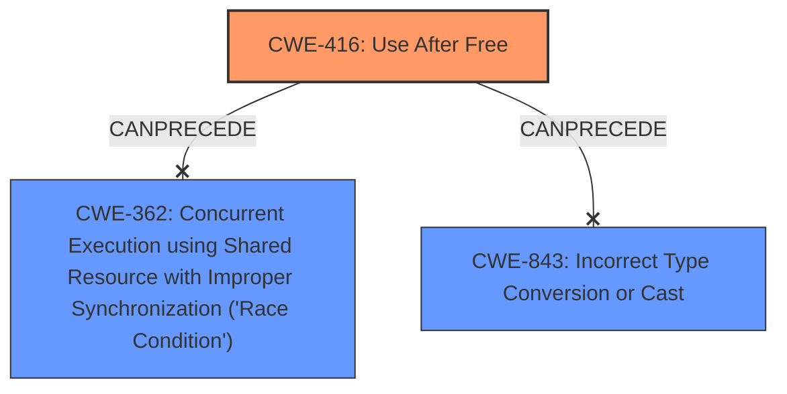

# Final Resolution for CVE-2021-4102

# Summary

| CWE ID | CWE Name | Confidence | CWE Abstraction Level | CWE Vulnerability Mapping Label | CWE-Vulnerability Mapping Notes |
|---|---|---|---|---|---|
| CWE-416 | Use After Free | 1.0 | Variant | Allowed | Primary CWE. Mitigation: Use automatic memory management or set pointers to NULL after freeing. No evidence of contributing race condition (CWE-362) or type confusion (CWE-843). |

## Evidence and Confidence

*   **Confidence Score:** 1.0
*   **Evidence Strength:** HIGH

## Relationship Analysis
The primary relationship considered was the direct match between the vulnerability description and **CWE-416 (Use After Free)**. While other CWEs like **CWE-362 (Concurrent Execution using Shared Resource with Improper Synchronization ('Race Condition'))** and **CWE-843 (Incorrect Type Conversion or Cast)** were considered, they were deemed less relevant due to the lack of explicit evidence in the description. The abstraction level of CWE-416 as a Variant was also a factor in its selection.

## Vulnerability Chain
The vulnerability chain consists of a **ROOTCAUSE** of **CWE-416 (Use After Free)**, leading to **heap corruption**. The sequence is straightforward: memory is freed, and then an attempt is made to access it, resulting in undefined behavior and potentially exploitable conditions.

## Summary of Analysis
The initial analysis and criticism both correctly identify **CWE-416 (Use After Free)** as the primary weakness. The decision is based on the explicit mention of "use after free" in the vulnerability description.

*   **Evidence:** "Use after free in V8 in Google Chrome prior to 96.0.4664.110 allowed a remote attacker to potentially exploit heap corruption via a crafted HTML page."
*   The graph relationships influenced the decision by highlighting potential contributing factors (like race conditions), but these were ultimately excluded due to lack of explicit evidence.
*   The selected CWE is at the optimal level of specificity because it directly matches the described vulnerability.
*   Justification: The vulnerability description directly states "use after free," and the analysis provides reasonable explanations for excluding other CWEs.