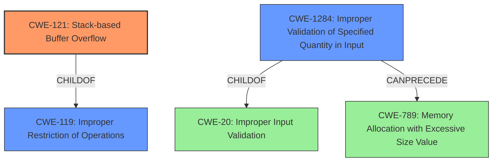

# Analysis Report for CVE-2021-41027

# Vulnerability Analysis Report: CVE-2021-41027

## Description

A stack-based buffer overflow in Fortinet FortiWeb version 6.4.1 and 6.4.0, allows an authenticated attacker to execute unauthorized code or commands via crafted certificates loaded into the device.

## Vulnerability Description Key Phrases

**Weakness:** stack-based buffer overflow
**Impact:** execute unauthorized code or commands
**Vector:** crafted certificates
**Attacker:** authenticated attacker
**Product:** Fortinet FortiWeb
**Version:** version 6.4.1 and 6.4.0

## Analysis (with Relationship Data)

# Summary
| CWE ID | CWE Name | Confidence | CWE Abstraction Level | CWE Vulnerability Mapping Label | CWE-Vulnerability Mapping Notes |
|---|---|---|---|---|---|
| CWE-121 | Stack-based Buffer Overflow | 0.95 | Variant | Allowed | Primary CWE |
| CWE-1284 | Improper Validation of Specified Quantity in Input | 0.7 | Base | Allowed | Secondary Candidate CWE |

## Evidence and Confidence

*   **Confidence Score:** 0.9
*   **Evidence Strength:** HIGH

- **Analysis and Justification:**  
  - *Explanation:* The vulnerability description explicitly states a "**stack-based buffer overflow**" in Fortinet FortiWeb. The CVE Reference Links Content Summary further clarifies that a type mismatch leads to this overflow. This aligns directly with CWE-121 (Stack-based Buffer Overflow), a Variant-level CWE, indicating a buffer overflow occurring on the stack. The impact allows an authenticated attacker to execute unauthorized code or commands. The retriever results also list CWE-121 as a strong candidate. MITRE mapping guidance for CWE-121 indicates that it is ALLOWED. The root cause is a type mismatch, which likely leads to the buffer overflow.
  
  - *Relationship Analysis:* CWE-121 is a variant of CWE-119 (Improper Restriction of Operations within the Bounds of a Memory Buffer). The vulnerability could potentially lead to other issues such as privilege escalation.

- **Confidence Score:**  
  - Confidence: 0.95 (High confidence due to explicit mention of "stack-based buffer overflow" and supporting details in the CVE Reference Links Content Summary.)

- **Analysis and Justification:**  
  - *Explanation:* CWE-1284 (Improper Validation of Specified Quantity in Input) is a potential secondary weakness. The crafted certificate used as the attack vector might contain a field that specifies the size or length of some data, and the FortiWeb software might fail to properly validate this quantity. If the size is not validated correctly, it could lead to a buffer overflow when the data is processed. The retriever results listed CWE-1284 with a good score. The **root cause** described in the CVE Reference Links Content Summary of type mismatch may be related to the improper validation of input.
  
  - *Relationship Analysis:* CWE-1284 is a base-level CWE and a child of CWE-20 (Improper Input Validation). It can precede CWE-789 (Memory Allocation with Excessive Size Value), which could potentially contribute to the buffer overflow.

- **Confidence Score:**  
  - Confidence: 0.7 (Medium confidence as the connection to crafted certificates and improper validation is inferred, but not explicitly stated. Further analysis of the type mismatch would be needed to confirm this relationship.)

## Criticism of Analysis

Okay, I've reviewed the analysis provided, including the full CWE specifications for each referenced weakness. Here's my critique:

**Overall Assessment:**

The analysis is generally good, especially in identifying CWE-121 as the primary weakness. The justification is clear, the confidence is high, and the evidence is strong. The inclusion of CWE-1284 as a secondary weakness is reasonable, although the connection is more speculative and relies on inference. The analysis also correctly identifies the limitations and areas for further investigation.

**Detailed Review:**

*   **CWE-121 (Stack-based Buffer Overflow) - Primary CWE:**

    *   **Assessment:** Correct and well-justified. The vulnerability description explicitly mentions "stack-based buffer overflow," making this a direct match. The provided summary of the CVE reference links confirms a type mismatch leads to an overflow. The use of Variant-level CWE is appropriate.
    *   **Confidence:** The high confidence (0.95) is warranted, given the explicit mention of the weakness in the description.
    *   **Mapping Guidance Consideration:**  The analysis correctly notes that CWE-121 is ALLOWED per MITRE mapping guidance.
    *   **Potential Mitigations:** The listed mitigations are relevant: compiler-based overflow detection, abstraction libraries, and input bounds checking.
    *   **Relationship Analysis:** Correctly identified CWE-121 as a child of CWE-119.
    *   **Good to Note:** The examples from the CWE database (CVE-2021-35395) aligns with the vulnerability being a "stack-based buffer overflow in wifi chipset used for IoT/embedded devices, as exploited in the wild per CISA KEV".

*   **CWE-1284 (Improper Validation of Specified Quantity in Input) - Secondary Candidate CWE:**

    *   **Assessment:** Reasonable, but the connection is less direct and depends on inference. The argument that the crafted certificate *might* contain a size/length field that is improperly validated is plausible. The root cause being described as a type mismatch, adds weight to this assessment.
    *   **Confidence:** The medium confidence (0.7) is appropriate because the connection isn't explicitly stated and requires further investigation of the type mismatch.
    *   **Mapping Guidance Consideration:** The analysis correctly notes that CWE-1284 is ALLOWED and that it is at the base level of abstraction.
    *   **Potential Mitigations:** The input validation mitigations are appropriate, especially the "accept known good" strategy.
    *   **Relationship Analysis:** The relationship to CWE-20 is accurate. The potential for it to precede CWE-789 is also valid, as improper validation of a size could lead to excessive memory allocation.

**General Improvements and Considerations:**

*   **CWE-119 (Improper Restriction of Operations within the Bounds of a Memory Buffer):** Although CWE-121 is correctly identified, it's worth briefly discussing *why* CWE-119 was *not* chosen as the primary weakness, even though CWE-121 is a child of CWE-119. This reinforces the reasoning and demonstrates an understanding of the CWE hierarchy. The analysis could explicitly state that CWE-119 is discouraged, and that the lower-level child CWE-121 is a better fit.

*   **CWE-20 (Improper Input Validation):** The analysis doesn't explicitly mention this, but it could be useful to mention that CWE-20 is generally discouraged and that CWE-1284 is a more specific child of CWE-20.

*   **Root Cause Investigation:** The summary of CVE reference links states a type mismatch is the root cause. This is good, but more exploration of what that type mismatch is *could* strengthen the analysis. For instance:
    *   Is the type mismatch in how the certificate length is handled?
    *   Is it a mismatch between the declared type of a certificate field versus the type actually used in the code?
    *   Is the root cause potentially an integer overflow if a large size is specified?

*   **Integer Overflows (CWE-190) and Off-by-One Errors (CWE-193):**  While these were lower on the retriever results, the root cause "type mismatch" could potentially involve an integer overflow if the type used to store the size is too small. Likewise, off-by-one errors can easily lead to stack-based buffer overflows. Briefly discussing *why* these are less likely than CWE-1284 (given the current limited information) would strengthen the analysis.

*   **CWE-130 (Improper Handling of Length Parameter Inconsistency):** Since the attack vector is a "crafted certificate", there might be a length parameter in the certificate that is inconsistent with the actual length of the data. It might be worth briefly considering this CWE, although further details about the crafted certificate would be needed.

*   **Specific Examples:** While the "Observed Examples" section lists relevant CVEs, including one related to IoT devices, most do not involve crafted certificates and SAML login. The analysis could be stronger by showing connections to prior incidents with similar attack vectors.

*   **CWE Database Examples for 119:** This section would be useful to show examples of stack-based buffer overflows, however the presented observed examples lack detail to justify the connection to certificates and SAML logins.

**Revised Summary Table (Based on Review)**

| CWE ID | CWE Name | Confidence | CWE Abstraction Level | CWE Vulnerability Mapping Label | CWE-Vulnerability Mapping Notes |
|---|---|---|---|---|---|
| CWE-121 | Stack-based Buffer Overflow | 0.95 | Variant | Allowed | Primary CWE |
| CWE-1284 | Improper Validation of Specified Quantity in Input | 0.7 | Base | Allowed | Secondary Candidate CWE. Requires further investigation of the root cause. |

**In conclusion:** This is a well-reasoned analysis, but some minor additions and considerations, based on the full CWE specifications, could further solidify the conclusions and demonstrate a more comprehensive understanding of the nuances of CWE mapping.

## Final Resolution

# Summary
| CWE ID | CWE Name | Confidence | CWE Abstraction Level | CWE Vulnerability Mapping Label | CWE-Vulnerability Mapping Notes |
|---|---|---|---|---|---|
| CWE-121 | Stack-based Buffer Overflow | 0.95 | Variant | Allowed | Primary CWE |
| CWE-1284 | Improper Validation of Specified Quantity in Input | 0.7 | Base | Allowed | Secondary Candidate CWE. Requires further investigation of the root cause. |

## Evidence and Confidence

*   **Confidence Score:** 0.9
*   **Evidence Strength:** HIGH

## Relationship Analysis
The primary relationship influencing the decision is the parent-child relationship between CWE-119 (**CWE-119: Improper Restriction of Operations within the Bounds of a Memory Buffer**) and CWE-121 (**CWE-121: Stack-based Buffer Overflow**). CWE-121 is a variant of CWE-119, providing a more specific classification for a stack-based buffer overflow. CWE-1284 (**CWE-1284: Improper Validation of Specified Quantity in Input**) is considered a secondary weakness and is a child of CWE-20 (**CWE-20: Improper Input Validation**). CWE-1284 can precede CWE-789 (**CWE-789: Memory Allocation with Excessive Size Value**). The abstraction levels were considered, favoring the Variant level for the primary CWE and the Base level for the secondary CWE.

## Vulnerability Chain
The vulnerability chain starts with a crafted certificate containing a malformed size/length field (potential **ROOTCAUSE**: CWE-1284). If the FortiWeb software fails to properly validate this quantity, it can lead to an excessive memory allocation. When the software attempts to write data based on this invalid size on the stack, it results in a stack-based buffer overflow (**WEAKNESS**: CWE-121). The impact is that an authenticated attacker can execute unauthorized code or commands.

## Summary of Analysis
The initial analysis and criticism both correctly identify CWE-121 as the primary weakness due to the explicit mention of "stack-based buffer overflow" in the vulnerability description. The evidence is strong, and the confidence is high. The secondary candidate, CWE-1284, is less directly supported by the evidence, but it's a reasonable inference based on the attack vector involving a crafted certificate.

The graph relationships influenced the final selection by highlighting the importance of choosing the most specific CWE available. Since the vulnerability is explicitly a stack-based buffer overflow, CWE-121 is preferred over its parent, CWE-119. This aligns with the mapping guidance that discourages the use of higher-level CWEs when more specific options are available.

The selected CWEs are at the optimal level of specificity. CWE-121 is a Variant-level CWE that accurately describes the type of buffer overflow. CWE-1284 is a Base-level CWE that represents a potential **ROOTCAUSE** contributing to the vulnerability. Choosing these CWEs provides a balance between accuracy and granularity, enabling a better understanding of the vulnerability and its potential mitigations.

The analysis of the CVE reference links which indicate a type mismatch may be related to the improper validation of input and could strengthen the analysis by further exploring the type mismatch.

The initial analysis stated:
"The vulnerability description explicitly states a "**stack-based buffer overflow**" in Fortinet FortiWeb."
"The retriever results also list CWE-121 as a strong candidate."

The criticism stated:
"The analysis correctly notes that CWE-121 is ALLOWED per MITRE mapping guidance."
"Correctly identified CWE-121 as a child of CWE-119."

*Report generated on 2025-03-18 02:22:54*
