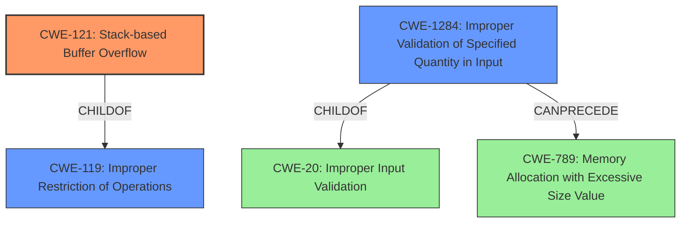

# Final Resolution for CVE-2021-41027

# Summary
| CWE ID | CWE Name | Confidence | CWE Abstraction Level | CWE Vulnerability Mapping Label | CWE-Vulnerability Mapping Notes |
|---|---|---|---|---|---|
| CWE-121 | Stack-based Buffer Overflow | 0.95 | Variant | Allowed | Primary CWE |
| CWE-1284 | Improper Validation of Specified Quantity in Input | 0.7 | Base | Allowed | Secondary Candidate CWE. Requires further investigation of the root cause. |

## Evidence and Confidence

*   **Confidence Score:** 0.9
*   **Evidence Strength:** HIGH

## Relationship Analysis
The primary relationship influencing the decision is the parent-child relationship between CWE-119 (**CWE-119: Improper Restriction of Operations within the Bounds of a Memory Buffer**) and CWE-121 (**CWE-121: Stack-based Buffer Overflow**). CWE-121 is a variant of CWE-119, providing a more specific classification for a stack-based buffer overflow. CWE-1284 (**CWE-1284: Improper Validation of Specified Quantity in Input**) is considered a secondary weakness and is a child of CWE-20 (**CWE-20: Improper Input Validation**). CWE-1284 can precede CWE-789 (**CWE-789: Memory Allocation with Excessive Size Value**). The abstraction levels were considered, favoring the Variant level for the primary CWE and the Base level for the secondary CWE.

## Vulnerability Chain
The vulnerability chain starts with a crafted certificate containing a malformed size/length field (potential **ROOTCAUSE**: CWE-1284). If the FortiWeb software fails to properly validate this quantity, it can lead to an excessive memory allocation. When the software attempts to write data based on this invalid size on the stack, it results in a stack-based buffer overflow (**WEAKNESS**: CWE-121). The impact is that an authenticated attacker can execute unauthorized code or commands.

## Summary of Analysis
The initial analysis and criticism both correctly identify CWE-121 as the primary weakness due to the explicit mention of "stack-based buffer overflow" in the vulnerability description. The evidence is strong, and the confidence is high. The secondary candidate, CWE-1284, is less directly supported by the evidence, but it's a reasonable inference based on the attack vector involving a crafted certificate.

The graph relationships influenced the final selection by highlighting the importance of choosing the most specific CWE available. Since the vulnerability is explicitly a stack-based buffer overflow, CWE-121 is preferred over its parent, CWE-119. This aligns with the mapping guidance that discourages the use of higher-level CWEs when more specific options are available.

The selected CWEs are at the optimal level of specificity. CWE-121 is a Variant-level CWE that accurately describes the type of buffer overflow. CWE-1284 is a Base-level CWE that represents a potential **ROOTCAUSE** contributing to the vulnerability. Choosing these CWEs provides a balance between accuracy and granularity, enabling a better understanding of the vulnerability and its potential mitigations.

The analysis of the CVE reference links which indicate a type mismatch may be related to the improper validation of input and could strengthen the analysis by further exploring the type mismatch.

The initial analysis stated:
"The vulnerability description explicitly states a "**stack-based buffer overflow**" in Fortinet FortiWeb."
"The retriever results also list CWE-121 as a strong candidate."

The criticism stated:
"The analysis correctly notes that CWE-121 is ALLOWED per MITRE mapping guidance."
"Correctly identified CWE-121 as a child of CWE-119."