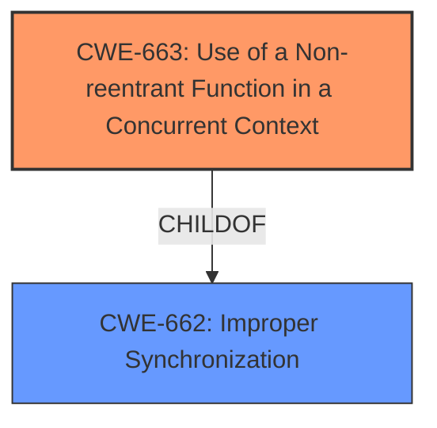

# Final Resolution for CVE-2021-41213

# Summary
| CWE ID | CWE Name | Confidence | CWE Abstraction Level | CWE Vulnerability Mapping Label | CWE-Vulnerability Mapping Notes |
|---|---|---|---|---|---|
| CWE-663 | Use of a Non-reentrant Function in a Concurrent Context | 0.95 | Base | Allowed | Primary CWE: The vulnerability involves a **non-reentrant lock** causing deadlocks in a concurrent context. |

## Evidence and Confidence

*   **Confidence Score:** 0.95
*   **Evidence Strength:** HIGH

## Relationship Analysis
The primary relationship considered was the direct match of the vulnerability description to the CWE-663 description. While CWE-662 (Improper Synchronization) is a parent, CWE-663 offers the specificity required. There are no significant chain relationships relevant in this case, as the **non-reentrant function** directly leads to the deadlock. The Base abstraction level of CWE-663 is optimal for mapping the **rootcause**.

## Vulnerability Chain
The vulnerability chain is straightforward:
1.  **Root Cause:** Use of a **non-reentrant Lock Python object** (CWE-663)
2.  **Weakness:** Two `tf.function` decorated Python functions are mutually recursive.
3.  **Impact:** Deadlock, leading to denial of service.

There are no missing links, as the description clearly outlines the steps leading to the vulnerability.

## Summary of Analysis
The initial analysis is accurate and well-justified. The **rootcause** is the usage of a **non-reentrant lock** which directly aligns with CWE-663. The criticality correctly points out that other CWE suggestions from the retriever are inaccurate and not relevant to the vulnerability description.

The vulnerability description states, "This occurs due to using a **non-reentrant Lock** Python object," which is the primary reason for selecting CWE-663. The fix also validated the selection by replacing the `threading.Lock` with `threading.RLock` which is re-entrant, therefore resolving the deadlock issue.

The graph relationships confirmed that CWE-663 is the most specific and appropriate classification. The other CWEs suggested by retrievers (CWE-835, CWE-824, CWE-1284, CWE-1287, CWE-787, CWE-617, CWE-1286, CWE-125, CWE-415) are not relevant based on the evidence provided.
CWE-663 is at the optimal level of specificity (Base).