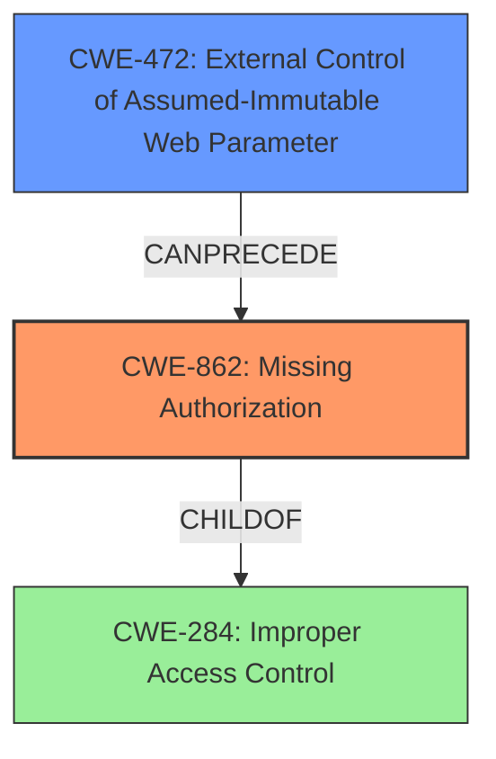

# Final Resolution for CVE-2021-41325

# Summary
| CWE ID | CWE Name | Confidence | CWE Abstraction Level | CWE Vulnerability Mapping Label | CWE-Vulnerability Mapping Notes |
|---|---|---|---|---|---|
| CWE-862 | Missing Authorization | 0.90 | Class | Primary | Allowed-with-Review |
| CWE-472 | External Control of Assumed-Immutable Web Parameter | 0.80 | Base | Secondary Candidate | Allowed |

## Evidence and Confidence

*   **Confidence Score:** 0.85
*   **Evidence Strength:** HIGH

## Relationship Analysis
The primary relationship influencing the decision is the parent-child relationship where the initial assessment leaned towards CWE-285 (Improper Authorization), but the criticism correctly pointed out its high level of abstraction. This pushed the analysis towards CWE-862 (Missing Authorization) which is more specific. CWE-472 (External Control of Assumed-Immutable Web Parameter) is considered as a preceding step, where the lack of input validation allows for the authorization bypass. The abstraction levels played a key role, with the final choices being a Class (CWE-862) and a Base (CWE-472), a better balance of specificity and coverage.

## Vulnerability Chain
The vulnerability chain starts with the lack of input validation on the `profile` parameter (CWE-472). This allows an attacker to control the parameter's value. Subsequently, there is a **missing authorization** check (CWE-862) to verify if the user has the right to create new user accounts or assign administrative roles. The combination of these weaknesses leads to the creation of unauthorized user accounts with elevated privileges, which is the final impact.

## Summary of Analysis
The initial analysis identified CWE-285 (**Improper Authorization**) as the primary **weakness**. However, the criticism highlighted that CWE-285 is a discouraged CWE due to its high level of abstraction. It correctly pointed out that the application *misses* an authorization check, which is a more accurate description of the **root cause**. The vulnerability description states: "Broken access control for user creation in Pydio Cells 2.2.9 allows remote anonymous users to create standard users via the profile parameter. (In addition, such users can be granted several admin permissions via the Roles parameter.)"

Based on this, CWE-862 (**Missing Authorization**) becomes a more appropriate primary CWE. It accurately describes the failure to perform an authorization check when an actor attempts to access a resource or perform an action.

Additionally, the analysis now incorporates CWE-472 (**External Control of Assumed-Immutable Web Parameter**) to address the manipulatable 'profile' parameter. By not validating the 'profile' parameter, the application allows an external actor to control a parameter that should be limited to a pre-defined set of values. This is considered a good supporting CWE because the Retriever Results listed it as a top result.

The decision to use CWE-862 and CWE-472 is based on both the content matching with the vulnerability description and the relationship analysis. The initial flaw is the **lack of validation** of an external parameter (CWE-472), which then leads to the **missing authorization** check (CWE-862) when creating a user.

The selected CWEs are at the optimal level of specificity because they directly address the **root causes** of the vulnerability, rather than being too abstract or focusing on the consequences.