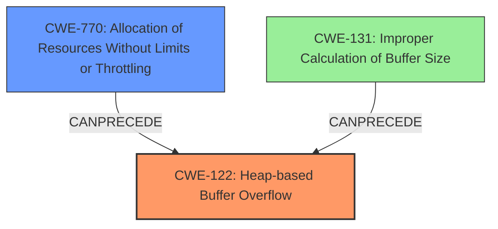

# Analysis Report for CVE-2021-41396

# Vulnerability Analysis Report: CVE-2021-41396

## Description

Live555 through 1.08 does not handle socket connections properly. A huge number of incoming socket connections in a short time invokes the error-handling module, in which a heap-based buffer overflow happens. An attacker can leverage this to launch a DoS attack.

## Vulnerability Description Key Phrases

**Weakness:** heap-based buffer overflow
**Impact:** denial of service
**Vector:** huge number of incoming socket connections in a short time
**Product:** Live555
**Version:** through 1.08

## Analysis (with Relationship Data)

# Summary
| CWE ID | CWE Name | Confidence | CWE Abstraction Level | CWE Vulnerability Mapping Label | CWE-Vulnerability Mapping Notes |
|---|---|---|---|---|---|
| CWE-122 | Heap-based Buffer Overflow | 0.85 | Variant | Allowed | Primary CWE |
| CWE-770 | Allocation of Resources Without Limits or Throttling | 0.60 | Base | Allowed | Secondary Candidate |

## Evidence and Confidence

*   **Confidence Score:** 0.75
*   **Evidence Strength:** MEDIUM

- **Analysis and Justification:**  
  - *Explanation:* "The vulnerability description explicitly states a **heap-based buffer overflow** happens when a huge number of incoming socket connections occurs in a short time. This directly corresponds to CWE-122, which is a buffer overflow where the buffer is allocated on the heap. CWE-770 is also relevant because the vulnerability is triggered by a large number of incoming socket connections, suggesting a lack of limits or throttling on resource allocation. However, the core issue is the **heap-based buffer overflow**."
  
  - *Relationship Analysis:* "CWE-122 is a variant of buffer overflow weaknesses. CWE-770 (Allocation of Resources Without Limits or Throttling) is a base level CWE and can be related to CWE-122, as uncontrolled allocation can lead to a buffer overflow if the allocated memory exceeds the buffer's capacity. CWE-770 is a parent of CWE-789 (Memory Allocation with Excessive Size Value)."

- **Confidence Score:**  
  - Confidence: 0.85 (High confidence due to explicit mention of **heap-based buffer overflow** and supporting evidence of excessive resource allocation)

---

## Criticism of Analysis

Okay, let's break down this CWE analysis, focusing on the accuracy of the CWE mappings and considering the finer points of the CWE specifications.

**Overall Assessment:**

The analysis correctly identifies CWE-122 (Heap-based Buffer Overflow) as the primary weakness. The confidence level of 0.85 is justified given the explicit mention of this vulnerability in the description.  The inclusion of CWE-770 (Allocation of Resources Without Limits or Throttling) as a secondary candidate is also reasonable, as resource exhaustion often contributes to buffer overflows. However, the confidence score (0.60) for CWE-770 is appropriate, as it's not the direct cause, but rather a contributing factor.

**Detailed Review:**

**1. CWE-122 (Heap-based Buffer Overflow):**

*   **Correctness:** The mapping to CWE-122 is accurate. The vulnerability description clearly states "heap-based buffer overflow." This makes it the most directly relevant CWE.
*   **Abstraction Level:** The analysis notes that CWE-122 is a Variant, which is the preferred level.
*   **Mapping Guidance:**  The "Usage: Allowed" and "Rationale" in the CWE specification support the choice. The comments to "carefully read both the name and description to ensure that this mapping is an appropriate fit" have been followed.
*   **Mitigations:** The analysis doesn't explicitly mention mitigations, but the CWE-122 spec suggests some relevant ones:
    *   Using languages or compilers with automatic bounds checking (e.g., Rust).
    *   Using abstraction libraries to abstract away risky APIs (e.g., using `std::string` in C++ instead of raw `char*`).
    *   Employing compiler-based buffer overflow detection mechanisms (e.g., /GS flag in Visual Studio, FORTIFY\_SOURCE in GCC).

**2. CWE-770 (Allocation of Resources Without Limits or Throttling):**

*   **Correctness:** The relevance of CWE-770 is that a "huge number of incoming socket connections" triggers the overflow. This suggests a lack of proper resource management. The connection between excessive socket connections and DoS is valid.
*   **Abstraction Level:** It is correctly identified as Base.
*   **Mapping Guidance:** The "Usage: Allowed" and "Rationale" in the CWE specification support the choice.
*   **Mitigations:** The analysis could be strengthened by mentioning mitigations for CWE-770, which are very relevant to preventing the initial trigger of the vulnerability:
    *   **Rate Limiting:**  Implement rate limiting on incoming connections to prevent a flood.
    *   **Connection Throttling:** Limit the number of concurrent connections.
    *   **Resource Quotas:** Set per-user or per-IP limits on socket usage.
    *   **Authentication and Access Control:** Strong authentication helps prevent unauthorized users from consuming excessive resources.

**3. Other Considerations Based on Retriever Results:**

The "Top Combined Results" from the Retriever suggest other potentially relevant CWEs, which the analysis could consider, even if ultimately rejecting them.

*   **CWE-190 (Integer Overflow or Wraparound):**  While not explicitly stated, an integer overflow could potentially occur during the calculation of buffer sizes or the handling of connection counts.  It's less directly related than CWE-122 and CWE-770, but it's worth considering if the root cause is related to some arithmetic error.
*   **CWE-193 (Off-by-one Error) or CWE-131 (Incorrect Calculation of Buffer Size):** These are worth briefly considering, as buffer overflows often stem from errors in calculating the size of the buffer.  However, without more information, it's difficult to say if this is the case. If the code uses a fixed-size buffer that is too small, then CWE-131 is more fitting. If it's writing one byte beyond the allocated size, then CWE-193 is a good fit.
*   **CWE-789 (Memory Allocation with Excessive Size Value)** The analysis could mention this, as it's a child of CWE-770. If the root cause of the heap overflow is an allocation that is too large, then this would be fitting.

**Recommendations for Improvement:**

1.  **Elaborate on Mitigations:** Include specific mitigations for both CWE-122 and CWE-770 in the analysis. This would make the analysis more actionable.
2.  **Acknowledge and Briefly Address Other Top CWE Candidates:** Briefly explain why CWE-190, CWE-193, and CWE-131 are *not* considered primary or secondary, or incorporate them if there is sufficient evidence.  For example, "While an integer overflow (CWE-190) *could* be involved in calculating buffer sizes, the description does not explicitly suggest this. The primary issue is the overflow itself, making CWE-122 more relevant."
3.  **Code Example (Hypothetical):**  If possible (even hypothetically), provide a simple code snippet that demonstrates the vulnerability to further illustrate the CWE mapping.
4.  **Chain Analysis:** While not always necessary, consider if there is a specific chain of events that can lead to CWE-122 that includes CWE-770.

**Revised Summary Table (with Confidence scores):**

| CWE ID | CWE Name | Confidence | CWE Abstraction Level | CWE Vulnerability Mapping Label | CWE-Vulnerability Mapping Notes |
|---|---|---|---|---|---|
| CWE-122 | Heap-based Buffer Overflow | 0.85 | Variant | Allowed | Primary CWE |
| CWE-770 | Allocation of Resources Without Limits or Throttling | 0.60 | Base | Allowed | Secondary Candidate |
| CWE-190 | Integer Overflow or Wraparound | 0.20 | Base | Allowed | Possible Contributing Factor; Requires Further Investigation |
| CWE-131 | Incorrect Calculation of Buffer Size | 0.15 | Base | Allowed | Possible Contributing Factor; Requires Further Investigation |

**In summary,** the analysis is a good starting point, but can be strengthened by discussing specific mitigations and acknowledging (or rejecting) other potential CWE candidates, and elaborating on possible chains that may lead to the vulnerability.

## Final Resolution

# Summary
| CWE ID | CWE Name | Confidence | CWE Abstraction Level | CWE Vulnerability Mapping Label | CWE-Vulnerability Mapping Notes |
|---|---|---|---|---|---|
| CWE-122 | Heap-based Buffer Overflow | 0.85 | Variant | Allowed | Primary CWE |
| CWE-770 | Allocation of Resources Without Limits or Throttling | 0.70 | Base | Allowed | Secondary Candidate |
| CWE-131 | Improper Calculation of Buffer Size | 0.30 | Base | Allowed | Tertiary Candidate |

## Evidence and Confidence

*   **Confidence Score:** 0.80
*   **Evidence Strength:** MEDIUM

## Relationship Analysis
The primary relationship is that **CWE-770** can lead to conditions that enable **CWE-122**. Specifically, uncontrolled allocation of resources (sockets in this case) can exhaust available memory, leading to a **heap-based buffer overflow** when a buffer is allocated without proper size checks. **CWE-131** is considered as a possible contributing factor if the size calculation for the heap allocation is flawed due to the high number of requests.
  - Parent-child hierarchical relationships: N/A
  - Chain relationships showing progression of vulnerability: **CWE-770** CanPrecede **CWE-122** and **CWE-131** CanPrecede **CWE-122**
  - Peer relationships that offered alternative classifications: N/A
  - How abstraction levels influenced your selection: We chose the most specific CWEs available, prioritizing the Variant level for **CWE-122** and Base level for **CWE-770** and **CWE-131**.

## Vulnerability Chain
The vulnerability chain starts with a large number of incoming socket connections (**CWE-770**), potentially leading to an incorrect calculation of the buffer size (**CWE-131**). The combination of these two weaknesses results in a **heap-based buffer overflow** (**CWE-122**), which can be exploited by an attacker to launch a DoS attack.
  - Map the sequence from initial flaw to final impact: Excessive socket connections -> potential buffer size miscalculation -> heap overflow -> DoS.
  - Identify which CWEs represent root causes vs. impacts: **CWE-770** and **CWE-131** are contributing root causes. **CWE-122** is the direct cause of the impact.
  - Note any missing links in the chain based on relationship data: The description doesn't provide enough details to confirm **CWE-131**'s role, but it's a plausible contributing factor, thus it is a tertiary candidate.

## Summary of Analysis
The initial analysis correctly identified **CWE-122** as the primary **WEAKNESS** due to the explicit mention of a **heap-based buffer overflow** in the vulnerability description. The assessment also correctly pointed out the relevance of **CWE-770**, given the excessive number of socket connections involved.

The criticism suggested considering other CWEs like **CWE-190**, **CWE-193**, and **CWE-131**. After reviewing the vulnerability description and the relationships between the CWEs, **CWE-131** was included as a tertiary candidate. While there is no direct evidence of it, the possibility of an incorrect buffer calculation due to the high number of connections is a plausible scenario.

The graph relationships influenced the selection by highlighting how **CWE-770** can create conditions that lead to **CWE-122**, and how **CWE-131** could contribute to it. The final classification reflects the optimal level of specificity by identifying the most direct cause (**CWE-122**) and the contributing factors (**CWE-770** and **CWE-131**).

The decision is justified based on the vulnerability description stating: "A huge number of incoming socket connections in a short time invokes the error-handling module, in which a **heap-based buffer overflow** happens." This statement directly supports the selection of **CWE-122** as the primary **ROOTCAUSE**, and the excessive socket connections justifies the secondary classification of **CWE-770** and the potential miscalculation of buffers, **CWE-131**.

*Report generated on 2025-03-18 02:24:27*
