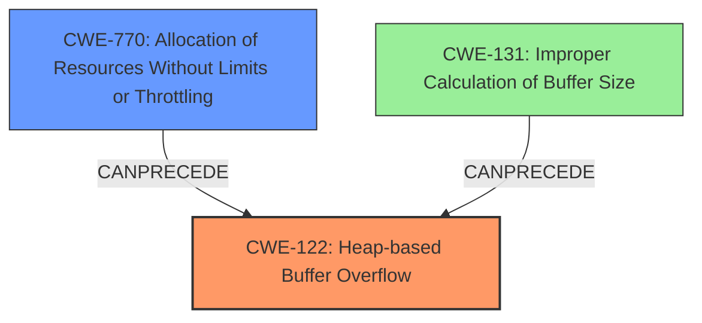

# Final Resolution for CVE-2021-41396

# Summary
| CWE ID | CWE Name | Confidence | CWE Abstraction Level | CWE Vulnerability Mapping Label | CWE-Vulnerability Mapping Notes |
|---|---|---|---|---|---|
| CWE-122 | Heap-based Buffer Overflow | 0.85 | Variant | Allowed | Primary CWE |
| CWE-770 | Allocation of Resources Without Limits or Throttling | 0.70 | Base | Allowed | Secondary Candidate |
| CWE-131 | Improper Calculation of Buffer Size | 0.30 | Base | Allowed | Tertiary Candidate |

## Evidence and Confidence

*   **Confidence Score:** 0.80
*   **Evidence Strength:** MEDIUM

## Relationship Analysis
The primary relationship is that **CWE-770** can lead to conditions that enable **CWE-122**. Specifically, uncontrolled allocation of resources (sockets in this case) can exhaust available memory, leading to a **heap-based buffer overflow** when a buffer is allocated without proper size checks. **CWE-131** is considered as a possible contributing factor if the size calculation for the heap allocation is flawed due to the high number of requests.
  - Parent-child hierarchical relationships: N/A
  - Chain relationships showing progression of vulnerability: **CWE-770** CanPrecede **CWE-122** and **CWE-131** CanPrecede **CWE-122**
  - Peer relationships that offered alternative classifications: N/A
  - How abstraction levels influenced your selection: We chose the most specific CWEs available, prioritizing the Variant level for **CWE-122** and Base level for **CWE-770** and **CWE-131**.

## Vulnerability Chain
The vulnerability chain starts with a large number of incoming socket connections (**CWE-770**), potentially leading to an incorrect calculation of the buffer size (**CWE-131**). The combination of these two weaknesses results in a **heap-based buffer overflow** (**CWE-122**), which can be exploited by an attacker to launch a DoS attack.
  - Map the sequence from initial flaw to final impact: Excessive socket connections -> potential buffer size miscalculation -> heap overflow -> DoS.
  - Identify which CWEs represent root causes vs. impacts: **CWE-770** and **CWE-131** are contributing root causes. **CWE-122** is the direct cause of the impact.
  - Note any missing links in the chain based on relationship data: The description doesn't provide enough details to confirm **CWE-131**'s role, but it's a plausible contributing factor, thus it is a tertiary candidate.

## Summary of Analysis
The initial analysis correctly identified **CWE-122** as the primary **WEAKNESS** due to the explicit mention of a **heap-based buffer overflow** in the vulnerability description. The assessment also correctly pointed out the relevance of **CWE-770**, given the excessive number of socket connections involved.

The criticism suggested considering other CWEs like **CWE-190**, **CWE-193**, and **CWE-131**. After reviewing the vulnerability description and the relationships between the CWEs, **CWE-131** was included as a tertiary candidate. While there is no direct evidence of it, the possibility of an incorrect buffer calculation due to the high number of connections is a plausible scenario.

The graph relationships influenced the selection by highlighting how **CWE-770** can create conditions that lead to **CWE-122**, and how **CWE-131** could contribute to it. The final classification reflects the optimal level of specificity by identifying the most direct cause (**CWE-122**) and the contributing factors (**CWE-770** and **CWE-131**).

The decision is justified based on the vulnerability description stating: "A huge number of incoming socket connections in a short time invokes the error-handling module, in which a **heap-based buffer overflow** happens." This statement directly supports the selection of **CWE-122** as the primary **ROOTCAUSE**, and the excessive socket connections justifies the secondary classification of **CWE-770** and the potential miscalculation of buffers, **CWE-131**.