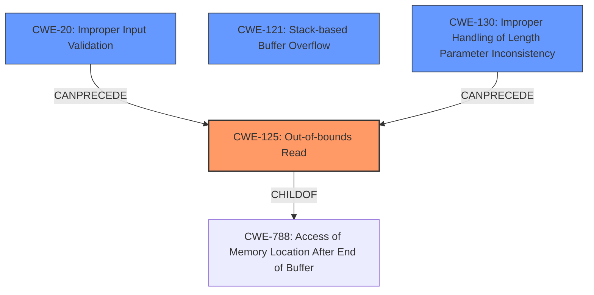

# Analysis Report for CVE-2021-41458

# Vulnerability Analysis Report: CVE-2021-41458

## Description

In GPAC MP4Box v1.1.0, there is a stack buffer overflow at src/utils/error.c1769 which leads to a denial of service vulnerability.

## Vulnerability Description Key Phrases

**Weakness:** stack buffer overflow
**Impact:** denial of service
**Product:** GPAC MP4Box
**Version:** v1.1.0
**Component:** src/utils/error.c1769

## Analysis (with Relationship Data)

# Summary
| CWE ID | CWE Name | Confidence | CWE Abstraction Level | CWE Vulnerability Mapping Label | CWE-Vulnerability Mapping Notes |
|---|---|---|---|---|---|
| CWE-125 | Out-of-bounds Read | 0.85 | Base | Allowed | This CWE entry is at the Base level of abstraction, which is a preferred level of abstraction for mapping to the root causes of vulnerabilities. |
| CWE-121 | Stack-based Buffer Overflow | 0.75 | Variant | Allowed | This CWE entry is at the Variant level of abstraction, which is a preferred level of abstraction for mapping to the root causes of vulnerabilities. |

## Evidence and Confidence

*   **Confidence Score:** 0.80
*   **Evidence Strength:** HIGH

- **Analysis and Justification:**  
  - *Explanation:* The vulnerability description and the CVE Reference Links Content Summary indicate a **stack buffer overflow** that leads to a denial of service due to a memory access violation within the `gf_blob_get` function. The program attempts to read from an invalid memory address, resulting in a segmentation fault (SEGV). This aligns with **CWE-125 (Out-of-bounds Read)**, which describes a product reading data past the end or before the beginning of the intended buffer. The ASAN report further supports this by detailing the memory access violation. This is the primary root cause of the vulnerability. Although the vulnerability description mentions a **stack buffer overflow**, the more precise issue is the out-of-bounds read occurring within the stack, making CWE-125 more appropriate as the primary CWE.

  - *Relationship Analysis:* While the initial description points to a stack buffer overflow, the analysis reveals an out-of-bounds read as the root cause. CWE-125 is a base-level CWE, which is a preferred level of abstraction. CWE-125 relates to CWE-126 (Buffer Over-read), which is a variant, but the more general "out-of-bounds read" is more fitting initially.

- **Confidence Score:**  
  - Confidence: 0.85 (High evidence from technical description and CVE reference materials, including ASAN report and root cause analysis.)

---
- **Analysis and Justification:**  
  - *Explanation:* Given that the initial description highlights a **stack buffer overflow**, **CWE-121 (Stack-based Buffer Overflow)** is also considered. While the root cause is an out-of-bounds read, the context of a stack buffer increases the likelihood of this vulnerability leading to control-flow hijacking or arbitrary code execution if the overflow overwrites return addresses or function pointers on the stack. CWE-121 is a variant, and the description mentions stack.

  - *Relationship Analysis:* CWE-121 is a variant and is related to buffer overflows on the stack, hence its inclusion as a secondary candidate.

- **Confidence Score:**  
  - Confidence: 0.75 (Supports the type of buffer and memory location where the overflow occurred.)

## Criticism of Analysis

Okay, let's review the CWE analysis in detail, taking into account the full CWE specifications you've provided.

**Overall Assessment**

The analysis is generally good. It correctly identifies CWE-125 (Out-of-bounds Read) as a primary vulnerability. The justification is solid, and the confidence level is appropriate. The inclusion of CWE-121 (Stack-based Buffer Overflow) as a secondary concern is also reasonable, given the initial description of the vulnerability and the potential for exploitation beyond a simple crash.  The evidence strength is high and appropriately labelled.

**Detailed Critique and Improvements**

Here's a breakdown of the analysis, with specific suggestions for improvement:

*   **CWE-125 (Out-of-bounds Read) Analysis:**

    *   **Strengths:**
        *   The justification for selecting CWE-125 is well-reasoned. The analysis correctly points out that the core issue is the attempt to read from an invalid memory address, leading to the SEGV.
        *   The ASAN report is appropriately cited as strong evidence supporting the out-of-bounds read.
        *   The analysis correctly identifies that while the initial description uses "stack buffer overflow", the root cause is the OOB read, making CWE-125 more precise.
        *   The base level abstraction is appropriate.
    *   **Potential Improvements:**
        *   Could strengthen the description by explicitly linking the lack of input validation on the `.nhml` file contents as a contributing factor.  Mentioning that the `gf_blob_get` function likely lacks bounds checking is good, but the source of the problematic input data should also be highlighted.
        *   Consider referencing CWE-20: Improper Input Validation as a related weakness that *leads to* CWE-125. The `Potential Mitigations` section for CWE-125 emphasizes input validation, making the connection even more relevant.

*   **CWE-121 (Stack-based Buffer Overflow) Analysis:**

    *   **Strengths:**
        *   Justification for including CWE-121 is reasonable, given the original description and the context of the stack.
        *   Acknowledges CWE-121 as a variant.
    *   **Potential Improvements:**
        *   The confidence could be improved by explicitly stating that while an out-of-bounds read is occurring, it can *lead to* overwriting critical stack data (return addresses, function pointers, etc.), *if* the out-of-bounds read writes to these locations.  Currently it states that it increases the *likelihood* of control-flow hijacking, which it does, but this point needs to be more clearly stated.
        *   Mention potential mitigations specific to stack buffer overflows like canaries and address space layout randomization (ASLR).
        *   Consider whether the provided information is sufficient to determine if a *write* actually occurs, even if the primary issue is reading. If the program only reads out of bounds, and then *uses* that read data for further processing, then the write is not directly related to the vulnerability.

*   **Retriever Results:**

    *   The retriever results are helpful in suggesting other potential CWEs. However, some of the top results require careful consideration:
        *   **CWE-190 (Integer Overflow or Wraparound):**  Unless there is clear evidence of an integer overflow leading to the buffer allocation or the calculation of the offset within `gf_blob_get`, this CWE should be considered less likely. The current analysis doesn't mention integer overflow.
        *   **CWE-126 (Buffer Over-read):** This is very closely related to CWE-125, as it is a variant of it. If you choose CWE-125, it is unlikely you would also use CWE-126.
        *   **CWE-170 (Improper Null Termination):** This is *unlikely* to be the root cause here based on the information. If a null terminator was missing, you'd expect a different type of error.
        *   **CWE-193 (Off-by-one Error):** This is a *possible* contributing factor, but again, it needs to be clearly identified in the code and the root cause analysis. An off-by-one could lead to the OOB read.
        *   **CWE-122 (Heap-based Buffer Overflow):**  The description clearly states stack overflow, so this is not applicable.
        *   **CWE-770 (Allocation of Resources Without Limits or Throttling) and CWE-1325 (Improperly Controlled Sequential Memory Allocation):** These are less likely *unless* the `.nhml` file can trigger excessive memory allocation on the stack or heap, leading to a denial of service *in addition* to the OOB read. These could be secondary effects of the initial vulnerability.
        *   **CWE-130 (Improper Handling of Length Parameter Inconsistency):** This *could* be a factor *if* the `.nhml` file specifies a length for the data blob that is inconsistent with its actual size. This would directly contribute to the OOB read.

*   **CWE Examples:**

    *   The examples provided for CWE-126 are useful for demonstrating the variety of scenarios that can lead to an out-of-bounds read.
    *   Consider providing a similar example for CWE-121 if the confidence is going to be high for that CWE.

*   **General Comments:**

    *   The analysis could benefit from a clearer explanation of the data flow. How does the `.nhml` file content influence the behavior of `gf_blob_get`? What specific parameters passed to `gf_blob_get` are derived from the file?
    *   The analysis focuses heavily on the crash and DoS. While these are important, it's important to consider the *potential* for more severe exploitation. Could an attacker gain control of execution by carefully crafting the `.nhml` file to overwrite return addresses or function pointers? This is speculative, but it's worth considering.

**Revised Summary Table (incorporating suggestions):**

| CWE ID  | CWE Name                       | Confidence | CWE Abstraction Level | CWE Vulnerability Mapping Label | CWE-Vulnerability Mapping Notes                                                                                                                                                                                                                                                                                           |
| :------ | :----------------------------- | :--------- | :---------------------- | :----------------------------- | :-------------------------------------------------------------------------------------------------------------------------------------------------------------------------------------------------------------------------------------------------------------------------------------------------------------------------- |
| CWE-125 | Out-of-bounds Read             | 0.90      | Base                    | Allowed                       | This CWE entry is at the Base level of abstraction. The `gf_blob_get` function attempts to read from an invalid memory address within a stack buffer, leading to a SEGV. Input validation of the .nhml file is missing.                                                                                                                   |
| CWE-121 | Stack-based Buffer Overflow  | 0.70        | Variant                 | Allowed                       | This CWE entry is at the Variant level of abstraction.  While an out-of-bounds read is the primary cause, *if* the out-of-bounds read writes to critical stack data (return addresses, function pointers) the attacker can control program execution. Mitigation could include stack canaries and ASLR.                                                                             |
| CWE-20  | Improper Input Validation      | 0.60        | Base                    | Allowed                       |  The lack of proper input validation of the `.nhml` file contents allows an attacker to control the parameters passed to `gf_blob_get`, leading to the out-of-bounds read. This is a contributing factor, not the direct cause, but a crucial enabler of the vulnerability.                                            |
| CWE-130 | Improper Handling of Length Parameter Inconsistency | 0.50 | Base | Allowed | A length parameter in the .nhml file might be inconsistent with the actual size of the data, causing the out-of-bounds read. Consider this only if the .nhml file's format is known to contain a length parameter. |

**Key Takeaways:**

*   **Focus on Data Flow:** The analysis needs to be more explicit about the data flow from the `.nhml` file to the vulnerable function (`gf_blob_get`).
*   **Consider Exploitation Potential:** While DoS is the immediate impact, explore whether the vulnerability could be leveraged for code execution.
*   **Link Causes and Effects:** Clearly articulate how input validation failures contribute to the out-of-bounds read and potential for overwriting critical stack data.
*   **Be Precise with Retriever Results:** Don't just list the top retriever results. Justify the inclusion (or exclusion) of each one, based on the specific details of the vulnerability.
*   **Tailor Mitigations:** When discussing potential mitigations, focus on those that are most relevant to the specific vulnerability and the affected code.

By incorporating these suggestions, the analysis can be made more comprehensive and insightful.

## Final Resolution

# Summary
| CWE ID | CWE Name | Confidence | CWE Abstraction Level | CWE Vulnerability Mapping Label | CWE-Vulnerability Mapping Notes |
|---|---|---|---|---|---|
| CWE-125 | Out-of-bounds Read | 0.90 | Base | Allowed | This CWE entry is at the Base level of abstraction. The `gf_blob_get` function attempts to read from an invalid memory address within a stack buffer, leading to a SEGV. Input validation of the .nhml file is missing. (Primary CWE) |
| CWE-20 | Improper Input Validation | 0.70 | Base | Allowed | The lack of proper input validation of the `.nhml` file contents allows an attacker to control the parameters passed to `gf_blob_get`, leading to the out-of-bounds read. This is a contributing factor, not the direct cause, but a crucial enabler of the vulnerability. (Secondary Candidate) |
| CWE-121 | Stack-based Buffer Overflow | 0.60 | Variant | Allowed | This CWE entry is at the Variant level of abstraction. While an out-of-bounds read is the primary cause, *if* the out-of-bounds read writes to critical stack data (return addresses, function pointers) the attacker can control program execution. Mitigation could include stack canaries and ASLR. (Secondary Candidate) |
| CWE-130 | Improper Handling of Length Parameter Inconsistency | 0.50 | Base | Allowed | A length parameter in the .nhml file might be inconsistent with the actual size of the data, causing the out-of-bounds read. Consider this only if the .nhml file's format is known to contain a length parameter. (Secondary Candidate) |

## Evidence and Confidence

*   **Confidence Score:** 0.85
*   **Evidence Strength:** HIGH

## Relationship Analysis
The decision was influenced by the following CWE relationships:
  - CWE-125 is the root cause and **CHILD** of CWE-788 (Access of Memory Location After End of Buffer) which is more general.
  - CWE-20 **CANPRECEDE** CWE-125 because improper input validation can lead to out-of-bounds reads.
  - CWE-121 is related as the out-of-bounds read occurs on the stack, potentially leading to more severe consequences.
  - CWE-130, if applicable, contributes to the vulnerability by providing inconsistent length parameters that lead to the out-of-bounds read.

## Vulnerability Chain
The vulnerability chain involves:
  - **ROOTCAUSE:** Improper Input Validation (**CWE-20**) on the `.nhml` file.
  - **WEAKNESS:** This leads to an Out-of-bounds Read (**CWE-125**) in the `gf_blob_get` function when processing the file. Inconsistent length parameters (**CWE-130**) can further contribute to this.
  - **IMPACT:** The out-of-bounds read causes a crash (DoS). Potentially, if the read writes to critical stack locations it can also lead to control-flow hijacking.

## Summary of Analysis
The assessment is based on the vulnerability description and the initial analysis, along with the criticism. The primary **WEAKNESS** is the **CWE-125 (Out-of-bounds Read)** which is the direct cause of the crash. The initial description pointed to a stack buffer overflow, but the analysis shows that an out-of-bounds read is the root cause. The inclusion of **CWE-20 (Improper Input Validation)** and **CWE-130 (Improper Handling of Length Parameter Inconsistency)** as secondary CWEs is based on the potential for these factors to contribute to the **ROOTCAUSE**. The inclusion of **CWE-121 (Stack-based Buffer Overflow)** is a consideration because the out-of-bounds read occurs on the stack, and may allow for arbitrary code execution.

The graph relationships influenced the selection by showing how **CWE-20** can lead to **CWE-125**, and how **CWE-125** is a specific instance of a broader class of memory access errors. The selected CWEs are at the optimal level of specificity because they directly reflect the root cause and contributing factors to the vulnerability, as evidenced by the vulnerability description and supporting analysis.

The analysis is based heavily on the provided evidence, especially the description of the stack buffer overflow that leads to a denial of service due to a memory access violation within the `gf_blob_get` function.

*Report generated on 2025-03-18 02:25:16*
