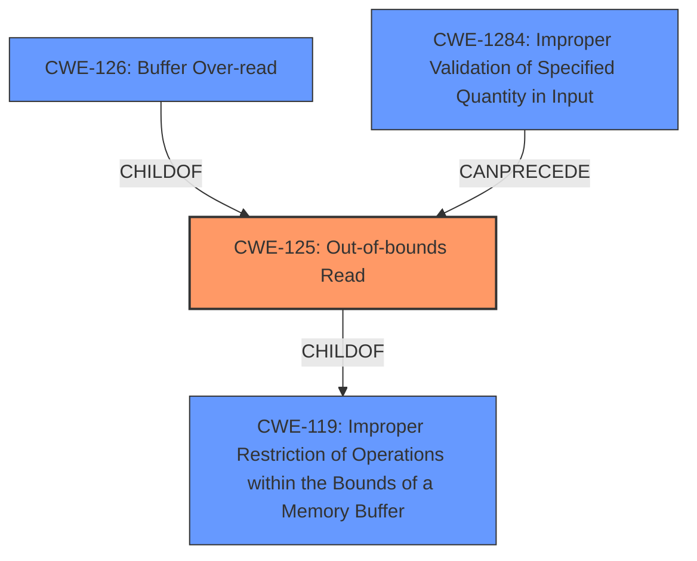

# Final Resolution for CVE-2021-4156

# Summary
| CWE ID | CWE Name | Confidence | CWE Abstraction Level | CWE Vulnerability Mapping Label | CWE-Vulnerability Mapping Notes |
|---|---|---|---|---|---|
| **CWE-125** | **Out-of-bounds Read** | 0.95 | Base | Allowed | Primary CWE |
| CWE-1284 | Improper Validation of Specified Quantity in Input | 0.6 | Base | Allowed | Secondary Candidate |

## Evidence and Confidence

*   **Confidence Score:** 0.95
*   **Evidence Strength:** HIGH

## Relationship Analysis
The primary choice is **CWE-125 (Out-of-bounds Read)**, which is a base-level CWE. The criticism suggested exploring **CWE-126 (Buffer Over-read)**, a variant of **CWE-125**, but we don't have enough information to definitively say that the read occurs *after* the buffer. We also considered **CWE-1284 (Improper Validation of Specified Quantity in Input)**, as the **root cause** involves inadequate validation of `frame->header.blocksize`. However, **CWE-125** directly describes the resulting **out-of-bounds read**, making it the more specific and appropriate primary classification. **CWE-1284** can be considered a contributing factor.

## Vulnerability Chain
The vulnerability chain begins with **CWE-1284 (Improper Validation of Specified Quantity in Input)**, where the `frame->header.blocksize` is not properly validated. This leads directly to **CWE-125 (Out-of-bounds Read)** when the application attempts to read beyond the allocated buffer. The impact is a potential crash or memory leak.

## Summary of Analysis
The initial analysis correctly identified **CWE-125 (Out-of-bounds Read)** as the primary **weakness**. The criticism raised valid points about potentially using the variant **CWE-126** or considering **CWE-1284**. However, based on the available evidence, **CWE-125** remains the most accurate and specific classification for the observed behavior (an **out-of-bounds read**). The vulnerability description explicitly states "An **out-of-bounds read** flaw was found in libsndfiles FLAC codec functionality." While **CWE-1284** contributes to the vulnerability by not validating the block size, the direct result is the **out-of-bounds read**. Therefore, **CWE-125** is the more appropriate primary classification, and **CWE-1284** is a secondary candidate. This decision is based on matching the vulnerability description to the CWE descriptions and considering the relationships between the CWEs. The chosen CWEs are at the base level of abstraction, which is appropriate given the information available. The confidence is slightly reduced from 1.0 to 0.95 due to the valid considerations raised in the criticism.