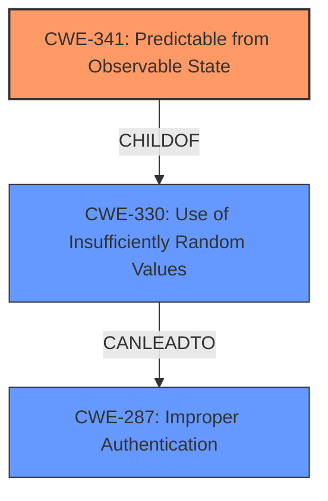

# Final Resolution for CVE-2021-41694

# Summary
| CWE ID | CWE Name | Confidence | CWE Abstraction Level | CWE Vulnerability Mapping Label | CWE-Vulnerability Mapping Notes |
|---|---|---|---|---|---|
| CWE-341 | Predictable from Observable State | 0.85 | Base | Allowed | Primary CWE. The vulnerability lies in using `md5($time)` which is predictable since 'time' is an observable state. |
| CWE-287 | Improper Authentication | 0.6 | Class | Discouraged | Secondary candidate. While the root cause is weak randomness, the impact is on authentication. |

## Evidence and Confidence

*   **Confidence Score:** 0.85
*   **Evidence Strength:** HIGH

## Relationship Analysis
The primary relationship that impacted the decision was the parent-child relationship between CWE-330 and CWE-341. CWE-341 is a child of CWE-330, which makes it a more specific classification. CWE-330 (Use of Insufficiently Random Values) CanLeadTo CWE-287 (Improper Authentication). The abstraction levels influenced the decision by favoring the base level CWE-341 over the class level CWE-330.

## Vulnerability Chain
The chain of root cause and weaknesses for the Vulnerability Description is as follows:
1.  **Root Cause:** CWE-341 (**Predictable from Observable State**) - The use of `time` as input to `md5` makes the output predictable since time is an observable state.
2.  CWE-330 (**Use of Insufficiently Random Values**) The `md5($time)` is insufficiently random for generating password reset codes.
3.  **Impact:** CWE-287 (**Improper Authentication**) - The predictable password reset code allows attackers to bypass authentication and take over accounts.

## Summary of Analysis
The analysis and criticism both agree that the root cause of the vulnerability lies in the **predictable password recovery** mechanism. The initial analysis identified CWE-330 as the primary weakness. However, the criticism suggested using CWE-341, which is a child of CWE-330 and a base level CWE, making it a more specific fit. The vulnerability description clearly indicates that the password reset code is predictable because it's based on the observable state (time).

The decision to use CWE-341 as the primary CWE is based on the following:

*   **Content Matching:** The description of CWE-341 ("A number or object is predictable based on observations that the attacker can make about the state of the system or network, such as time, process ID, etc.") directly matches the vulnerability where `time` is used to generate the password reset code.
*   **Relationship Analysis:** CWE-341 is a child of CWE-330, providing a more specific classification.
*   **Mapping Guidance:** CWE-341 is a Base level CWE, which is preferred for mapping root causes.
*   **Evidence:** The CVE summary states that the password recovery code is predictable due to `md5($time)`.

The selected CWEs are at the optimal level of specificity because CWE-341 directly addresses the **predictability** arising from the observable `time` state, and CWE-287 captures the resulting **improper authentication**.