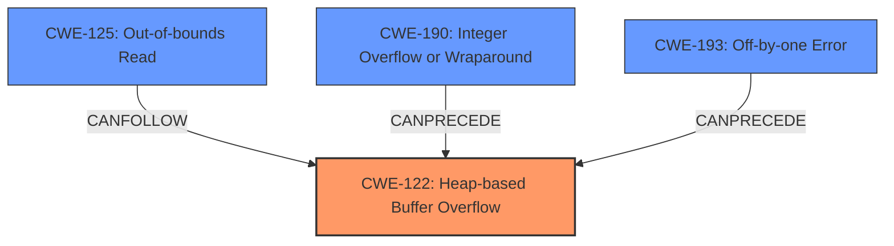

# Final Resolution for CVE-2021-41736

# Summary

| CWE ID  | CWE Name                                                        | Confidence | CWE Abstraction Level | CWE Vulnerability Mapping Label | CWE-Vulnerability Mapping Notes |
| :------- | :-------------------------------------------------------------- | :--------- | :-------------------- | :------------------------------ | :----------------------------- |
| CWE-122  | Heap-based Buffer Overflow                                      | 0.9        | Variant               | Allowed                         | Primary CWE                    |
| CWE-125  | Out-of-bounds Read                                            | 0.6        | Base                  | Allowed                         | Secondary Candidate            |
| CWE-190  | Integer Overflow or Wraparound                                | 0.5        | Base                  | Allowed                         | Secondary Candidate            |
| CWE-193  | Off-by-one Error                                              | 0.3        | Base                  | Allowed                         | Secondary Candidate            |

## Evidence and Confidence

*   **Confidence Score:** 0.9
*   **Evidence Strength:** HIGH

## Relationship Analysis

The primary CWE is CWE-122 (Heap-based Buffer Overflow), a variant of buffer overflows, making it more specific than a general buffer overflow (like CWE-120). CWE-125 (Out-of-bounds Read) can follow CWE-122 as a consequence. CWE-190 (Integer Overflow or Wraparound) and CWE-193 (Off-by-one Error) could potentially precede CWE-122 if they contribute to an incorrect calculation of the buffer size. The abstraction levels (Variant and Base) are appropriate for mapping root causes.

## Vulnerability Chain

The vulnerability chain starts with a potential **ROOTCAUSE** such as CWE-190 or CWE-193 if they lead to an incorrect buffer size calculation. This leads to CWE-122, the **WEAKNESS** (Heap-based Buffer Overflow), and can result in CWE-125 (Out-of-bounds Read) if an attacker attempts to read sensitive data after the overflow. The initial flaw is the incorrect calculation or handling of the buffer size, the overflow is the direct consequence, and reading sensitive data is a potential impact.

## Summary of Analysis

The initial analysis and the criticism are both well-reasoned. The primary CWE, CWE-122, is strongly supported by the vulnerability description ("heap-buffer overflow in the function realPropagate() at propagate.cpp"). The secondary candidates are plausible, but their connection to the primary weakness requires careful consideration.

*   **CWE-122:** The description clearly indicates a heap-based buffer overflow, making CWE-122 the most specific and appropriate choice. This is a direct match to the provided evidence.
*   **CWE-125:** The criticism suggested adding a sentence explaining how the out-of-bounds read could occur as a result of the overflow. I agree with the assessment and have included this.
*   **CWE-190:** As the criticism pointed out, a stronger argument is needed to explain how an integer overflow might contribute. The possibility exists if the buffer size calculation involves integers and wraparound occurs, leading to a smaller buffer allocation.
*   **CWE-193:** The connection to the primary weakness is weak. I have lowered the confidence to 0.3.

The graph relationships help visualize the potential flow of weaknesses. CWE-190 and CWE-193 could precede CWE-122, and CWE-125 could follow CWE-122. These relationships help in understanding the overall context of the vulnerability.

The selected CWEs are at the optimal level of specificity. CWE-122 is a Variant that highlights the heap-based nature of the overflow. The other CWEs are Base-level CWEs that could contribute to or result from the primary weakness.