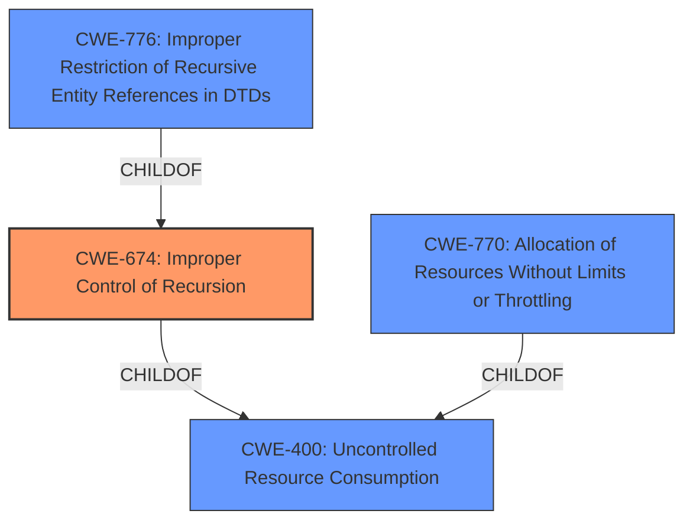

# Analysis Report for CVE-2021-41752

# Vulnerability Analysis Report: CVE-2021-41752

## Description

Stack overflow vulnerability in Jerryscript before commit e1ce7dd7271288be8c0c8136eea9107df73a8ce2 on Oct 20, 2021 due to an unbounded recursive call to the new opt() function.

## Vulnerability Description Key Phrases

**Rootcause:** unbounded recursive call
**Weakness:** stack overflow
**Product:** Jerryscript
**Version:** before commit e1ce7dd7271288be8c0c8136eea9107df73a8ce2
**Component:** new opt() function

## Analysis (with Relationship Data)

# Summary
| CWE ID | CWE Name | Confidence | CWE Abstraction Level | CWE Vulnerability Mapping Label | CWE-Vulnerability Mapping Notes |
|---|---|---|---|---|---|
| CWE-674 | Improper Control of Recursion | 0.9 | Class | Primary | Allowed-with-Review |

## Evidence and Confidence

*   **Confidence Score:** 0.9
*   **Evidence Strength:** HIGH

- **Analysis and Justification:**
  - *Explanation:* The vulnerability description explicitly states "**unbounded recursive call**" as the root cause, leading to a "**stack overflow**". This aligns directly with CWE-674, which describes "Improper Control of Recursion". The CVE Reference Links Content Summary further reinforces this by highlighting the "infinite recursion" due to the line `let obj = new opt();` within the `opt` function, confirming the lack of a base case to terminate the recursion. While a stack limit was in place, it was ineffective, thus the primary issue is the unbounded recursion. The MITRE mapping guidance for CWE-674 states that it is a Class and "might have Base-level children that would be more appropriate", but there isn't a more specific CWE that captures unbounded recursion.
  
  - *Relationship Analysis:* CWE-674 is a Class-level CWE. While it doesn't have direct relationships listed in the provided data, it can be conceptually related to resource exhaustion issues. The unbounded recursion directly leads to stack exhaustion, which is a form of resource exhaustion.

- **Confidence Score:**
  - *Example:* Confidence: 0.9 (High confidence due to direct evidence from the vulnerability description and CVE reference materials.)

## Criticism of Analysis

Okay, here's a detailed review of the analysis, considering the full CWE specifications provided.

**Overall Assessment:**

The analysis correctly identifies CWE-674 (Improper Control of Recursion) as the primary vulnerability. The confidence score of 0.9 is justified given the clear description of unbounded recursion in the vulnerability description.  The analysis also correctly notes that, despite being a Class-level CWE, a more specific Base-level CWE isn't readily available to capture the exact nature of this vulnerability.

**Detailed Review:**

**1.  CWE-674: Improper Control of Recursion (Chosen CWE)**

*   **Correctness:**  The choice of CWE-674 is appropriate. The description of the vulnerability *directly* matches the CWE definition: "The product does not properly control the amount of recursion that takes place, consuming excessive resources, such as allocated memory or the program stack." The core issue is the lack of a proper termination condition in the recursive `opt()` function.
*   **Abstraction Level:** The analysis acknowledges that CWE-674 is a Class-level CWE and that a more specific Base-level CWE *might* be more ideal. However, in this case, there isn't a better fit.  The guidance "Examine children of this entry to see if there is a better fit" is valid, but none of the children (currently just CWE-776) are applicable.
*   **Mapping Guidance:** The "Allowed-with-Review" usage is correctly applied.
*   **Potential Mitigations:** The analysis does not explicitly mention the potential mitigations listed in CWE-674, but they are relevant:
    *   **Mitigation 1 (Ensure an end condition):**  This is the *fundamental* fix required. Adding a base case to the recursion to ensure it terminates.
    *   **Mitigation 2 (Increase the stack size):**  This is a *limited* mitigation. It only delays the inevitable crash and doesn't address the root cause. The analysis *does* mention that the `--stack-limit` option was not effective *until* the fix was applied, implicitly acknowledging that increasing the stack size is insufficient without addressing the uncontrolled recursion.
* **CWE Examples:** The provided CWE examples for CWE-674 are helpful.  CVE-2007-3409 (Self-referencing pointers create infinite loop and resultant stack exhaustion.) and CVE-2016-10707 (Javascript application accidentally changes input in a way that prevents a recursive call from detecting an exit condition) are particularly relevant.

**2. Retriever Results (Alternatives Considered)**

Let's analyze why the top retriever results are *not* the best fit:

*   **CWE-1265: Unintended Reentrant Invocation of Non-reentrant Code Via Nested Calls:** This is *not* the core issue.  While recursion involves nested calls, the problem here isn't the re-entrancy of non-reentrant code.  The issue is the *uncontrolled* nature of the recursion itself.  CWE-1265 is more applicable when concurrency or asynchronous events are involved.

*   **CWE-663: Use of a Non-reentrant Function in a Concurrent Context:**  This is *not* relevant. The vulnerability doesn't involve concurrency. The recursion happens within a single thread of execution.

*   **CWE-776: Improper Restriction of Recursive Entity References in DTDs ('XML Entity Expansion'):**  This is *not* applicable. It's specific to XML entity expansion and DTDs, which are not involved in this vulnerability. This CWE is a child of CWE-674, so it's not surprising that it was suggested by the retriever, but it's too specific.

*   **CWE-190: Integer Overflow or Wraparound:** This is *not* directly related.  While integer overflows *could* potentially contribute to recursion problems in some scenarios (e.g., an integer overflow affecting a loop counter or a base case condition), it's not the primary cause here. The core issue is the lack of a termination condition.

*   **CWE-193: Off-by-one Error:**  This is *not* relevant. Off-by-one errors are not related to the root cause of the stack overflow caused by unbounded recursion.

*   **CWE-121: Stack-based Buffer Overflow:** While the *symptom* is a stack overflow, the *cause* is not a buffer being overflowed. It's the *exhaustion* of the stack due to excessive recursion.  CWE-121 is triggered by copying more data than the allocated buffer size can hold, which is not the mechanism in this scenario.

*   **CWE-120: Buffer Copy without Checking Size of Input ('Classic Buffer Overflow'):** Similar to CWE-121, this is not the correct CWE as it's directly related to an overflow resulting from copying data into a buffer without proper size checks.

*   **CWE-1325: Improperly Controlled Sequential Memory Allocation:** This CWE is closer in concept, as uncontrolled memory allocation can lead to resource exhaustion. However, the key distinction is that CWE-1325 is typically used when *separate* memory allocations are performed in a loop. In this case, the stack growth comes from the *function calls* themselves, rather than individual allocations within the function. While the `new opt()` call *does* allocate memory, the memory allocation is secondary to the recursion.

*   **CWE-194: Unexpected Sign Extension:** Irrelevant to the root cause of the vulnerability.

*   **CWE-252: Unchecked Return Value:** Irrelevant to the root cause of the vulnerability.

**3. Missing CWE Considerations (if any)**

*   **CWE-834: Excessive Iteration:**  While recursion isn't *exactly* iteration, it's a form of repeated execution.  CWE-834 is a Class-level CWE, and CWE-674 is a child of it. However, CWE-834 is even *less* specific than CWE-674. It talks about loops without limiting the number of times the loop executes.
*   **CWE-400: Uncontrolled Resource Consumption:** This is a higher-level CWE (a Pillar) that represents the *consequence* of the vulnerability. While the stack overflow *is* a form of uncontrolled resource consumption, it's better to identify the *specific* cause, which is CWE-674.

**Recommendations:**

1.  **Explicitly Mention Mitigations from CWE-674:**  The analysis should explicitly state that the primary mitigation is to ensure an end condition is reached under all logical conditions within the `opt()` function. It could also briefly mention that increasing the stack size is an insufficient mitigation.

2.  **Strengthen Justification Against Alternatives:** When dismissing alternative CWEs suggested by the retriever (especially CWE-1265, CWE-663, and CWE-1325), clearly state *why* those CWEs don't accurately represent the root cause. The reasoning should align with the specific definitions of those CWEs.

**Revised Summary Table:**

| CWE ID | CWE Name | Confidence | CWE Abstraction Level | CWE Vulnerability Mapping Label | CWE-Vulnerability Mapping Notes |
|---|---|---|---|---|---|
| CWE-674 | Improper Control of Recursion | 0.9 | Class | Primary | Allowed-with-Review. No more specific Base-level CWE is suitable. Mitigation requires ensuring an end condition to the recursive call. Increasing stack size is an insufficient mitigation. |

## Final Resolution

# Summary 
| CWE ID | CWE Name | Confidence | CWE Abstraction Level | CWE Vulnerability Mapping Label | CWE-Vulnerability Mapping Notes |
|---|---|---|---|---|---|
| CWE-674 | Improper Control of Recursion | 0.95 | Class | Primary | Allowed-with-Review. No more specific Base-level CWE is suitable. Mitigation requires ensuring an end condition to the recursive call. Increasing stack size is an insufficient mitigation. |

## Evidence and Confidence

*   **Confidence Score:** 0.95
*   **Evidence Strength:** HIGH

## Relationship Analysis
The primary relationship considered was the parent-child hierarchy. CWE-674 is a Class-level CWE, and while a more specific Base-level CWE would ideally be selected, none of its children (like CWE-776) fit the vulnerability description. The analysis confirmed that alternative CWEs, particularly those related to resource management or concurrency, were not applicable due to the specific nature of the unbounded recursion. The abstraction level of CWE-674 as a Class was considered, and the decision was made to retain it due to the lack of a more specific and relevant Base CWE.

## Vulnerability Chain
The vulnerability chain starts with the **ROOTCAUSE**: the **CWE-674 Improper Control of Recursion**. This leads to an unbounded recursive call, which consumes excessive stack space. This stack exhaustion results in a stack overflow, ultimately causing the application to crash. There are no missing links in this chain based on the available information. The consequence is the denial of service.

## Summary of Analysis
The initial analysis correctly identified **CWE-674 (Improper Control of Recursion)** as the primary **WEAKNESS**. The criticism provided a thorough review and reinforced this decision by analyzing alternative CWEs and explaining why they are not suitable.

The vulnerability description clearly states an "**unbounded recursive call**" leading to a "**stack overflow**". This directly supports the selection of CWE-674.

The graph relationships confirm that while CWE-674 is a Class-level CWE, its children are not applicable. Alternatives like CWE-770 and CWE-400 are related to resource consumption but don't capture the specific nature of the unbounded recursion.

The selected CWE is at the optimal level of specificity because it directly describes the **ROOTCAUSE** of the vulnerability (unbounded recursion), and no more specific Base-level CWE is suitable. Mitigations align with CWE-674, requiring an end condition to terminate the recursive call. Increasing stack size is insufficient. I am raising the confidence to 0.95 to reflect this more detailed assessment.

*Report generated on 2025-03-18 02:27:20*
