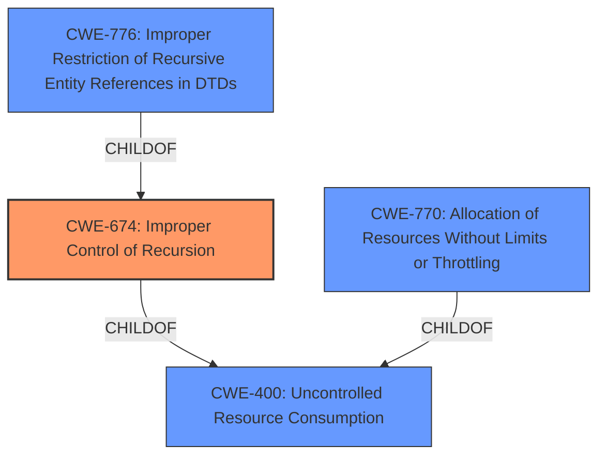

# Final Resolution for CVE-2021-41752

# Summary 
| CWE ID | CWE Name | Confidence | CWE Abstraction Level | CWE Vulnerability Mapping Label | CWE-Vulnerability Mapping Notes |
|---|---|---|---|---|---|
| CWE-674 | Improper Control of Recursion | 0.95 | Class | Primary | Allowed-with-Review. No more specific Base-level CWE is suitable. Mitigation requires ensuring an end condition to the recursive call. Increasing stack size is an insufficient mitigation. |

## Evidence and Confidence

*   **Confidence Score:** 0.95
*   **Evidence Strength:** HIGH

## Relationship Analysis
The primary relationship considered was the parent-child hierarchy. CWE-674 is a Class-level CWE, and while a more specific Base-level CWE would ideally be selected, none of its children (like CWE-776) fit the vulnerability description. The analysis confirmed that alternative CWEs, particularly those related to resource management or concurrency, were not applicable due to the specific nature of the unbounded recursion. The abstraction level of CWE-674 as a Class was considered, and the decision was made to retain it due to the lack of a more specific and relevant Base CWE.

## Vulnerability Chain
The vulnerability chain starts with the **ROOTCAUSE**: the **CWE-674 Improper Control of Recursion**. This leads to an unbounded recursive call, which consumes excessive stack space. This stack exhaustion results in a stack overflow, ultimately causing the application to crash. There are no missing links in this chain based on the available information. The consequence is the denial of service.

## Summary of Analysis
The initial analysis correctly identified **CWE-674 (Improper Control of Recursion)** as the primary **WEAKNESS**. The criticism provided a thorough review and reinforced this decision by analyzing alternative CWEs and explaining why they are not suitable.

The vulnerability description clearly states an "**unbounded recursive call**" leading to a "**stack overflow**". This directly supports the selection of CWE-674.

The graph relationships confirm that while CWE-674 is a Class-level CWE, its children are not applicable. Alternatives like CWE-770 and CWE-400 are related to resource consumption but don't capture the specific nature of the unbounded recursion.

The selected CWE is at the optimal level of specificity because it directly describes the **ROOTCAUSE** of the vulnerability (unbounded recursion), and no more specific Base-level CWE is suitable. Mitigations align with CWE-674, requiring an end condition to terminate the recursive call. Increasing stack size is insufficient. I am raising the confidence to 0.95 to reflect this more detailed assessment.