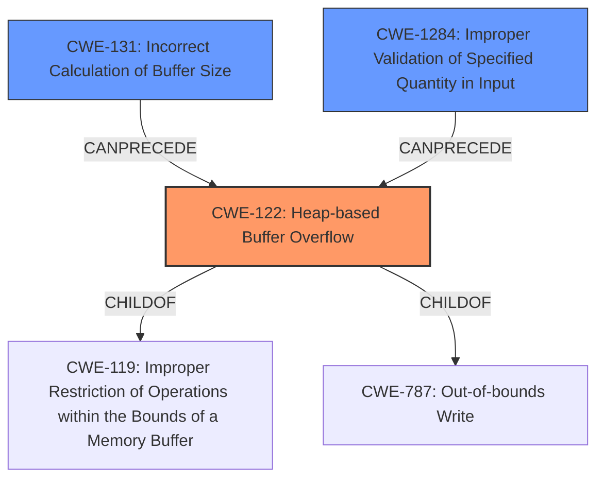

# Final Resolution for CVE-2021-41987

# Summary
| CWE ID | CWE Name | Confidence | CWE Abstraction Level | CWE Vulnerability Mapping Label | CWE-Vulnerability Mapping Notes |
|---|---|---|---|---|---|
| CWE-122 | Heap-based Buffer Overflow | 0.95 | Variant | Allowed | Primary CWE: The vulnerability is explicitly described as a heap-based buffer overflow. |
| CWE-131 | Incorrect Calculation of Buffer Size | 0.75 | Base | Allowed | Secondary Candidate: The root cause is identified as a miscalculation of the buffer size during Base64 decoding. |
| CWE-1284 | Improper Validation of Specified Quantity in Input | 0.60 | Base | Allowed | Secondary Candidate: Input buffer length not validated against base64 encoding rules. |

## Evidence and Confidence

*   **Confidence Score:** 0.85
*   **Evidence Strength:** HIGH

## Relationship Analysis
The primary weakness is a **CWE-122 (Heap-based Buffer Overflow)**, which is a variant of **CWE-119 (Improper Restriction of Operations within the Bounds of a Memory Buffer)**. The root cause of this overflow is **CWE-131 (Incorrect Calculation of Buffer Size)**, which directly leads to the heap overflow. A contributing factor could be **CWE-1284 (Improper Validation of Specified Quantity in Input)**, where the input buffer length is not validated against the requirements for Base64 encoding, but this is less certain based on the current evidence. **CWE-787 (Out-of-bounds Write)** is a parent of **CWE-122**, but **CWE-122** is a more specific variant that applies directly, so it is preferred.

## Vulnerability Chain
The vulnerability chain starts with the **ROOTCAUSE** of **CWE-131 (Incorrect Calculation of Buffer Size)** in the `base64Decode` function. This results in an undersized buffer being allocated on the heap. The subsequent Base64 decoding process then writes data beyond the allocated buffer, leading to **CWE-122 (Heap-based Buffer Overflow)**. If the input length is not validated to adhere to Base64 encoding rules, this contributes via **CWE-1284 (Improper Validation of Specified Quantity in Input)** to the **CWE-122**. The heap overflow allows an attacker to overwrite heap metadata, potentially leading to the overwriting of a vtable pointer and ultimately achieving remote code execution.

## Summary of Analysis
The initial analysis and criticism were both accurate. The vulnerability description clearly states a **heap-based buffer overflow**, making **CWE-122** the most appropriate primary classification. The CVE Reference Links Content Summary confirms that a miscalculation in the `base64Decode` function leads to an undersized buffer allocation, confirming **CWE-131** as a contributing factor.

The graph relationships influenced the final selection by emphasizing the importance of specificity. While **CWE-787** is a parent of **CWE-122**, choosing **CWE-122** provides a more precise classification.

The suggestion to consider **CWE-1284** is reasonable. If the `input_buffer_length` is not validated to adhere to Base64 encoding rules (e.g., length must be a multiple of 4), this would contribute to the vulnerability. Therefore, I am adding **CWE-1284** as a secondary candidate.

The selected CWEs are at the optimal level of specificity because they directly reflect the technical details of the vulnerability. **CWE-122** accurately describes the type of buffer overflow (heap-based), while **CWE-131** identifies the root cause (incorrect buffer size calculation). **CWE-1284** adds further context regarding missing input validation.

The evidence provided supports the classification with high confidence. The vulnerability description explicitly mentions a **heap-based buffer overflow**, and the CVE summary details the flawed buffer size calculation in the `base64Decode` function.