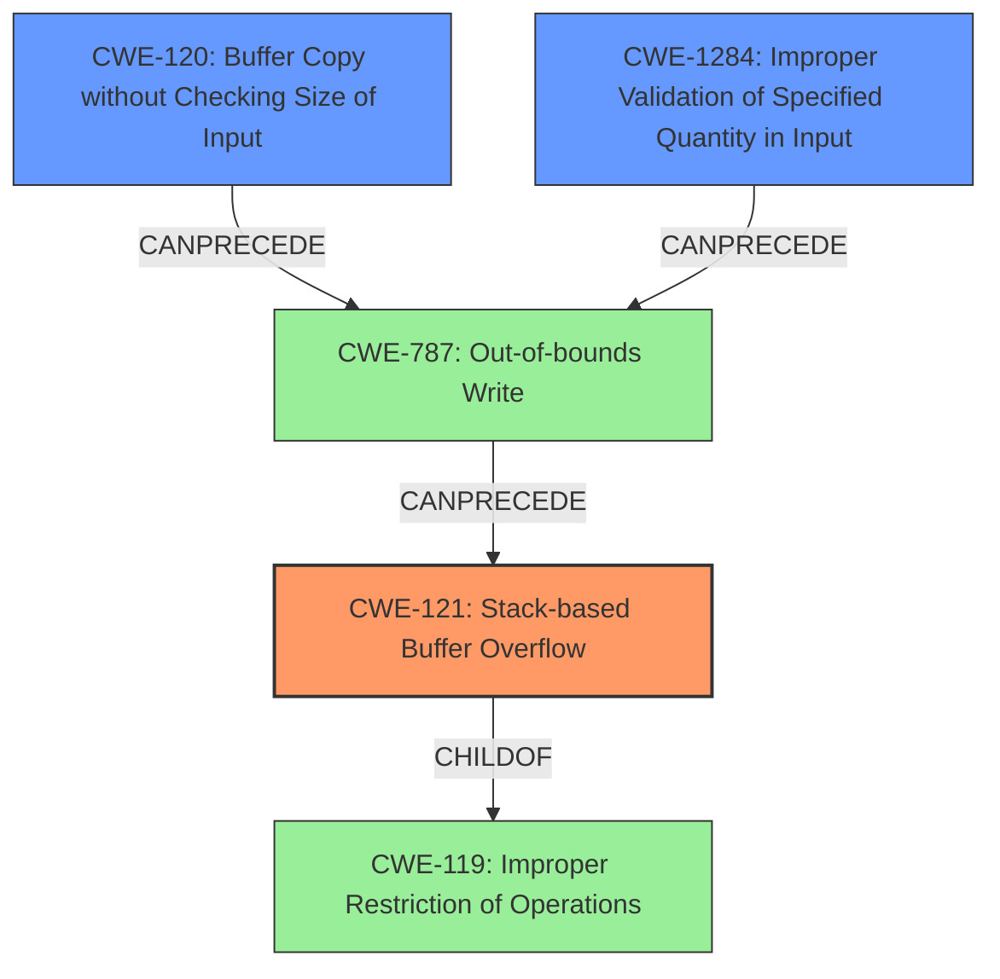

# Final Resolution for CVE-2021-42059

# Summary
| CWE ID | CWE Name | Confidence | CWE Abstraction Level | CWE Vulnerability Mapping Label | CWE-Vulnerability Mapping Notes |
|---|---|---|---|---|---|
| CWE-121 | Stack-based Buffer Overflow | 0.95 | Variant | Allowed | Primary CWE |
| CWE-120 | Buffer Copy without Checking Size of Input ('Classic Buffer Overflow') | 0.75 | Base | Allowed-with-Review | Secondary Candidate |
| CWE-1284 | Improper Validation of Specified Quantity in Input | 0.65 | Base | Allowed | Secondary Candidate |

## Evidence and Confidence

*   **Confidence Score:** 0.85
*   **Evidence Strength:** MEDIUM

## Relationship Analysis
The primary weakness is CWE-121 **Stack-based Buffer Overflow**, a variant of CWE-119 **Improper Restriction of Operations within the Bounds of a Memory Buffer**. The analysis moves away from CWE-119 due to its broad nature. The root cause is identified as either CWE-120 **Buffer Copy without Checking Size of Input** or CWE-1284 **Improper Validation of Specified Quantity in Input**, reflecting potential causes for the overflow. CWE-120 can precede CWE-787 **Out-of-bounds Write** which then leads to CWE-121.

## Vulnerability Chain
The vulnerability chain starts with either CWE-120 (**Buffer Copy without Checking Size of Input**) or CWE-1284 (**Improper Validation of Specified Quantity in Input**) leading to CWE-787 (**Out-of-bounds Write**) which results in CWE-121 (**Stack-based Buffer Overflow**). The initial **WEAKNESS** lies in inadequate input validation or unchecked buffer copies. The subsequent **WEAKNESS** is writing beyond buffer boundaries, culminating in a **stack-based buffer overflow**, which allows for arbitrary code execution.

## Summary of Analysis
The initial analysis correctly identified CWE-121 (**Stack-based Buffer Overflow**) as the primary **WEAKNESS**. The criticism highlighted the need to explore potential root causes and contributing factors more thoroughly. Based on the retriever results and further analysis, CWE-120 (**Buffer Copy without Checking Size of Input**) and CWE-1284 (**Improper Validation of Specified Quantity in Input**) are added as secondary candidates, representing potential root causes. The decision to include these is supported by the vulnerability description, which indicates a buffer overflow, and the knowledge that these CWEs often lead to such overflows. The retriever scores also support this decision.

The evidence from the vulnerability description is: "A stack-based buffer overflow leads to arbitrary code execution in UEFI DisplayTypeDxe DXE driver." This directly supports the selection of CWE-121. The relationships between the CWEs, particularly the CANPRECEDE relationship of CWE-120 and CWE-1284 to CWE-787 (**Out-of-bounds Write**), further justifies their inclusion. The mapping guidance for CWE-121 is "ALLOWED", and for CWE-120 is "Allowed-with-Review".

The selected CWEs are at the optimal level of specificity because CWE-121 accurately describes the type and location of the buffer overflow, while CWE-120 and CWE-1284 identify potential underlying causes. Using CWE-119 (**Improper Restriction of Operations within the Bounds of a Memory Buffer**) would be too general, as it doesn't provide specific information about the stack location or the potential causes of the overflow.