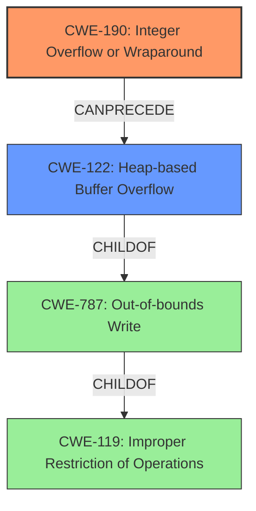

# Final Resolution for CVE-2021-4206

# Summary
| CWE ID | CWE Name | Confidence | CWE Abstraction Level | CWE Vulnerability Mapping Label | CWE-Vulnerability Mapping Notes |
|---|---|---|---|---|---|
| **CWE-190** | **Integer Overflow or Wraparound** | 0.95 | Base | Allowed | Primary CWE: The **integer overflow** is the root cause, leading to a heap overflow. |
| **CWE-122** | **Heap-based Buffer Overflow** | 0.95 | Variant | Allowed | Secondary CWE: The integer overflow results in a small allocation, leading to a **heap-based buffer overflow** when the system writes past the allocated buffer. |

## Evidence and Confidence

*   **Confidence Score:** 0.95
*   **Evidence Strength:** HIGH

## Relationship Analysis
The analysis correctly identifies CWE-190 as the **root cause**, which **CanPrecede** CWE-122. CWE-122 is a variant of CWE-787 (Out-of-bounds Write), which is a child of CWE-119 (Improper Restriction of Operations within the Bounds of a Memory Buffer). The hierarchical relationships highlight the flow from a general buffer issue (CWE-119) to a specific out-of-bounds write (CWE-787) that manifests as a heap overflow (CWE-122), driven by an initial integer overflow (CWE-190). Abstraction levels are appropriate, with CWE-190 at the Base level and CWE-122 at the Variant level, providing a detailed yet focused view of the vulnerability.

## Vulnerability Chain
The vulnerability chain starts with **CWE-190 (Integer Overflow or Wraparound)** in the cursor_alloc() function. This leads to an undersized buffer allocation on the heap. Subsequently, when data is written to this buffer, it overflows the allocated space, resulting in **CWE-122 (Heap-based Buffer Overflow)**. The root cause is the integer overflow, and the impact is the heap overflow, allowing a malicious guest user to crash the QEMU process or potentially execute arbitrary code. There are no missing links in the chain.

## Summary of Analysis
The initial analysis correctly identifies **CWE-190 (Integer Overflow or Wraparound)** as the primary **weakness** and **CWE-122 (Heap-based Buffer Overflow)** as the secondary **weakness**. This assessment is based on the vulnerability description: "An **integer overflow** in the cursor_alloc() function can lead to the allocation of a small cursor object followed by a subsequent **heap-based buffer overflow**." The graph relationships confirm that CWE-190 can precede CWE-122, and the abstraction levels are appropriate for identifying the root cause and its direct consequence. Alternative CWEs like CWE-1284 (Improper Validation of Specified Quantity in Input) were considered but deemed less relevant because the primary issue wasn't the lack of input validation but the integer overflow itself. The selected CWEs are at the optimal level of specificity, providing a clear and accurate representation of the vulnerability.