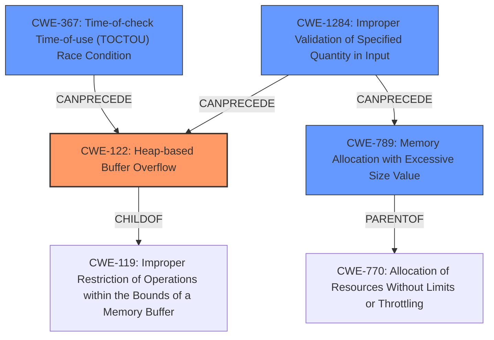

# Final Resolution for CVE-2021-4207

# Summary
| CWE ID | CWE Name | Confidence | CWE Abstraction Level | CWE Vulnerability Mapping Label | CWE-Vulnerability Mapping Notes |
|---|---|---|---|---|---|
| CWE-122 | Heap-based Buffer Overflow | 0.9 | Variant | Allowed | Primary CWE: The vulnerability results in a **heap-based buffer overflow** due to a **double fetch** of guest-controlled values, leading to an undersized allocation and subsequent overflow. |
| CWE-367 | Time-of-check Time-of-use (TOCTOU) Race Condition | 0.8 | Base | Allowed | Secondary CWE: The **double fetch** operation introduces a **race condition**, as the values can change between the check and the use. |
| CWE-1284 | Improper Validation of Specified Quantity in Input | 0.6 | Base | Allowed | Contributing CWE: Guest-controlled width and height values are not adequately validated before allocation. |
| CWE-789 | Memory Allocation with Excessive Size Value | 0.5 | Variant | Allowed | Contributing CWE: Memory is allocated based on untrusted guest input without proper size validation. |

## Evidence and Confidence

*   **Confidence Score:** 0.85
*   **Evidence Strength:** HIGH

## Relationship Analysis
The primary weakness is a **heap-based buffer overflow (CWE-122)**, a variant of the more general **CWE-119 (Improper Restriction of Operations within the Bounds of a Memory Buffer)**. The **double fetch** operation leads to a **Time-of-check Time-of-use (TOCTOU) Race Condition (CWE-367)**, where the values of `width` and `height` can change between the check and the use, which **can precede** the **buffer overflow**. Additionally, **CWE-1284 (Improper Validation of Specified Quantity in Input)** and **CWE-789 (Memory Allocation with Excessive Size Value)** are included as contributing factors, highlighting the lack of input validation. **CWE-789** is a parent of **CWE-770**.

## Vulnerability Chain
The vulnerability chain starts with the **improper validation of guest-controlled width and height values (CWE-1284)**. These values are then used in a **Time-of-check Time-of-use (TOCTOU) Race Condition (CWE-367)** due to the **double fetch**, where the values can change between the checks and the actual memory allocation. This can lead to an undersized allocation, resulting in a **Heap-based Buffer Overflow (CWE-122)** when data is written beyond the allocated buffer. **CWE-789** contributes by allowing memory allocation based on untrusted input without proper size validation.

## Summary of Analysis
The initial analysis correctly identified **CWE-122 (Heap-based Buffer Overflow)** as the primary issue. The criticism suggested replacing **CWE-362 (Race Condition)** with **CWE-367 (Time-of-check Time-of-use (TOCTOU) Race Condition)**, which is a more precise characterization of the race condition due to the **double fetch**. The criticism also proposed adding **CWE-1284 (Improper Validation of Specified Quantity in Input)** and **CWE-789 (Memory Allocation with Excessive Size Value)** as contributing factors.

The vulnerability description explicitly mentions a **heap-based buffer overflow** and a **double fetch** of guest-controlled values. The **double fetch** clearly indicates a **Time-of-check Time-of-use (TOCTOU) Race Condition (CWE-367)**, making it more appropriate than the general **CWE-362 (Race Condition)**. The lack of validation of the guest-controlled values directly contributes to the vulnerability, justifying the inclusion of **CWE-1284 (Improper Validation of Specified Quantity in Input)**. **CWE-789** is relevant because the untrusted input is used to determine the size of the memory allocation.

The selection of **CWE-122** as the primary CWE is at the optimal level of specificity, as it accurately reflects the **heap-based buffer overflow** condition. **CWE-367**, **CWE-1284**, and **CWE-789** are included to provide a more comprehensive understanding of the vulnerability chain, from the initial lack of input validation to the final **buffer overflow**.
The confidence score is increased to 0.85 to reflect the more precise CWE selections and the identification of contributing factors.