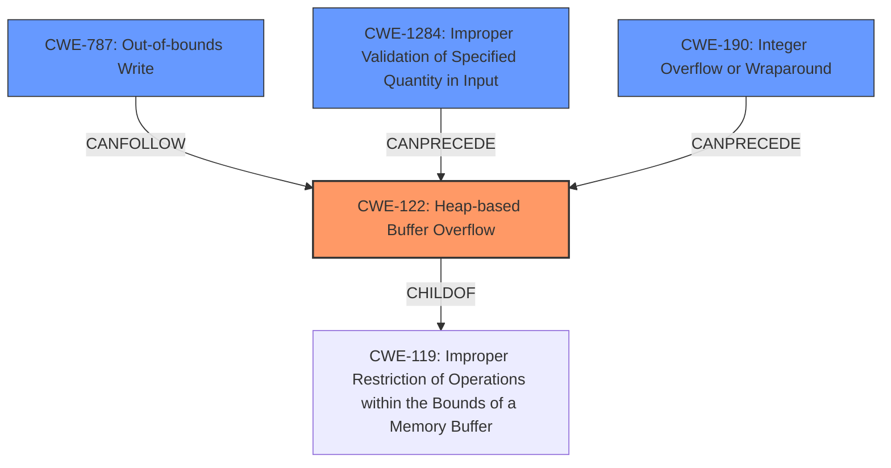

# Final Resolution for CVE-2021-4214

# Summary
| CWE ID  | CWE Name                                        | Confidence | CWE Abstraction Level | CWE Vulnerability Mapping Label | CWE-Vulnerability Mapping Notes                                                                                                                      |
| ------- | ----------------------------------------------- | ---------- | --------------------- | --------------------------------- | ------------------------------------------------------------------------------------------------------------------------------------------------- |
| CWE-122 | Heap-based Buffer Overflow                       | 0.90       | Variant               | Allowed                           | The vulnerability is explicitly described as a **heap overflow**, making CWE-122 the most accurate primary mapping.                                 |
| CWE-787 | Out-of-bounds Write                              | 0.70       | Base                  | Allowed                           | The **heap overflow** leads to writing beyond the allocated buffer.                                                                               |
| CWE-1284 | Improper Validation of Specified Quantity in Input | 0.60       | Base                  | Allowed                           | A specially crafted PNG is passed, implying the quantity is not correctly validated. This leads to allocating too little memory for the image data. |
| CWE-190 | Integer Overflow or Wraparound                    | 0.40        | Base                  | Allowed                           | A hardcoded length value may lead to an integer overflow or wraparound, causing a value smaller than expected to be allocated on the heap.                      |

  - The Primary CWE should be first and noted as the Primary CWEs
  - The secondary candidate CWEs should be next and noted as secondary candidates.
  - The confidence is a confidence score 0 to 1 to rate your confidence in your assessment for that CWE.
  - The CWE Abstraction Level as one of these values: Base, Variant, Pillar, Class, Compound
  - The Mapping Notes Usage as one of these values: Allowed, Allowed-with-Review, Prohibited, Discouraged

## Evidence and Confidence

*   **Confidence Score:** 0.85
*   **Evidence Strength:** HIGH

## Relationship Analysis
The primary CWE is CWE-122 (**heap overflow**), which is a variant of the more general CWE-119 (Improper Restriction of Operations within the Bounds of a Memory Buffer). The **heap overflow** leads to CWE-787 (Out-of-bounds Write). CWE-1284 (Improper Validation of Specified Quantity in Input) can precede CWE-787 as the root cause for the **heap overflow** if the quantity/size of the PNG data is not validated. CWE-190 (Integer Overflow or Wraparound) is included as a possibility if integer calculations for buffer allocation result in a smaller than expected buffer. Choosing CWE-122 provides a balance between specificity and broad applicability, as it directly describes the vulnerability while remaining at a suitable level of abstraction. CWE-119 is avoided as the primary because it is too general.

## Vulnerability Chain
The vulnerability chain starts with a specially crafted PNG file (CWE-1284) leading to an improperly calculated or validated size. If the size calculation involves integer arithmetic and it overflows (CWE-190), this can cause a smaller-than-expected buffer allocation on the heap (CWE-122). This undersized buffer then gets overwritten, leading to an out-of-bounds write (CWE-787), which causes the application to crash and results in a denial of service.

## Summary of Analysis
The initial analysis correctly identified CWE-122 as the primary weakness due to the explicit mention of "**heap overflow**" in the vulnerability description: "A **heap overflow** flaw was found in libpngs pngimage.c program." The inclusion of CWE-787 and CWE-1284 is also justified. The suggestion to include CWE-190 has merit, as there is a possibility that an integer overflow in size calculations contributes to the **heap overflow**, however, this is speculative based on the description, and therefore assigned a lower confidence score.

The graph relationships reinforce the selection of CWE-122 as the primary, as it is the direct result of the input validation failure (CWE-1284) and/or integer overflow (CWE-190), and leads to the out-of-bounds write (CWE-787). The abstraction levels are appropriate: CWE-122 is a Variant, providing sufficient specificity. CWE-787, CWE-1284 and CWE-190 are base level.

The selected CWEs are at the optimal level of specificity because they accurately reflect the root cause (improper validation and potential integer overflow) and the direct consequence (**heap overflow** and out-of-bounds write) of the vulnerability.