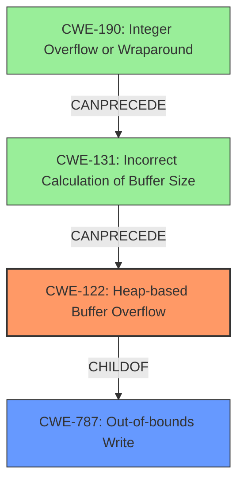

# Final Resolution for CVE-2021-42199

# Summary
| CWE ID | CWE Name | Confidence | CWE Abstraction Level | CWE Vulnerability Mapping Label | CWE-Vulnerability Mapping Notes |
|---|---|---|---|---|---|
| CWE-122 | Heap-based Buffer Overflow | 0.95 | Variant | Allowed | Primary CWE: The vulnerability is explicitly described as a heap-based buffer overflow. |
| CWE-787 | Out-of-bounds Write | 0.70 | Base | Allowed | Secondary Candidate: Parent of CWE-122. While applicable, CWE-122 provides a more specific description of the vulnerability. |
| CWE-131 | Incorrect Calculation of Buffer Size | 0.30 | Base | Allowed | Secondary Candidate: Possible contributing factor if the code incorrectly calculates the size of the heap buffer, leading to the overflow. Requires further code analysis for confirmation. |
| CWE-190 | Integer Overflow or Wraparound | 0.20 | Base | Allowed | Secondary Candidate: Could be related to the buffer overflow if the size calculation involves an integer overflow. Requires further code analysis. |

## Evidence and Confidence

*   **Confidence Score:** 0.90
*   **Evidence Strength:** MEDIUM

## Relationship Analysis
The primary CWE is CWE-122 (**Heap-based Buffer Overflow**), which is a variant of the base CWE CWE-787 (**Out-of-bounds Write**). CWE-131 (**Incorrect Calculation of Buffer Size**) and CWE-190 (**Integer Overflow or Wraparound**) could potentially precede CWE-122 in a vulnerability chain if the buffer size calculation is flawed. The abstraction levels influenced the selection by prioritizing the most specific CWE (CWE-122) while acknowledging its relationship to the more general CWE-787.

## Vulnerability Chain
The vulnerability chain starts potentially with an incorrect calculation of the buffer size (**ROOTCAUSE**: CWE-131 or CWE-190 if integer overflow is involved in the size calculation). This leads to a **WEAKNESS**: Heap-based Buffer Overflow (CWE-122), where data is written beyond the allocated memory region. The **IMPACT** is potential code execution. Further code analysis would be required to confirm the involvement of CWE-131 and/or CWE-190.

## Summary of Analysis
The initial analysis correctly identified CWE-122 (**Heap-based Buffer Overflow**) as the primary **WEAKNESS** based on the explicit description in the vulnerability report: "A **heap buffer overflow** exists in the function swf_FontExtract_DefineTextCallback() located in swftext.c. It allows an attacker to cause code execution."

The criticism suggested considering CWE-787 (**Out-of-bounds Write**), CWE-131 (**Incorrect Calculation of Buffer Size**), and CWE-190 (**Integer Overflow or Wraparound**). I agree that while CWE-787 is a valid parent, CWE-122 provides more specificity. CWE-131 and CWE-190 are potential contributing factors, but require further code analysis to confirm if the size calculation within `swf_FontExtract_DefineTextCallback` is flawed.

The graph relationships influenced the decision by highlighting the hierarchical relationship between CWE-122 and CWE-787, emphasizing the importance of selecting the most specific CWE. The potential chain relationships involving CWE-131 and CWE-190 were also considered.

The selected CWEs are at the optimal level of specificity based on the available evidence. CWE-122 directly matches the reported vulnerability type. While CWE-787 is a parent, it is less descriptive. The inclusion of CWE-131 and CWE-190 as secondary candidates acknowledges potential contributing factors that could be confirmed with further analysis.