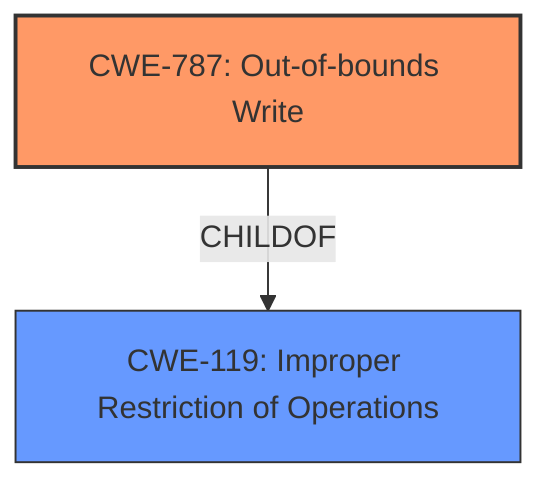

# Final Resolution for CVE-2021-42526

# Summary
| CWE ID | CWE Name | Confidence | CWE Abstraction Level | CWE Vulnerability Mapping Label | CWE-Vulnerability Mapping Notes |
|---|---|---|---|---|---|
| CWE-787 | Out-of-bounds Write | 0.9 | Base | Primary | Allowed |
| CWE-119 | Improper Restriction of Operations within the Bounds of a Memory Buffer | 0.5 | Class | Secondary | Discouraged |

## Evidence and Confidence

*   **Confidence Score:** 0.9
*   **Evidence Strength:** HIGH

## Relationship Analysis
The primary relationship influencing the decision is the parent-child relationship between CWE-119 (Improper Restriction of Operations within the Bounds of a Memory Buffer) and CWE-787 (Out-of-bounds Write). CWE-787 is a child of CWE-119, providing a more specific description of the **weakness**. This specificity is crucial because the vulnerability description explicitly mentions an "out-of-bounds write," making CWE-787 a more accurate representation of the **root cause**. The chain relationships (CANPRECEDE, CANFOLLOW) are less relevant in this direct classification, but they highlight potential consequences and related vulnerabilities. The abstraction levels also guided the selection, favoring the Base level CWE-787 over the Class level CWE-119.

## Vulnerability Chain
The vulnerability chain starts with the **insecure handling** of a malicious file. This leads to an **out-of-bounds write** (CWE-787), which corrupts memory. The corrupted memory can then lead to arbitrary code execution. Therefore, the chain is: Malicious File -> **Out-of-bounds Write** (CWE-787) -> Memory Corruption -> Arbitrary Code Execution. The **root cause** is the **insecure handling** that allows the **out-of-bounds write** to occur.

## Summary of Analysis
The initial analysis and criticism both correctly identify CWE-787 (Out-of-bounds Write) as the primary CWE. The decision is strongly supported by the vulnerability description and the "CVE Reference Links Content Summary," which explicitly mentions "Access of Memory Location After End of Buffer" and "**Out-of-bounds write**". The relationship analysis, particularly the child-of relationship between CWE-787 and CWE-119, reinforces the choice of the more specific CWE-787. The abstraction level (Base) of CWE-787 further supports its selection. The decision to assign CWE-119 as secondary with a lower confidence is based on its broader nature and the MITRE guidance that discourages its use when more specific CWEs are available. The selection of CWE-787 is at the optimal level of specificity, accurately reflecting the technical details of the vulnerability.