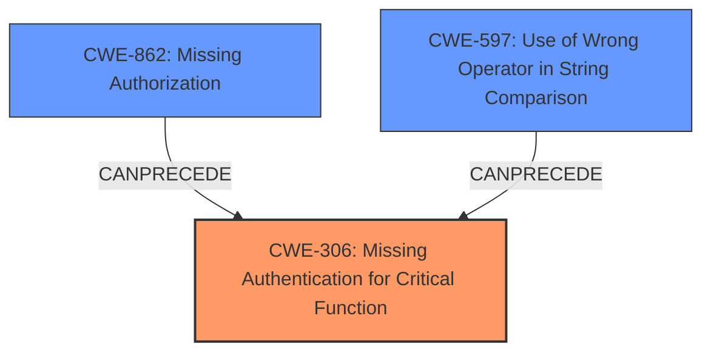

# Final Resolution for CVE-2021-42557

# Summary
| CWE ID | CWE Name | Confidence | CWE Abstraction Level | CWE Vulnerability Mapping Label | CWE-Vulnerability Mapping Notes |
|---|---|---|---|---|---|
| CWE-306 | Missing Authentication for Critical Function | 0.9 | Base | Primary | Allowed |
| CWE-862 | Missing Authorization | 0.7 | Class | Secondary | Allowed-with-Review |
| CWE-597 | Use of Wrong Operator in String Comparison | 0.7 | Variant | Secondary | Allowed |

## Evidence and Confidence

*   **Confidence Score:** 0.8
*   **Evidence Strength:** HIGH

## Relationship Analysis
The primary weakness is **CWE-306 (Missing Authentication for Critical Function)**, which is a Base level CWE and directly addresses the core issue of absent authentication. **CWE-597 (Use of Wrong Operator in String Comparison)** is a Variant level CWE that explains the specific mechanism by which authentication is bypassed (type juggling via loose comparison). **CWE-862 (Missing Authorization)** is a Class level CWE that accurately describes the immediate consequence of the authentication bypass, which is the absence of proper authorization checks.

## Vulnerability Chain
The vulnerability chain starts with **CWE-597 (Use of Wrong Operator in String Comparison)**, which allows an attacker to bypass authentication (**CWE-306 (Missing Authentication for Critical Function)**). This leads to **CWE-862 (Missing Authorization)**, because after the authentication bypass there is no authorization that occurs, resulting in unauthorized access to sensitive user credentials. The final impact is the retrieval of these credentials, leading to a loss of confidentiality.

## Summary of Analysis
The initial analysis correctly identified **CWE-306 (Missing Authentication for Critical Function)** and **CWE-597 (Use of Wrong Operator in String Comparison)**. However, the inclusion of **CWE-200 (Exposure of Sensitive Information to an Unauthorized Actor)** was questionable because it's a high-level impact rather than a root cause.

The criticism suggested replacing **CWE-200 (Exposure of Sensitive Information to an Unauthorized Actor)** with **CWE-862 (Missing Authorization)**, which is a more accurate representation of the authorization failure that occurs after the authentication bypass. This is based on the evidence that the type juggling effectively bypasses the authentication routine, leading to *no* authorization check being done for the API call.

The graph relationships support this decision, as **CWE-597 (Use of Wrong Operator in String Comparison)** directly precedes **CWE-306 (Missing Authentication for Critical Function)**, which in turn leads to **CWE-862 (Missing Authorization)**.

The selected CWEs are at the optimal level of specificity. **CWE-306 (Missing Authentication for Critical Function)** is a Base level CWE that directly addresses the core issue. **CWE-597 (Use of Wrong Operator in String Comparison)** is a Variant level CWE that explains the specific mechanism of the bypass. **CWE-862 (Missing Authorization)** is a Class level CWE that represents the immediate consequence of the failed authentication.

The vulnerability description states that "a **bug** allows a remote attacker to bypass API access and retrieve users credentials." This directly supports the selection of **CWE-306 (Missing Authentication for Critical Function)** and **CWE-862 (Missing Authorization)**. The CVE reference summary highlights the root cause as a "**type juggling issue** due to the use of a loose comparison (`==`) instead of a strict comparison (`===`) in the `jeedom::apiAccess` function," which directly supports the selection of **CWE-597 (Use of Wrong Operator in String Comparison)**.