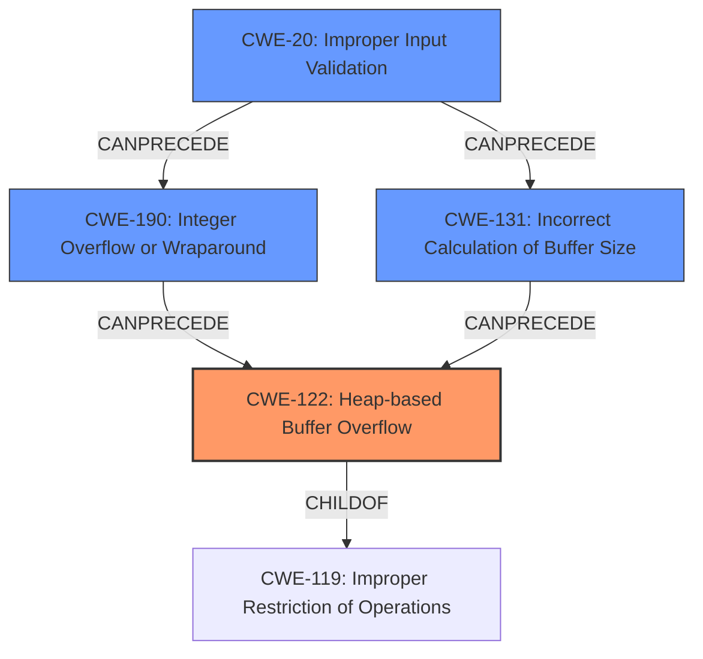

# Analysis Report for CVE-2021-42585

# Vulnerability Analysis Report: CVE-2021-42585

## Description

A heap buffer overflow was discovered in copy_compressed_bytes in decode_r2007.c in dwgread before 0.12.4 via a crafted dwg file.

## Vulnerability Description Key Phrases

**Weakness:** heap buffer overflow
**Vector:** crafted dwg file
**Product:** dwgread
**Version:** before 0.12.4
**Component:** copy_compressed_bytes in decode_r2007.c

## Analysis (with Relationship Data)

# Summary
| CWE ID  | CWE Name                    | Confidence | CWE Abstraction Level | CWE Vulnerability Mapping Label | CWE-Vulnerability Mapping Notes |
|---------|-----------------------------|------------|-----------------------|---------------------------------|-----------------------------------|
| CWE-122 | Heap-based Buffer Overflow  | 0.95       | Variant               | Allowed                         | Primary CWE                       |
| CWE-190 | Integer Overflow or Wraparound | 0.60       | Base                 | Allowed                         | Secondary Candidate               |
| CWE-131 | Incorrect Calculation of Buffer Size | 0.50       | Base                 | Allowed                         | Secondary Candidate               |

## Evidence and Confidence

*   **Confidence Score:** 0.90
*   **Evidence Strength:** HIGH

- **Analysis and Justification:**  
  - *Explanation:* The vulnerability description explicitly states "**heap buffer overflow**" in `copy_compressed_bytes`. The CVE Reference Links Content Summary confirms this, stating "The primary vulnerability is a heap buffer overflow, where the `memcpy` function writes data past the allocated buffer." This aligns directly with CWE-122 (Heap-based Buffer Overflow), a Variant of buffer overflow that occurs in the heap portion of memory. The description mentions an incorrect calculation of buffer size which may have lead to the overflow. The MITRE mapping guidance for CWE-122 indicates this is ALLOWED for heap overflow vulnerabilities.
  
  - *Relationship Analysis:* CWE-122 is a variant of CWE-119 (Improper Restriction of Operations within the Bounds of a Memory Buffer). It's also related to memory management and allocation issues. The incorrect buffer size calculation could potentially be linked to CWE-131, or an integer overflow (CWE-190) during the size calculation, making these secondary considerations.

- **Confidence Score:**  
  - Confidence: 0.95 (High evidence from technical description and CVE reference materials)

- **Analysis and Justification for Secondary Candidates:**
  - *Explanation:* The root cause description states, "The overflow occurs due to an incorrect calculation of buffer size when decompressing data." This incorrect calculation could be due to an integer overflow, which aligns with CWE-190 (Integer Overflow or Wraparound). If the size calculation wraps around, it could lead to a smaller-than-expected buffer allocation, resulting in a heap overflow when more data is written than allocated. While not explicitly stated, it's a plausible contributing factor.
  - Confidence: 0.60

- *Explanation:* The description also indicates the possibility of CWE-131 (Incorrect Calculation of Buffer Size) since the buffer size was incorrectly calculated. CWE-131 can lead to buffer overflows.
  - Confidence: 0.50

---

## Criticism of Analysis

Okay, here's a review of the analysis, considering the full CWE specifications provided:

**Overall Assessment:**

The analysis is generally good and well-justified. The primary CWE selection (CWE-122) is appropriate and backed by strong evidence. The secondary CWE candidates (CWE-190 and CWE-131) are plausible contributing factors, and the confidence scores assigned to them reflect the degree of certainty based on the available information. However, there is some room for improvement in terms of considering alternative perspectives or chain mappings, particularly when looking at the root cause from a more abstract level.

**Detailed Review:**

*   **CWE-122 (Heap-based Buffer Overflow) - Primary CWE:**

    *   **Selection Justification:** Excellent. The vulnerability description clearly states "heap buffer overflow," and the ASAN report confirms an out-of-bounds write in the heap. The `memcpy` operation exceeding the allocated buffer is a textbook example of this CWE.
    *   **Mapping Guidance:** The mapping guidance for CWE-122 is "Allowed" and "Acceptable-Use," which aligns perfectly with the situation.
    *   **Potential Mitigations:**
        *   The analysis could briefly mention some of the mitigations listed in the CWE specification, such as using memory-safe languages or libraries, or enabling compiler-based buffer overflow detection (e.g., /GS flag in Visual Studio). This would strengthen the analysis by showing consideration of preventative measures.
    *   **Observed Examples:** The analysis includes some good observed examples of CWE-122, and specifically chains that include Integer Overflow (CWE-190).
    *   **Confidence:** The 0.95 confidence score is appropriate given the explicit nature of the vulnerability.

*   **CWE-190 (Integer Overflow or Wraparound) - Secondary CWE:**

    *   **Selection Justification:** Reasonable. The description mentions an "incorrect calculation of buffer size," which *could* be caused by an integer overflow. The analysis rightly acknowledges that this is a plausible contributing factor but not explicitly stated.  The chain example `CVE-2021-43537` is a good example of CWE-190 leading to CWE-122.
    *   **Mapping Guidance:** The mapping guidance for CWE-190 is "Allowed" and "Acceptable-Use."
    *   **Potential Mitigations:**
        *   The analysis is missing mitigations of CWE-190. The analysis could briefly mention some mitigations, such as using range checks or safe integer libraries.
    *   **Observed Examples:** It's helpful to link to CVEs where CWE-190 directly contributes to a heap overflow.
    *   **Confidence:** A confidence score of 0.60 is fair, reflecting the uncertainty.

*   **CWE-131 (Incorrect Calculation of Buffer Size) - Secondary CWE:**

    *   **Selection Justification:** This is also a reasonable secondary candidate. The vulnerability description mentions an "incorrect calculation of buffer size when decompressing data." This directly relates to CWE-131.
    *   **Mapping Guidance:** The mapping guidance for CWE-131 is "Allowed" and "Acceptable-Use."
    *   **Potential Mitigations:**
        *   The analysis is missing mitigations of CWE-131. The analysis could briefly mention the mitigations in CWE-131 such as allocating for the largest possible encoding, or validating range limits.
    *   **Observed Examples:** The analysis should search for examples of CWE-131 leading to CWE-787 or CWE-122 for better chain analysis.
    *   **Confidence:** A confidence score of 0.50 is acceptable, as it's a contributing factor that is less certain than the primary CWE.

**Recommendations for Improvement:**

1.  **Chain Mapping Considerations:** While the individual CWEs are well-chosen, consider a chain mapping perspective.  The root cause might be framed as:
    *   CWE-20 (Improper Input Validation) -> CWE-190 (Integer Overflow) -> CWE-131 (Incorrect Buffer Size Calculation) -> CWE-122 (Heap-based Buffer Overflow). This chain highlights how a malicious DWG file could inject a large size, trigger an integer overflow, leading to a too-small buffer allocation, and ultimately a heap overflow.
    *   CWE-20 (Improper Input Validation) -> CWE-130 (Improper Handling of Length Parameter Inconsistency) -> CWE-122 (Heap-based Buffer Overflow)
    By framing as a chain, more context can be given to the source input from the crafted file. The score for the chain can be reduced if there is not enough information to make the conclusions.

2.  **Mitigation Inclusion:** As noted above, add a brief mention of potential mitigations for CWE-190 and CWE-131 to strengthen the analysis.
3.  **Review Top Combined Results:** A quick glance over the Top Combined Results shows that Off-by-One errors (CWE-193) may be relevant. Even though it is unlikely, this should be investigated and ruled out.
4.  **CWE-119 Avoidance:** The analysis correctly avoids directly mapping to CWE-119, recognizing it as a broad category and opting for more specific CWEs. This demonstrates a good understanding of CWE mapping principles.

**Revised Table:**

| CWE ID  | CWE Name                    | Confidence | CWE Abstraction Level | CWE Vulnerability Mapping Label | CWE-Vulnerability Mapping Notes |
|---------|-----------------------------|------------|-----------------------|---------------------------------|-----------------------------------|
| CWE-122 | Heap-based Buffer Overflow  | 0.95       | Variant               | Allowed                         | Primary CWE                       |
| CWE-190 | Integer Overflow or Wraparound | 0.60       | Base                 | Allowed                         | Secondary Candidate               |
| CWE-131 | Incorrect Calculation of Buffer Size | 0.50       | Base                 | Allowed                         | Secondary Candidate               |
| CWE-20 | Improper Input Validation | 0.30       | Class                 | Discouraged                         | Chain Mapping                     |

**Conclusion:**

This is a solid analysis, and the primary CWE selection is correct. By incorporating chain mapping considerations, mitigations, and addressing the Top Combined Results, the analysis can be made even more comprehensive.

## Final Resolution

# Summary
| CWE ID  | CWE Name                    | Confidence | CWE Abstraction Level | CWE Vulnerability Mapping Label | CWE-Vulnerability Mapping Notes |
|---------|-----------------------------|------------|-----------------------|---------------------------------|-----------------------------------|
| CWE-122 | Heap-based Buffer Overflow  | 0.95       | Variant               | Allowed                         | Primary CWE                       |
| CWE-190 | Integer Overflow or Wraparound | 0.60       | Base                 | Allowed                         | Secondary Candidate               |
| CWE-131 | Incorrect Calculation of Buffer Size | 0.50       | Base                 | Allowed                         | Secondary Candidate               |
| CWE-20 | Improper Input Validation | 0.30       | Class                 | Discouraged                         | Chain Mapping                     |

## Evidence and Confidence

*   **Confidence Score:** 0.90
*   **Evidence Strength:** HIGH

## Relationship Analysis
The primary CWE is CWE-122 (**CWE-122: Heap-based Buffer Overflow**), a variant of CWE-119 (**CWE-119: Improper Restriction of Operations within the Bounds of a Memory Buffer**). The secondary candidates, CWE-190 (**CWE-190: Integer Overflow or Wraparound**) and CWE-131 (**CWE-131: Incorrect Calculation of Buffer Size**), can precede CWE-122, contributing to the vulnerability chain. CWE-20 (**CWE-20: Improper Input Validation**) is considered as an initial entry point in the chain, potentially leading to CWE-190 or CWE-131. The abstraction levels influenced the selection by focusing on specific weaknesses (Variant and Base) over broader categories (Class).

## Vulnerability Chain
The chain of weaknesses is as follows:
1.  **CWE-20: Improper Input Validation**: A crafted DWG file injects a large size.
2.  **CWE-190: Integer Overflow or Wraparound**: The large size triggers an integer overflow during buffer size calculation.
3.  **CWE-131: Incorrect Calculation of Buffer Size**: The integer overflow results in a smaller-than-expected buffer allocation.
4.  **CWE-122: Heap-based Buffer Overflow**: When data is written to the undersized buffer using `memcpy`, a heap overflow occurs.

This chain maps the sequence from the initial flaw (improper input validation) to the final impact (heap buffer overflow).

## Summary of Analysis
The initial analysis correctly identified CWE-122 as the primary weakness due to the explicit mention of a "heap buffer overflow" in the vulnerability description. The choice of CWE-122 is strongly supported by the evidence: "The vulnerability description explicitly states '**heap buffer overflow**' in `copy_compressed_bytes`... The CVE Reference Links Content Summary confirms this, stating 'The primary vulnerability is a heap buffer overflow, where the `memcpy` function writes data past the allocated buffer.'"
The secondary candidates, CWE-190 and CWE-131, are plausible contributing factors because the description also indicates "The overflow occurs due to an incorrect calculation of buffer size when decompressing data."
CWE-20 was added to represent the start of the vulnerability chain, as the crafted DWG file and its potentially malicious inputs leads to an integer overflow and incorrect buffer size calculation.

The graph relationships influenced the final selection by emphasizing the chain of events, starting from input validation to the ultimate heap overflow. The selected CWEs are at the optimal level of specificity, providing a clear and accurate representation of the vulnerability.

*Report generated on 2025-03-18 02:35:28*
