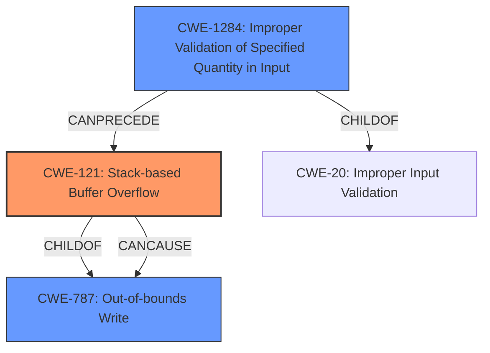

# Final Resolution for CVE-2021-42727

# Summary
| CWE ID  | CWE Name                          | Confidence | CWE Abstraction Level | CWE Vulnerability Mapping Label | CWE-Vulnerability Mapping Notes |
| :------- | :--------------------------------- | :--------- | :-------------------- | :------------------------------ | :------------------------------ |
| **CWE-121** | **Stack-based Buffer Overflow**         | 0.95       | Variant               | Allowed                         | Primary **CWE**: Directly reflects the reported **stack overflow**.                                                                                                                               |
| **CWE-787** | **Out-of-bounds Write**               | 0.75       | Base                  | Allowed                         | Secondary Candidate: Consequence of the **stack overflow**.                                                                                                                                   |
| **CWE-1284** | **Improper Validation of Specified Quantity in Input** | 0.60       | Base                  | Allowed                         | Secondary Candidate: Possible contributing factor if the size/length of data in the crafted file is not validated. The **insecure handling** of a crafted file can indicate the missing validation of size. |

## Evidence and Confidence

*   **Confidence Score:** 0.90
*   **Evidence Strength:** HIGH

## Relationship Analysis
The analysis correctly identifies CWE-121 as the primary weakness due to the explicit mention of "stack overflow" in the vulnerability description. CWE-787 is considered a secondary candidate as a consequence of the stack overflow, representing the out-of-bounds write that occurs when the buffer is overflowed. CWE-1284 is also considered as a secondary candidate because the "insecure handling" of the crafted file suggests a potential lack of proper input validation regarding the size or structure of the file's contents.

The hierarchical relationship is that CWE-121 is a variant of CWE-119 (which is intentionally avoided) and a child of CWE-787. CWE-1284 is a child of CWE-20 (Improper Input Validation). The chain relationship is that CWE-1284 can precede CWE-121, which then leads to CWE-787.

## Vulnerability Chain
The vulnerability chain starts with a crafted file that is handled insecurely. This **insecure handling** could involve a failure to validate the size or length of data within the file (CWE-1284). This missing validation can then lead to a stack-based buffer overflow (CWE-121), which in turn results in an out-of-bounds write (CWE-787). The final impact is arbitrary code execution.

CWE-1284 (Improper Validation of Specified Quantity in Input) -> CWE-121 (Stack-based Buffer Overflow) -> CWE-787 (**Out-of-bounds Write**) -> Arbitrary code execution.

## Summary of Analysis
The initial analysis and criticism provided a solid foundation for classifying this vulnerability. The vulnerability description explicitly mentions a "stack overflow," making CWE-121 the most appropriate primary **CWE**. The confidence score of 0.95 reflects this direct match. The analysis correctly identifies CWE-787 as a secondary candidate, representing the out-of-bounds write that is a consequence of the stack overflow. The consideration of CWE-1284 is also justified, as the "insecure handling" of the crafted file suggests a potential lack of proper input validation.

The graph relationships influenced the final selection by highlighting the hierarchical relationship between CWE-121 and CWE-787. The chain relationship also helped to clarify the sequence of events leading to the vulnerability.

The selected **CWE**s are at the optimal level of specificity because they directly reflect the technical details of the vulnerability. CWE-121 is specific to stack-based overflows, while CWE-787 and CWE-1284 represent related but less specific weaknesses that contribute to the overall vulnerability.

The evidence from the vulnerability description is: "Adobe Bridge 11.1.1 (and earlier) is affected by a **stack overflow** vulnerability due to **insecure handling** of a crafted file, potentially resulting in arbitrary code execution in the context of the current user."
Based on this, I agree with the assessment.