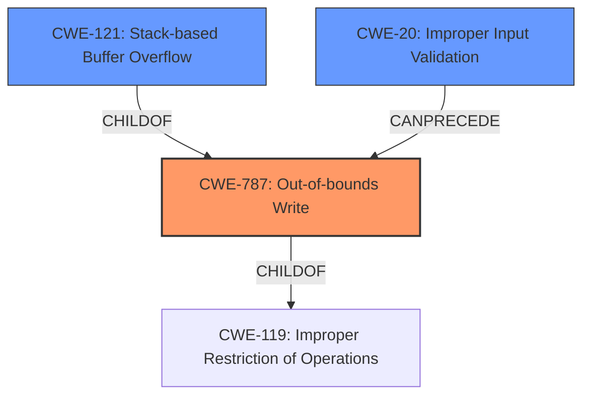

# Final Resolution for CVE-2021-42728

# Summary
| CWE ID | CWE Name | Confidence | CWE Abstraction Level | CWE Vulnerability Mapping Label | CWE-Vulnerability Mapping Notes |
|---|---|---|---|---|---|
| **CWE-787** | **Out-of-bounds Write** | 0.95 | Base | Primary | Allowed |
| **CWE-121** | **Stack-based Buffer Overflow** | 0.7 | Variant | Secondary Candidate | Allowed |
| CWE-20 | Improper Input Validation | 0.4 | Class | Secondary Candidate in Chain (Implicit) | Discouraged - could be present in chain due to lack of input validation |

## Evidence and Confidence

*   **Confidence Score:** 0.95
*   **Evidence Strength:** HIGH

## Relationship Analysis
The primary relationship impacting the decision is the parent-child relationship between **CWE-787** (**Out-of-bounds Write**) and **CWE-121** (**Stack-based Buffer Overflow**). **CWE-121** is a specific type of **CWE-787**. **CWE-787** itself is a child of **CWE-119** (**Improper Restriction of Operations within the Bounds of a Memory Buffer**), but choosing **CWE-119** would be too general. Including **CWE-20** (**Improper Input Validation**) suggests a possible vulnerability chain, where failure to validate input leads to the **out-of-bounds write**.

## Vulnerability Chain
The vulnerability chain starts with a crafted file containing malicious input. This input is not properly validated (**CWE-20**), leading to an **out-of-bounds write** (**CWE-787**) on the stack, specifically a **stack-based buffer overflow** (**CWE-121**). The impact is arbitrary code execution.

## Summary of Analysis
The initial analysis and criticism both converge on the appropriateness of **CWE-787** (**Out-of-bounds Write**) as the primary **WEAKNESS**. The vulnerability description explicitly mentions a stack overflow due to insecure handling of a crafted file. The CVE reference further supports this with the statement "Root cause of vulnerability: Out-of-bounds Write" and "Weaknesses/vulnerabilities present: The software writes data past the end of the buffer." This direct evidence strongly supports the choice of **CWE-787**. The inclusion of **CWE-121** (**Stack-based Buffer Overflow**) acknowledges the specific location of the overflow. The addition of **CWE-20** represents a possible, but implicit, vulnerability chain element, reflecting the insecure handling of the crafted file, specifically the lack of input validation. The relationships between these CWEs, particularly the parent-child relationship between **CWE-787** and **CWE-121**, and the potential chain relationship with **CWE-20**, further solidify the classification. **CWE-787** is at the optimal level of specificity because it directly describes the **ROOTCAUSE** (out-of-bounds write), while **CWE-121** specifies where it occurs. **CWE-119** is too general, and the mapping guidance discourages its use when more specific CWEs are available. Confidence increased to 0.95 to reflect inclusion of **CWE-20** into a potential vulnerability chain.