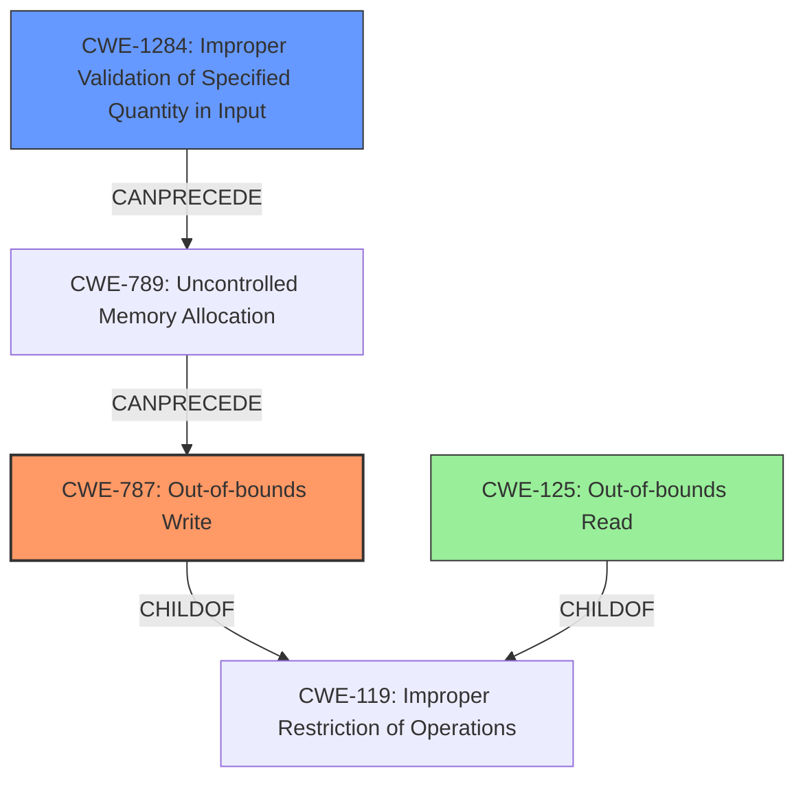

# Analysis Report for CVE-2021-42729

# Vulnerability Analysis Report: CVE-2021-42729

## Description

Adobe Bridge version 11.1.1 (and earlier) is affected by a memory corruption vulnerability due to insecure handling of a malicious WAV file, potentially resulting in arbitrary code execution in the context of the current user. User interaction is required to exploit this vulnerability.

## Vulnerability Description Key Phrases

**Rootcause:** insecure handling
**Weakness:** memory corruption
**Impact:** arbitrary code execution
**Vector:** malicious WAV file
**Product:** Adobe Bridge
**Version:** 11.1.1 (and earlier)

## Analysis (with Relationship Data)

# Summary
| CWE ID | CWE Name | Confidence | CWE Abstraction Level | CWE Vulnerability Mapping Label | CWE-Vulnerability Mapping Notes |
|---|---|---|---|---|---|
| CWE-787 | Out-of-bounds Write | 0.85 | Base | Allowed | Primary CWE |
| CWE-788 | Access of Memory Location After End of Buffer | 0.65 | Base | Discouraged | Secondary Candidate |
| CWE-125 | Out-of-bounds Read | 0.50 | Base | Allowed | Secondary Candidate |

## Evidence and Confidence

*   **Confidence Score:** 0.80
*   **Evidence Strength:** HIGH

- **Analysis and Justification:**  
  - *Explanation:* The vulnerability description states a "**memory corruption**" issue due to "**insecure handling**" of a malicious WAV file, leading to potential arbitrary code execution. The "CVE Reference Links Content Summary" specifies that the **root cause** is access of a memory location after the end of the buffer and lists an out-of-bounds read (CWE-788) as a weakness. The **memory corruption** suggests that data is being written outside the intended boundaries of a buffer, which aligns well with CWE-787 (Out-of-bounds Write). Although the summary mentions CWE-788 (Access of Memory Location After End of Buffer), CWE-787 is more appropriate because the impact indicates that the crafted WAV file leads to arbitrary code execution, implying a write operation corrupted program memory. Since the root cause is accessing memory outside the intended buffer, it can lead to both read and write issues, I have added CWE-125 (Out-of-bounds Read) as a secondary weakness.

  - *Relationship Analysis:* CWE-787 (Out-of-bounds Write) is a base-level CWE and a child of CWE-119 (Improper Restriction of Operations within the Bounds of a Memory Buffer). CWE-788 (Access of Memory Location After End of Buffer) is a base-level CWE. CWE-125 (Out-of-bounds Read) is a base-level CWE and a child of CWE-119. All three CWEs are related to buffer boundary issues.

- **Confidence Score:**  
  - Confidence: 0.85 (High confidence due to the explicit mention of memory corruption and the ability to achieve arbitrary code execution.)
  - Confidence for CWE-788: 0.65 (Medium confidence as the summary mentions it as a present weakness.)
  - Confidence for CWE-125: 0.50 (Medium Confidence, it's possible but not explicitly stated that the application reads out of bounds.)

---

## Criticism of Analysis

Okay, I've reviewed the provided analysis against the full CWE specifications. Here's a breakdown of my critique, focusing on the mapping guidance, potential mitigations, confidence levels, and overall justification:

**Overall Assessment:**

The analysis is generally well-reasoned and provides a solid justification for the primary CWE selection.  The inclusion of secondary candidates is appropriate, given the information available. The confidence levels are reasonable, and the detailed explanations are helpful. However, there are some areas where the reasoning could be strengthened or where alternative CWEs might be considered, particularly in addressing the input validation aspect of the vulnerability.

**Detailed Critique:**

1.  **Primary CWE: CWE-787 Out-of-bounds Write (Confidence: 0.85)**

    *   **Justification:** The choice of CWE-787 as the primary weakness is strong. The description explicitly mentions "memory corruption" and the ability to achieve "arbitrary code execution," which strongly implies a write operation outside of intended buffer boundaries. The provided CWE specification reinforces this, highlighting "Memory Corruption" as an alternative term for CWE-787's consequences.

    *   **Mapping Guidance:** The analysis acknowledges that CWE-787 is a child of CWE-119, which is good. The CWE specification states that CWE-787 is at the Base level of abstraction, making it an appropriate level for mapping.

    *   **Potential Mitigations:** Mitigation strategies such as Language Selection, Libraries/Frameworks, and Environment Hardening (e.g., compiler flags like /GS) are applicable.

    *   **Critique:** The reasoning is sound. The high confidence level is justifiable.

2.  **Secondary Candidate: CWE-788 Access of Memory Location After End of Buffer (Confidence: 0.65)**

    *   **Justification:** Listing CWE-788 as a secondary candidate is reasonable, considering that the CVE reference summary specifically mentions it. However, the specifications for CWE-788 say its usage is "Discouraged" and that it should be investigated if it is known that an access is a read or a write operation. Since the impact of arbitrary code execution suggests a write operation, it reinforces CWE-787.

    *   **Mapping Guidance:** The analysis notes the discouraged usage of CWE-788. This is important because the specification explicitly suggests investigating children of CWE-119 like CWE-787 and CWE-125 if the access operation is known.

    *   **Potential Mitigations:**  While mitigations for CWE-788 might include general memory safety practices, they are less specific than those for CWE-787 in this context.

    *   **Critique:** The confidence level of 0.65 is appropriate. Given the description and specifications, it's likely a contributing factor, but not the *primary* cause leading to arbitrary code execution. The analysis correctly leans towards the "write" aspect.

3.  **Secondary Candidate: CWE-125 Out-of-bounds Read (Confidence: 0.50)**

    *   **Justification:** The justification for CWE-125 is weaker. While an out-of-bounds read *could* be involved in preparing the data for the out-of-bounds write, the description doesn't explicitly suggest it. If the goal was only to trigger a denial of service then I would agree that the OOB read would be a higher candidate than for arbitrary code execution.

    *   **Mapping Guidance:** The analysis acknowledges this is "possible but not explicitly stated." CWE specification states that "Carefully read both the name and description to ensure that this mapping is an appropriate fit."

    *   **Potential Mitigations:**  Input Validation strategies, specifically those related to length arguments and buffer size calculations, are relevant. Language selection would also be appropriate.

    *   **Critique:** Confidence of 0.5 is adequate. It's a plausible contributing factor but not as strongly indicated as CWE-787 or CWE-788.

4.  **Missing Consideration: Input Validation (CWE-20 and its Children)**

    *   **Point:** The vulnerability description highlights "insecure handling" of a malicious WAV file. "Insecure handling" is a broad term that is typically associated with input validation. The core issue is that a malformed WAV file is *not* being properly validated before being processed, which then leads to the memory corruption. The analysis doesn't explicitly address the lack of or inadequate input validation. While CWE-119, CWE-787, CWE-788, and CWE-125 address the *result* of the problem, they don't address the *cause*.

    *   **Recommendation:** Consider including CWE-20 (Improper Input Validation) *or* one of its more specific children as a contributing CWE.

    *   **Possible Children of CWE-20:**
        *   **CWE-1284 (Improper Validation of Specified Quantity in Input):** This would be appropriate if the WAV file contains fields that specify the size or length of data within the file, and these fields are not properly validated. The specification states that, "When the quantity is not properly validated, then attackers can specify malicious quantities to cause excessive resource allocation, trigger unexpected failures, enable buffer overflows, etc."
        *   **CWE-1286 (Improperly formatted file):** An improperly formatted file will cause memory corruption when processed if it is not validated.

    *   **Mapping Guidance (for CWE-20):** The specification discourages the use of CWE-20 when lower-level CWEs can be identified. The analysis should examine which specific aspect of the input is not being validated.
    *   **Mitigations (for CWE-20/CWE-1284):** Use an "accept known good" input validation strategy. When performing input validation, consider all potentially relevant properties, including length, type of input, the full range of acceptable values, missing or extra inputs, syntax, consistency across related fields, and conformance to business rules.

**Recommendations:**

*   **Strengthen the Justification for CWE-787:** While the reasoning is good, explicitly connecting the arbitrary code execution impact to the ability to overwrite program memory with attacker-controlled data would further strengthen the justification.
*   **Re-evaluate CWE-125:** If there is no specific evidence or reasonable inference of an out-of-bounds *read* contributing to the vulnerability, consider reducing its confidence level or removing it entirely.
*   **Add Input Validation CWE:** Include either CWE-20 (with a lower confidence) or, preferably, a more specific child like CWE-1284 or an equivalent CWE that reflects the lack of size validation for the WAV file format. Emphasize that the root cause involves a failure to properly validate the structure or size parameters within the malicious WAV file.

By addressing these points, the analysis would be even more comprehensive and aligned with the CWE specifications.

## Final Resolution

# Summary
| CWE ID | CWE Name | Confidence | CWE Abstraction Level | CWE Vulnerability Mapping Label | CWE-Vulnerability Mapping Notes |
|---|---|---|---|---|---|
| **CWE-787** | **Out-of-bounds Write** | 0.90 | Base | Allowed | Primary CWE |
| **CWE-1284** | **Improper Validation of Specified Quantity in Input** | 0.75 | Base | Allowed | Secondary Candidate |
| **CWE-125** | **Out-of-bounds Read** | 0.30 | Base | Allowed | Secondary Candidate |

## Evidence and Confidence

*   **Confidence Score:** 0.85
*   **Evidence Strength:** MEDIUM

## Relationship Analysis
The primary relationship influencing the decision is that **CWE-787 (Out-of-bounds Write)** is a child of **CWE-119 (Improper Restriction of Operations within the Bounds of a Memory Buffer)**. This indicates that the out-of-bounds write is a specific type of buffer handling issue. **CWE-1284 (Improper Validation of Specified Quantity in Input)** can precede **CWE-789 (Uncontrolled Memory Allocation)** which in turn can precede **CWE-787 (Out-of-bounds Write)**. This highlights a potential vulnerability chain where a failure to validate input size leads to memory allocation issues and subsequent out-of-bounds writes. **CWE-125 (Out-of-bounds Read)** is also a child of **CWE-119 (Improper Restriction of Operations within the Bounds of a Memory Buffer)**, representing a similar type of buffer handling issue but involving reading instead of writing. All selected CWEs are at the Base or Variant level of abstraction, providing a good level of specificity.

## Vulnerability Chain
The vulnerability chain starts with **CWE-1284 (Improper Validation of Specified Quantity in Input)**, where the size or length parameters within the WAV file are not properly validated. This leads to a potential for **CWE-789 (Uncontrolled Memory Allocation)** (inferred). Consequently, this can result in **CWE-787 (Out-of-bounds Write)**, where the product writes data past the end of the intended buffer, leading to memory corruption and arbitrary code execution. The inclusion of **CWE-125 (Out-of-bounds Read)** is less certain, and thus given a lower confidence, but could potentially be involved in preparing the data or as a consequence of the write.

## Summary of Analysis
The initial analysis correctly identified **CWE-787 (Out-of-bounds Write)** as the primary weakness given the evidence of "memory corruption" and "arbitrary code execution." However, the criticism highlighted the missing consideration of input validation, which is a crucial aspect of the vulnerability description ("insecure handling of a malicious WAV file"). Therefore, I've added **CWE-1284 (Improper Validation of Specified Quantity in Input)** as a secondary CWE with a confidence of 0.75. This addition addresses the root cause of the problem, where the product fails to validate the size or length parameters within the WAV file, allowing for malformed data to be processed and ultimately leading to the out-of-bounds write. I am reducing the confidence in **CWE-125 (Out-of-bounds Read)** to 0.3, as the vulnerability description focuses on memory corruption due to writing, making the read less likely. This assessment is primarily based on the vulnerability description provided and the relationships between CWEs. The selected CWEs are at the optimal level of specificity, with **CWE-787 (Out-of-bounds Write)** describing the direct consequence of the vulnerability and **CWE-1284 (Improper Validation of Specified Quantity in Input)** addressing the root cause of inadequate input validation.

*Report generated on 2025-03-18 03:01:13*
