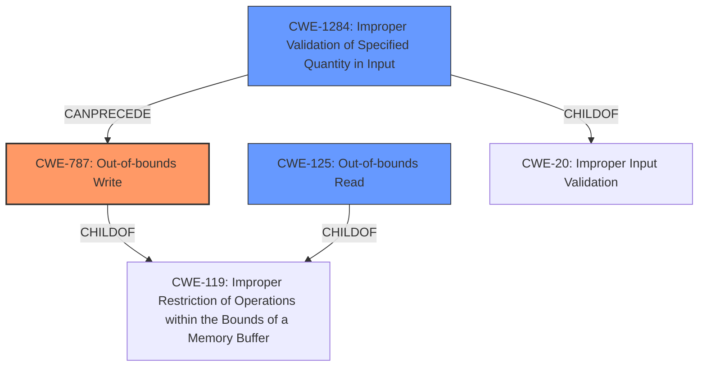

# Final Resolution for CVE-2021-42730

# Summary
| CWE ID | CWE Name | Confidence | CWE Abstraction Level | CWE Vulnerability Mapping Label | CWE-Vulnerability Mapping Notes |
|---|---|---|---|---|---|
| CWE-787 | Out-of-bounds Write | 0.9 | Base | Allowed | The vulnerability involves writing data past the end of the intended buffer due to insecure handling of a PSD file. |
| CWE-125 | Out-of-bounds Read | 0.7 | Base | Allowed | The reference summary indicates out-of-bounds read. |
| CWE-1284 | Improper Validation of Specified Quantity in Input | 0.5 | Base | Allowed | The image dimensions are not validated |

## Evidence and Confidence

*   **Confidence Score:** 0.85
*   **Evidence Strength:** MEDIUM

## Relationship Analysis
The primary weakness is **CWE-787 (Out-of-bounds Write)**, which is a child of **CWE-119 (Improper Restriction of Operations within the Bounds of a Memory Buffer)**. Selecting **CWE-787** provides a more specific classification than its parent. **CWE-125 (Out-of-bounds Read)** is included as a secondary weakness because it is often related to out-of-bounds writes. **CWE-1284 (Improper Validation of Specified Quantity in Input)** is included to highlight the lack of input validation on the PSD file, specifically regarding image dimensions, which could lead to the buffer overflow. It is a child of **CWE-20 (Improper Input Validation)**.

## Vulnerability Chain
The vulnerability chain begins with the **ROOTCAUSE** being the insecure handling of a malicious PSD file, particularly the lack of validation for the quantity of data specified within the file (**CWE-1284**). This leads to an out-of-bounds write (**CWE-787**), where data is written beyond the allocated buffer. This can potentially result in an out-of-bounds read (**CWE-125**) and ultimately, arbitrary code execution.

## Summary of Analysis
The initial analysis correctly identified **CWE-787 (Out-of-bounds Write)** as the primary weakness due to the explicit mention of memory corruption and out-of-bounds access in the vulnerability description. The inclusion of **CWE-125 (Out-of-bounds Read)** as a secondary candidate is also justified based on the CVE reference summary. The criticism suggested considering **CWE-131 (Incorrect Calculation of Buffer Size)** and a child of **CWE-20 (Improper Input Validation)**. Based on the "insecure handling of a malicious PSD file," I've added **CWE-1284 (Improper Validation of Specified Quantity in Input)** as a contributing factor since the vulnerability description suggests the image dimensions are not validated.

The relationship analysis further supports these selections. **CWE-787** is a child of **CWE-119**, providing a more specific classification. **CWE-1284** is a child of **CWE-20**, highlighting the lack of input validation. The selected CWEs are at the optimal level of specificity, as they accurately reflect the root cause and contributing factors of the vulnerability based on the available evidence.