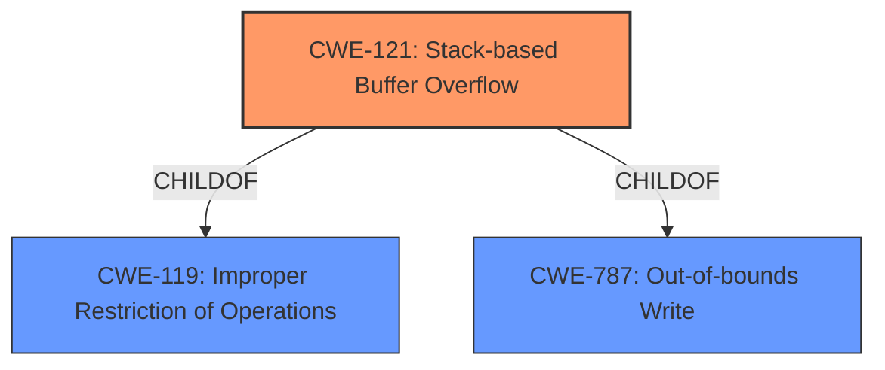

# Analysis Report for CVE-2021-42756

# Vulnerability Analysis Report: CVE-2021-42756

## Description

Multiple stack-based buffer overflow vulnerabilities [CWE-121] in the proxy daemon of FortiWeb 5.x all versions, 6.0.7 and below, 6.1.2 and below, 6.2.6 and below, 6.3.16 and below, 6.4 all versions may allow an unauthenticated remote attacker to achieve arbitrary code execution via specifically crafted HTTP requests.

## Vulnerability Description Key Phrases

**Rootcause:** stack-based buffer overflow
**Weakness:** CWE-121
**Impact:** arbitrary code execution
**Vector:** specifically crafted HTTP requests
**Attacker:** unauthenticated remote attacker
**Product:** FortiWeb
**Version:** 5.x all versions, 6.0.7 and below, 6.1.2 and below, 6.2.6 and below, 6.3.16 and below, 6.4 all versions
**Component:** proxy daemon

## Analysis (with Relationship Data)

# Summary
| CWE ID | CWE Name | Confidence | CWE Abstraction Level | CWE Vulnerability Mapping Label | CWE-Vulnerability Mapping Notes |
|---|---|---|---|---|---|
| CWE-121 | Stack-based Buffer Overflow | 1.0 | Variant | Allowed | Primary CWE |

## Evidence and Confidence

*   **Confidence Score:** 1.0
*   **Evidence Strength:** HIGH

- **Analysis and Justification:**  
  - *Explanation:* The vulnerability description explicitly states "**stack-based buffer overflow** vulnerabilities [**CWE-121**]" which aligns perfectly with CWE-121 (Stack-based Buffer Overflow). The evidence shows that specifically crafted HTTP requests can trigger this condition, leading to arbitrary code execution. The "Vulnerability Description Key Phrases" and "CVE Reference Links Content Summary" sections further reinforce this mapping, explicitly mentioning CWE-121 as the relevant weakness. The MITRE mapping guidance for CWE-121 indicates that its usage is ALLOWED, confirming the appropriateness of this mapping.

  - *Relationship Analysis:* CWE-121 is a variant of CWE-119 (Improper Restriction of Operations within the Bounds of a Memory Buffer). While CWE-119 is a broader category, the description specifically mentions a stack-based buffer overflow, making CWE-121 the more specific and accurate choice.

- **Confidence Score:**  
  - Confidence: 1.0 (The vulnerability description explicitly mentions CWE-121)

## Criticism of Analysis

Okay, here's a detailed review of the provided CWE analysis, considering the full CWE specifications:

**Overall Assessment:**

The analysis is well-structured and demonstrates a good understanding of the vulnerability description and the CWE specifications. The initial mapping to CWE-121 (Stack-based Buffer Overflow) is accurate and justified with strong evidence. The confidence score of 1.0 is appropriate given the explicit mention of "stack-based buffer overflow" in the vulnerability description. The retriever results, while not perfect, do point to several potentially related CWEs, and the analysis correctly explains why CWE-121 is the most appropriate.

**Detailed Review by Section:**

*   **Vulnerability Description:** This section is well-written. The key phrases are helpful for quickly understanding the vulnerability.
*   **CVE Reference Links Content Summary:** This section accurately summarizes the relevant information from the CVE description.
*   **Retriever Results:** The retriever results are interesting. The high scores for CWE-124, CWE-120, and CWE-78 suggest that the automated tools are picking up on generic buffer overflow characteristics, and command injection as a possibility from HTTP requests. These results highlight the importance of manual analysis to refine the mapping to the most specific CWE.
*   **Analysis to Review - Summary Table:** The summary table is clear and concise. The Confidence, Abstraction Level, Vulnerability Mapping Label, and Mapping Notes are accurately filled.

*   **Analysis and Justification (Evidence and Confidence):**
    *   The explanation is excellent. It provides a clear justification for choosing CWE-121 and correctly highlights the relationship to CWE-119 (Improper Restriction of Operations within the Bounds of a Memory Buffer) and why CWE-121 is the more specific choice.
    *   The justification references the MITRE mapping guidance for CWE-121, which is crucial for confirming the appropriateness of the mapping.
    *   The confidence score justification is accurate and reflects the certainty provided by the explicit mention of CWE-121 in the vulnerability description.

*   **CWE Examples from Database:** The examples provided under CWE-119 are relevant as they showcase various instances of buffer overflows, including stack-based ones. However, providing examples for CWE-121 would have been more directly relevant.

*   **Relevant CWE Specifications:** The inclusion of the full CWE specifications is excellent. This allows for a deeper understanding of the chosen CWE and its relationships to other CWEs. This is especially useful for understanding the rationale behind the mapping guidance.

**Critique of Alternative CWEs suggested by Retriever and not chosen:**

*   **CWE-124 (Buffer Underwrite):** This is less likely because the vulnerability description specifies a buffer *overflow*, implying writing *past* the end of the buffer, not before the beginning.
*   **CWE-120 (Buffer Copy without Checking Size of Input):** While this could be a contributing factor, the description focuses on the *location* of the buffer (stack) rather than the specific copy operation. If further analysis revealed that the root cause was a `strcpy`-like function without bounds checking, CWE-120 could be a more appropriate primary mapping, but CWE-121 would still be relevant.
*   **CWE-78 (OS Command Injection):** This is less likely unless the crafted HTTP requests are used to inject OS commands, which is not explicitly stated in the description.
*   **CWE-113 (HTTP Request/Response Splitting):** This is also less likely unless the crafted HTTP requests are used to inject CRLF sequences. While it's possible, the description doesn't emphasize this aspect.
*   **CWE-23 (Relative Path Traversal):** Unlikely, as this is focused on file paths, not memory buffers.
*   **CWE-122 (Heap-based Buffer Overflow):** The description specifically mentions *stack*-based, ruling this out.
*   **CWE-126 (Buffer Over-read):** This is incorrect because the primary issue is about *writing* beyond the boundary of the allocated memory.
*   **CWE-73 (External Control of File Name or Path):** This isn't applicable because the vulnerability isn't directly related to manipulating file paths.
*   **CWE-787 (Out-of-bounds Write):** This is very closely related and a parent of CWE-121. CWE-787 could be used as a more general mapping if the details of it being stack-based were not available.

**Improvements:**

*   **CWE Examples:** Include specific examples of CVEs that are directly mapped to CWE-121. This would further strengthen the justification.
*   **Relationship Analysis:**  While the relationship analysis correctly identifies the parent CWE (CWE-119), it could be expanded to discuss *how* the stack-based nature of the overflow influences the potential exploitation techniques. For example, overwriting the return address on the stack is a common exploitation method for stack-based buffer overflows.
*   **Mitigation Discussion:** While the analysis correctly identifies CWE-121, it doesn't explicitly discuss how the *specific* mitigations for stack-based buffer overflows (e.g., stack canaries, address space layout randomization (ASLR), non-executable stack) apply to the identified vulnerability. Adding this discussion would further demonstrate understanding.
*   **Exploitation Context:** Briefly mentioning how an attacker could exploit this vulnerability, given it's a stack-based buffer overflow, could add value. Overwriting the return address to redirect execution to attacker-controlled code is a common technique.

**Conclusion:**

The analysis is strong and accurately maps the vulnerability to CWE-121. The justifications are clear and well-supported. The suggested improvements are minor and would further enhance the completeness and clarity of the analysis. The confidence score of 1.0 is justified, and the Abstraction Level and Mapping Guidance are correctly applied.

## Final Resolution

# Summary
| CWE ID | CWE Name | Confidence | CWE Abstraction Level | CWE Vulnerability Mapping Label | CWE-Vulnerability Mapping Notes |
|---|---|---|---|---|---|
| CWE-121 | Stack-based Buffer Overflow | 1.0 | Variant | Allowed | Primary CWE |

## Evidence and Confidence

*   **Confidence Score:** 1.0
*   **Evidence Strength:** HIGH

## Relationship Analysis
The primary relationship impacting the decision is the parent-child relationship between CWE-119 (**CWE-119: Improper Restriction of Operations within the Bounds of a Memory Buffer**) and CWE-121 (**CWE-121: Stack-based Buffer Overflow**). CWE-121 is a variant of CWE-119, providing a more specific classification because the vulnerability is explicitly described as a stack-based buffer overflow. While CWE-787 (**CWE-787: Out-of-bounds Write**) is also a parent, it's less specific than CWE-121 in this instance. The provided information does not suggest any chain relationships or peer relationships that would influence the selection. The variant level of CWE-121 makes it ideal because the information is available to allow for a more specific mapping.

## Vulnerability Chain
The vulnerability chain begins with a lack of proper input validation, leading to a **CWE-121** (**CWE-121: Stack-based Buffer Overflow**) when specifically crafted HTTP requests are processed. The consequence is arbitrary code execution, which means the **WEAKNESS** leads directly to a significant impact.

## Summary of Analysis
The initial analysis correctly identified **CWE-121** (**CWE-121: Stack-based Buffer Overflow**) as the primary **ROOTCAUSE**. The vulnerability description clearly states, "Multiple stack-based buffer overflow vulnerabilities [**CWE-121**]... may allow an unauthenticated remote attacker to achieve arbitrary code execution via specifically crafted HTTP requests." This evidence strongly supports the selection of **CWE-121**. The criticism also supports this decision, noting that the explicit mention of "stack-based buffer overflow" in the description justifies the high confidence score. The choice of **CWE-121** is at the optimal level of specificity because the "stack-based" nature of the overflow is explicitly mentioned. Broader CWEs like **CWE-119** (**CWE-119: Improper Restriction of Operations within the Bounds of a Memory Buffer**) or **CWE-787** (**CWE-787: Out-of-bounds Write**) are less specific and therefore less appropriate. The analysis is based on the provided evidence and aligns with the MITRE mapping guidance, which allows for the use of **CWE-121**.

*Report generated on 2025-03-18 03:03:23*
