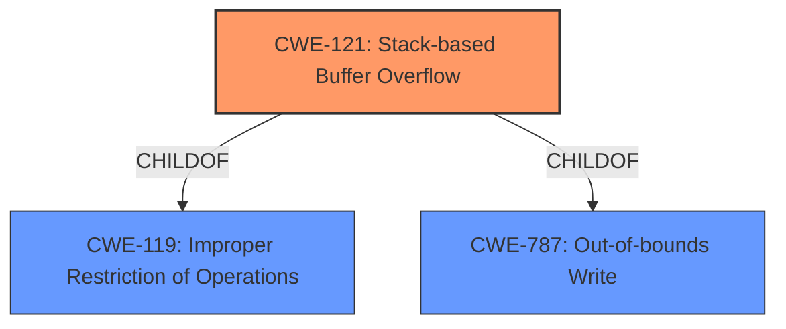

# Final Resolution for CVE-2021-42756

# Summary
| CWE ID | CWE Name | Confidence | CWE Abstraction Level | CWE Vulnerability Mapping Label | CWE-Vulnerability Mapping Notes |
|---|---|---|---|---|---|
| CWE-121 | Stack-based Buffer Overflow | 1.0 | Variant | Allowed | Primary CWE |

## Evidence and Confidence

*   **Confidence Score:** 1.0
*   **Evidence Strength:** HIGH

## Relationship Analysis
The primary relationship impacting the decision is the parent-child relationship between CWE-119 (**CWE-119: Improper Restriction of Operations within the Bounds of a Memory Buffer**) and CWE-121 (**CWE-121: Stack-based Buffer Overflow**). CWE-121 is a variant of CWE-119, providing a more specific classification because the vulnerability is explicitly described as a stack-based buffer overflow. While CWE-787 (**CWE-787: Out-of-bounds Write**) is also a parent, it's less specific than CWE-121 in this instance. The provided information does not suggest any chain relationships or peer relationships that would influence the selection. The variant level of CWE-121 makes it ideal because the information is available to allow for a more specific mapping.

## Vulnerability Chain
The vulnerability chain begins with a lack of proper input validation, leading to a **CWE-121** (**CWE-121: Stack-based Buffer Overflow**) when specifically crafted HTTP requests are processed. The consequence is arbitrary code execution, which means the **WEAKNESS** leads directly to a significant impact.

## Summary of Analysis
The initial analysis correctly identified **CWE-121** (**CWE-121: Stack-based Buffer Overflow**) as the primary **ROOTCAUSE**. The vulnerability description clearly states, "Multiple stack-based buffer overflow vulnerabilities [**CWE-121**]... may allow an unauthenticated remote attacker to achieve arbitrary code execution via specifically crafted HTTP requests." This evidence strongly supports the selection of **CWE-121**. The criticism also supports this decision, noting that the explicit mention of "stack-based buffer overflow" in the description justifies the high confidence score. The choice of **CWE-121** is at the optimal level of specificity because the "stack-based" nature of the overflow is explicitly mentioned. Broader CWEs like **CWE-119** (**CWE-119: Improper Restriction of Operations within the Bounds of a Memory Buffer**) or **CWE-787** (**CWE-787: Out-of-bounds Write**) are less specific and therefore less appropriate. The analysis is based on the provided evidence and aligns with the MITRE mapping guidance, which allows for the use of **CWE-121**.