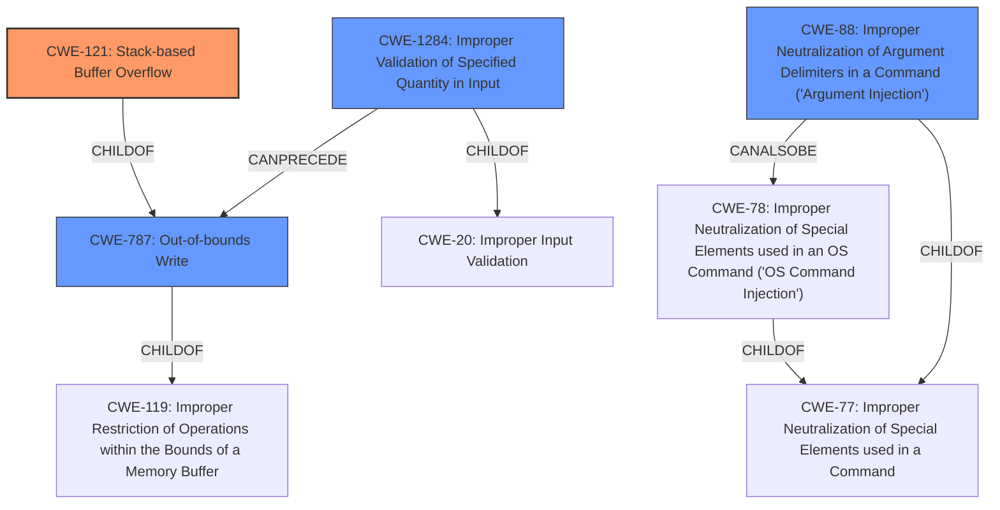

# Analysis Report for CVE-2021-42757

# Vulnerability Analysis Report: CVE-2021-42757

## Description

A buffer overflow [CWE-121] in the TFTP client library of FortiOS before 6.4.7 and FortiOS 7.0.0 through 7.0.2, may allow an authenticated local attacker to achieve arbitrary code execution via specially crafted command line arguments.

## Vulnerability Description Key Phrases

**Rootcause:** command line arguments
**Weakness:** buffer overflow
**Impact:** arbitrary code execution
**Attacker:** authenticated local attacker
**Product:** FortiOS
**Version:** before 6.4.7 and FortiOS 7.0.0 through 7.0.2
**Component:** TFTP client library

## Analysis (with Relationship Data)

# Summary
| CWE ID | CWE Name | Confidence | CWE Abstraction Level | CWE Vulnerability Mapping Label | CWE-Vulnerability Mapping Notes |
|---|---|---|---|---|---|
| CWE-121 | Stack-based Buffer Overflow | 0.9 | Variant | Primary | Allowed |
| CWE-787 | Out-of-bounds Write | 0.6 | Base | Secondary | Allowed |
| CWE-1284 | Improper Validation of Specified Quantity in Input | 0.5 | Base | Secondary | Allowed |

## Evidence and Confidence

*   **Confidence Score:** 0.8
*   **Evidence Strength:** HIGH

- **Analysis and Justification:**  
  - *Explanation:* The vulnerability description explicitly states a "**buffer overflow** [CWE-121]" in the TFTP client library. The **root cause** is exploitable via "**command line arguments**". This aligns directly with CWE-121 (Stack-based Buffer Overflow) because the overflow occurs on the stack. CWE-121 is a Variant level CWE, providing a more specific classification than its parent, CWE-119. The CVE Reference Links Content Summary reinforces this by stating that the vulnerability is a buffer overflow (CWE-121). The attack requires specially crafted command line arguments, suggesting a potential lack of input validation, which could be related to CWE-1284. Also, the buffer overflow by definition involves writing beyond the intended boundaries of the buffer, so CWE-787 Out-of-bounds Write is also a good candidate. MITRE mapping guidance for CWE-121 indicates this is ALLOWED for stack-based buffer overflow vulnerabilities.

  - *Relationship Analysis:* "CWE-121 is a variant of CWE-119 (Improper Restriction of Operations within the Bounds of a Memory Buffer). CWE-787 is a parent of CWE-121. CWE-1284 CanPrecede CWE-787.

- **Confidence Score:**  
  - Confidence: 0.9 (High confidence due to explicit mention of buffer overflow and command line arguments).
---

## Criticism of Analysis

Okay, I've reviewed the provided analysis against the full CWE specifications. Here's a detailed critique:

**Overall Assessment:**

The analysis is generally good and provides a reasonable mapping based on the provided information. The primary mapping to CWE-121 (Stack-based Buffer Overflow) is well-justified and has a high confidence score. The inclusion of CWE-787 (Out-of-bounds Write) as a secondary mapping is also appropriate, given the nature of buffer overflows.  The inclusion of CWE-1284 is weaker.

**Detailed Critique:**

*   **CWE-121: Stack-based Buffer Overflow (Primary)**
    *   **Confidence:** 0.9 - Correct. The explicit mention of "buffer overflow" and the context of "command line arguments" make this mapping very strong.
    *   **Justification:** Excellent. The explanation clearly states the connection to stack allocation, which is the defining characteristic of CWE-121.  The recognition that it's a Variant-level CWE, preferred for root cause mapping, is good.
    *   **Mapping Guidance Adherence:** Correct. The analysis notes that the MITRE mapping guidance for CWE-121 indicates this is "ALLOWED" for stack-based buffer overflow vulnerabilities.
    *   **Potential Improvements:** None
*   **CWE-787: Out-of-bounds Write (Secondary)**
    *   **Confidence:** 0.6 - Correct. A buffer overflow *always* involves writing out of bounds, so including this CWE provides a more general understanding.
    *   **Justification:** Good. The analysis correctly identifies the relationship between a buffer overflow and writing beyond the buffer's boundaries.
    *   **Mapping Guidance Adherence:** Correct. The analysis is consistent with the provided specifications.
    *   **Potential Improvements:** None
*   **CWE-1284: Improper Validation of Specified Quantity in Input (Secondary)**
    *   **Confidence:** 0.5 - Weaker, but potentially applicable. The analysis correctly links the use of command line arguments, which have a length or size, to the potential for a lack of proper input validation. This is a plausible *contributing* factor, but not necessarily the *direct* cause of the overflow.
    *   **Justification:** Acceptable, but less direct than the other CWEs. The reasoning hinges on the *potential* lack of input validation related to the size or length of the command line arguments. This isn't explicitly stated in the vulnerability description, but it is a reasonable inference.  The *CanPrecede* relationship between CWE-1284 and CWE-787 was stated in the description as an additional justification.
    *   **Mapping Guidance Adherence:** Correct.
    *   **Potential Improvements:** It would be stronger if the analysis acknowledged the weaker connection and clearly stated that CWE-1284 represents a *possible contributing factor* related to input validation, rather than a direct root cause. Consider lowering the confidence.
*   **Omissions/Alternatives:**
    *   **CWE-77: Improper Neutralization of Special Elements used in an OS Command ('OS Command Injection') or CWE-88 Improper Neutralization of Argument Delimiters in a Command ('Argument Injection'):**  While the report correctly mapped CWE-121, it should be noted that buffer overflows related to command line arguments are sometimes coupled with an OS command injection vulnerability. The analysis did not contain any notes to dismiss this CWE.

**Recommendations:**

1.  **Lower Confidence in CWE-1284:** Reduce the confidence score for CWE-1284 to 0.3 or 0.4. While plausible, it's a weaker connection than the others and represents a potential contributing factor rather than a direct cause.
2.  **Consider CWE-77/88 (OS Command Injection).** Command line arguments often have command injection vulnerabilities. Even if the buffer overflow is root cause, other weaknesses could exist.
3.  **Review Top Combined Results from Retriever:** The retriever results suggest other CWEs such as CWE-78 (OS Command Injection) and CWE-88 (Argument Injection) are also potentially relevant. Consider these other CWEs and explain why they are not applicable, or add them as secondary CWEs with appropriate justification.
4.  **Input Validation Focus:** Emphasize that input validation (or lack thereof) plays a crucial role in preventing buffer overflows. However, make sure to stress it is not a direct cause.
5.  **Relationship Clarity:** Explicitly state the relationships between the CWEs. For example:  "CWE-787 is a parent of CWE-121.  The vulnerability can be mitigated by addressing CWE-1284, the input validation issues."

By incorporating these suggestions, the analysis will be more comprehensive and nuanced, providing a more accurate and useful understanding of the vulnerability.

## Final Resolution

# Summary
| CWE ID | CWE Name | Confidence | CWE Abstraction Level | CWE Vulnerability Mapping Label | CWE-Vulnerability Mapping Notes |
|---|---|---|---|---|---|
| CWE-121 | Stack-based Buffer Overflow | 0.9 | Variant | Primary | Allowed |
| CWE-787 | Out-of-bounds Write | 0.7 | Base | Secondary | Allowed |
| CWE-1284 | Improper Validation of Specified Quantity in Input | 0.3 | Base | Secondary | Allowed |
| CWE-88 | Improper Neutralization of Argument Delimiters in a Command ('Argument Injection') | 0.4 | Base | Secondary | Allowed |

## Evidence and Confidence

*   **Confidence Score:** 0.8
*   **Evidence Strength:** MEDIUM

## Relationship Analysis
The primary relationship is that CWE-121 (Stack-based Buffer Overflow) is a specific type of **buffer overflow**, which inherently involves **out-of-bounds write** (CWE-787). Thus, CWE-787 is a parent of CWE-121. CWE-1284 (Improper Validation of Specified Quantity in Input) can **precede** CWE-787, as insufficient input validation could lead to a buffer overflow. CWE-88 (Improper Neutralization of Argument Delimiters in a Command ('Argument Injection')) is a peer of CWE-78 (Improper Neutralization of Special Elements used in an OS Command ('OS Command Injection')), and both are children of CWE-77 (Improper Neutralization of Special Elements used in a Command). Because the vulnerability is triggered via command line arguments, CWE-88 is a relevant peer consideration.

## Vulnerability Chain
The vulnerability chain starts with potentially **improper input validation** (CWE-1284) of command-line arguments. This leads to the **lack of sanitization of argument delimiters** (CWE-88), which then results in an exploitable **stack-based buffer overflow** (CWE-121) during the processing of the command-line arguments. The **out-of-bounds write** (CWE-787) is a direct consequence of the buffer overflow, where data is written beyond the allocated buffer's boundaries on the stack. The ultimate impact is arbitrary code execution.

## Summary of Analysis
The initial analysis correctly identified CWE-121 as the primary **WEAKNESS**, given the vulnerability description's explicit mention of a "buffer overflow" in the stack. The criticism provided helpful suggestions for improving the analysis, specifically regarding the confidence level for CWE-1284 and the potential inclusion of CWE-88.

Based on the retriever scores and the nature of command-line argument exploitation, CWE-88 (Improper Neutralization of Argument Delimiters in a Command ('Argument Injection')) is added as a secondary CWE with a confidence of 0.4. The reasoning is that command-line arguments often involve parsing and interpretation, and a failure to properly neutralize argument delimiters could contribute to the **buffer overflow** by allowing an attacker to inject malicious data. This wasn't explicitly stated but is a reasonable inference, aligning with the retriever's suggestions.

The confidence in CWE-1284 is reduced to 0.3. While a lack of input validation may contribute, it's not as direct a cause as the **buffer overflow** itself or the **improper neutralization of argument delimiters**. It remains a secondary consideration because it highlights the potential for preventing the vulnerability through better input handling, but the evidence for it is not strong.

The confidence in CWE-787 is adjusted to 0.7, reflecting that while it is always part of **buffer overflows**, it is less specific than CWE-121.

The selected CWEs are at the optimal level of specificity. CWE-121 is a Variant that accurately describes the stack-based nature of the **buffer overflow**. CWE-787 is a Base CWE that complements CWE-121 by highlighting the **out-of-bounds write** aspect. CWE-1284 and CWE-88 address the potential contributing factors related to input validation and command interpretation, respectively. These are all Base CWEs and thus an appropriate level of abstraction.

*Report generated on 2025-03-18 03:04:11*
