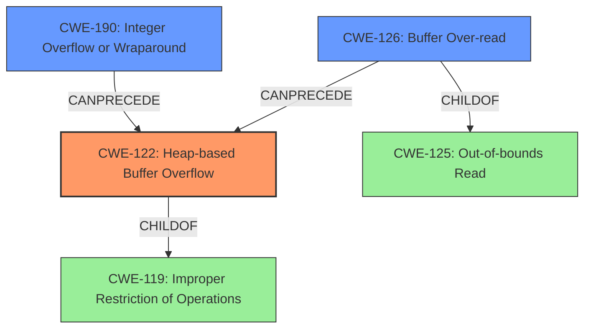

# Analysis Report for CVE-2021-42781

# Vulnerability Analysis Report: CVE-2021-42781

## Description

Heap buffer overflow issues were found in Opensc before version 0.22.0 in pkcs15-oberthur.c that could potentially crash programs using the library.

## Vulnerability Description Key Phrases

**Weakness:** buffer overflow
**Impact:** crash
**Product:** Opensc
**Version:** before version 0.22.0
**Component:** pkcs15-oberthur.c

## Analysis (with Relationship Data)

# Summary
| CWE ID | CWE Name | Confidence | CWE Abstraction Level | CWE Vulnerability Mapping Label | CWE-Vulnerability Mapping Notes |
|---|---|---|---|---|---|
| CWE-122 | Heap-based Buffer Overflow | 0.95 | Variant | Allowed | Acceptable-Use |
| CWE-190 | Integer Overflow or Wraparound | 0.70 | Base | Allowed | Acceptable-Use |
| CWE-125 | Out-of-bounds Read | 0.60 | Base | Allowed | Acceptable-Use |

## Evidence and Confidence

*   **Confidence Score:** 0.85
*   **Evidence Strength:** HIGH

- **Analysis and Justification:**  
  - *Explanation:* The vulnerability description explicitly mentions a "**heap buffer overflow**" in Opensc, which directly corresponds to CWE-122 (Heap-based Buffer Overflow). The CVE Reference Links Content Summary reinforces this by stating "Multiple heap buffer overflows exist within the `pkcs15-oberthur.c` file in OpenSC." It further explains that this occurs due to insufficient bounds checking when handling data structures from Oberthur smart cards, where the code fails to validate data lengths, leading to overflows when copying data into fixed-size buffers. This aligns directly with the characteristics of CWE-122, which is a variant of buffer overflow that occurs in the heap. The impact, as mentioned, is program crashes.
  
  - *Relationship Analysis:* CWE-122 is a variant of CWE-119 (Improper Restriction of Operations within the Bounds of a Memory Buffer). The provided information specifically points to a heap-based overflow, making CWE-122 a more precise choice than its parent. The vulnerability arises from reading smart card data and copying it into fixed-size buffers without proper bounds checking, creating the potential for a heap overflow.

- **Confidence Score:**  
  - Confidence: 0.95 (High confidence due to direct evidence of heap buffer overflow)

---
- **Analysis and Justification:**
  - *Explanation:* The CVE Reference Links Content Summary mentions "Inconsistent length validation: Sometimes the code uses `offs > info_len` and sometimes `offs + 2 > info_len` leading to missing checks." This could lead to **integer overflow** or wraparound issues if `offs` and `info_len` are close to the maximum or minimum values of their data type, respectively. Hence, CWE-190 is a possible contributing factor. This means that an integer overflow could occur when calculating the size of the buffer needed. While the primary issue is the heap buffer overflow, the integer overflow could be a contributing factor in determining the size of the buffer, thus making CWE-190 a secondary concern.
  - *Relationship Analysis:* CWE-190 can precede CWE-119 because an integer overflow can cause less memory to be allocated than required, leading to a buffer overflow.

- **Confidence Score:**
  - Confidence: 0.70 (Moderate confidence due to the potential for integer overflow influencing the buffer size calculation)

---
- **Analysis and Justification:**
  - *Explanation:* Since the **heap buffer overflow** is caused due to insufficient bounds checking when handling data structures, this leads to scenarios where the product may attempt to read data beyond the allocated buffer leading to an **out-of-bounds read**. This aligns with CWE-125 (Out-of-bounds Read), where the product reads data past the end of the intended buffer.
  - *Relationship Analysis:* CWE-125 is a child of CWE-119 (Improper Restriction of Operations within the Bounds of a Memory Buffer). The specific act of reading beyond the buffer bounds makes CWE-125 a relevant, though secondary, consideration.

- **Confidence Score:**
  - Confidence: 0.60 (Moderate confidence due to the implication of reading beyond buffer bounds)

## Criticism of Analysis

Okay, I've reviewed the provided CWE analysis along with the full CWE specifications. Here's my critique, focusing on the accuracy of the CWE assignments, the confidence levels, and whether the mapping guidance has been properly followed:

**Overall Assessment:**

The analysis is generally good, particularly in identifying CWE-122 as the primary weakness. The reasoning is well-articulated and supported by the provided context. The secondary CWEs, CWE-190 and CWE-125, are also reasonable considerations, but their confidence levels could be slightly adjusted based on a more nuanced understanding of their roles in the vulnerability.

**Detailed Review:**

**1. CWE-122: Heap-based Buffer Overflow**

*   **CWE Assignment:** Correct. The vulnerability description explicitly mentions a "heap buffer overflow," making CWE-122 the most appropriate choice.
*   **Confidence Score:** 0.95 - Justified.  The evidence is direct and compelling.
*   **Abstraction Level:** Variant - Acceptable.
*   **CWE-Vulnerability Mapping Notes:**  Acceptable-Use - Correct, Variant level is preferred
*   **Justification Quality:** Excellent. The explanation clearly connects the vulnerability description to the CWE definition and elaborates on the specific conditions that lead to the heap overflow (insufficient bounds checking, fixed-size buffers, etc.).
*   **Relationship Analysis:** Appropriate.  The analysis correctly points out the parent-child relationship with CWE-119 but clarifies why CWE-122 is more specific and relevant.
*   **Potential Improvements:** None. The confidence score is already very high.

**2. CWE-190: Integer Overflow or Wraparound**

*   **CWE Assignment:** Acceptable. It is plausible that inconsistent length validation could lead to an integer overflow, especially if `offs` and `info_len` are user controlled, however, without code context, it is just a possibility.
*   **Confidence Score:** 0.70 - slightly high. given no code context. I'd recommend reducing this confidence level to 0.60.
*   **Abstraction Level:** Base - Acceptable.
*   **CWE-Vulnerability Mapping Notes:** Acceptable-Use - Correct, Base level is preferred
*   **Justification Quality:** Good, but needs slight adjustment. The explanation accurately identifies a potential integer overflow scenario. The summary of CVE Reference Links that states "Inconsistent length validation: Sometimes the code uses `offs > info_len` and sometimes `offs + 2 > info_len` leading to missing checks." This could potentially lead to integer overflow or wraparound issues. However, it should be emphasized that this is more of a *potential* contributing factor rather than a definitively confirmed one. If the integer overflow were to occur, it *could* lead to an undersized buffer allocation, exacerbating the heap overflow.
*   **Relationship Analysis:** Acceptable.
*   **Potential Improvements:**
    *   Reduce the confidence score to 0.60.
    *   Rephrase the explanation to emphasize that the integer overflow is a potential contributing factor that *could* influence buffer size calculations, rather than stating it as a direct cause of the heap overflow.

**3. CWE-125: Out-of-bounds Read**

*   **CWE Assignment:** Acceptable, but should consider CWE-126. The description states that insufficient bounds checking leads to a read beyond the allocated buffer. Given that it is a heap buffer, CWE-126 is a more precise choice.
*   **Confidence Score:** 0.60 - Appropriate, could be slighty increased to 0.65 if CWE-126 is used.
*   **Abstraction Level:** Base - Acceptable.
*   **CWE-Vulnerability Mapping Notes:** Acceptable-Use - Correct, Base level is preferred
*   **Justification Quality:** Good. The explanation logically connects the insufficient bounds checking to the possibility of reading beyond the buffer.
*   **Relationship Analysis:** Good.
*   **Potential Improvements:** Consider replacing CWE-125 with CWE-126, and justify the change.

**Recommendations:**

1.  **Adjust Confidence Level for CWE-190:** Reduce the confidence level from 0.70 to 0.60 to better reflect the speculative nature of the integer overflow scenario.
2.  **Consider CWE-126:** Change CWE-125 with CWE-126 and rewrite the justification.
3.  **Review relationships again** Double-check the relationships between the CWEs, especially considering CWE-682 and CWE-20. However, the current assignments are reasonable, and no major changes are necessary.

By implementing these suggestions, the analysis will be even more accurate and informative, providing a more complete and nuanced understanding of the vulnerability.

## Final Resolution

# Summary
| CWE ID | CWE Name | Confidence | CWE Abstraction Level | CWE Vulnerability Mapping Label | CWE-Vulnerability Mapping Notes |
|---|---|---|---|---|---|
| CWE-122 | Heap-based Buffer Overflow | 0.95 | Variant | Allowed | Acceptable-Use |
| CWE-190 | Integer Overflow or Wraparound | 0.60 | Base | Allowed | Acceptable-Use |
| CWE-126 | Buffer Over-read | 0.65 | Variant | Allowed | Acceptable-Use |

## Evidence and Confidence

*   **Confidence Score:** 0.87
*   **Evidence Strength:** HIGH

## Relationship Analysis
The primary weakness is CWE-122, a variant of CWE-119, indicating a heap-based buffer overflow due to insufficient bounds checking. CWE-190 is a potential contributing factor, where integer overflow during size calculation could lead to an undersized buffer. CWE-126 represents reading beyond the allocated heap buffer.

## Vulnerability Chain
The vulnerability chain starts with potential **CWE-190 Integer Overflow or Wraparound** during buffer size calculation, leading to an undersized buffer being allocated. Subsequently, due to **insufficient bounds checking**, a **CWE-122 Heap-based Buffer Overflow** occurs when data is copied into the buffer. This results in a **CWE-126 Buffer Over-read** due to reading beyond the allocated heap buffer, ultimately leading to program crashes.

## Summary of Analysis
The initial analysis was strong, correctly identifying **CWE-122** as the primary weakness. The criticism provided valuable suggestions for refinement.

*   The confidence level for **CWE-190** was reduced to 0.60 to reflect its potential, rather than definitive, contribution. This is based on the statement from CVE Reference Links Content Summary mentions "Inconsistent length validation: Sometimes the code uses `offs > info_len` and sometimes `offs + 2 > info_len` leading to missing checks."
*   **CWE-125** was replaced with **CWE-126** as it is a more precise classification given the vulnerability occurs in the heap.

The selected CWEs are at the optimal level of specificity, with **CWE-122** being a variant that accurately describes the heap-based overflow, and **CWE-190** and **CWE-126** providing additional context about potential contributing factors and consequences.

*Report generated on 2025-03-18 03:05:00*
