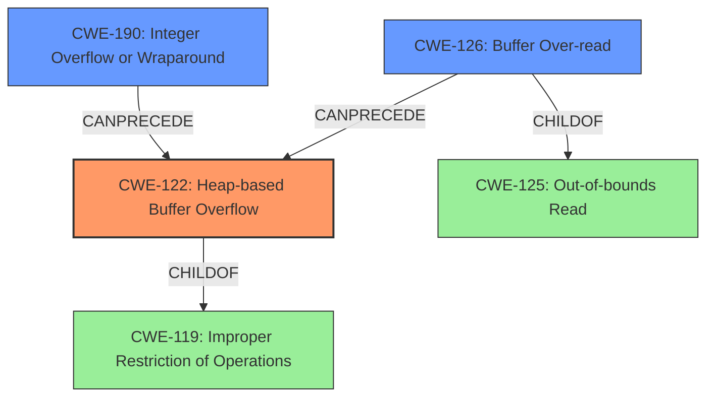

# Final Resolution for CVE-2021-42781

# Summary
| CWE ID | CWE Name | Confidence | CWE Abstraction Level | CWE Vulnerability Mapping Label | CWE-Vulnerability Mapping Notes |
|---|---|---|---|---|---|
| CWE-122 | Heap-based Buffer Overflow | 0.95 | Variant | Allowed | Acceptable-Use |
| CWE-190 | Integer Overflow or Wraparound | 0.60 | Base | Allowed | Acceptable-Use |
| CWE-126 | Buffer Over-read | 0.65 | Variant | Allowed | Acceptable-Use |

## Evidence and Confidence

*   **Confidence Score:** 0.87
*   **Evidence Strength:** HIGH

## Relationship Analysis
The primary weakness is CWE-122, a variant of CWE-119, indicating a heap-based buffer overflow due to insufficient bounds checking. CWE-190 is a potential contributing factor, where integer overflow during size calculation could lead to an undersized buffer. CWE-126 represents reading beyond the allocated heap buffer.

## Vulnerability Chain
The vulnerability chain starts with potential **CWE-190 Integer Overflow or Wraparound** during buffer size calculation, leading to an undersized buffer being allocated. Subsequently, due to **insufficient bounds checking**, a **CWE-122 Heap-based Buffer Overflow** occurs when data is copied into the buffer. This results in a **CWE-126 Buffer Over-read** due to reading beyond the allocated heap buffer, ultimately leading to program crashes.

## Summary of Analysis
The initial analysis was strong, correctly identifying **CWE-122** as the primary weakness. The criticism provided valuable suggestions for refinement.

*   The confidence level for **CWE-190** was reduced to 0.60 to reflect its potential, rather than definitive, contribution. This is based on the statement from CVE Reference Links Content Summary mentions "Inconsistent length validation: Sometimes the code uses `offs > info_len` and sometimes `offs + 2 > info_len` leading to missing checks."
*   **CWE-125** was replaced with **CWE-126** as it is a more precise classification given the vulnerability occurs in the heap.

The selected CWEs are at the optimal level of specificity, with **CWE-122** being a variant that accurately describes the heap-based overflow, and **CWE-190** and **CWE-126** providing additional context about potential contributing factors and consequences.