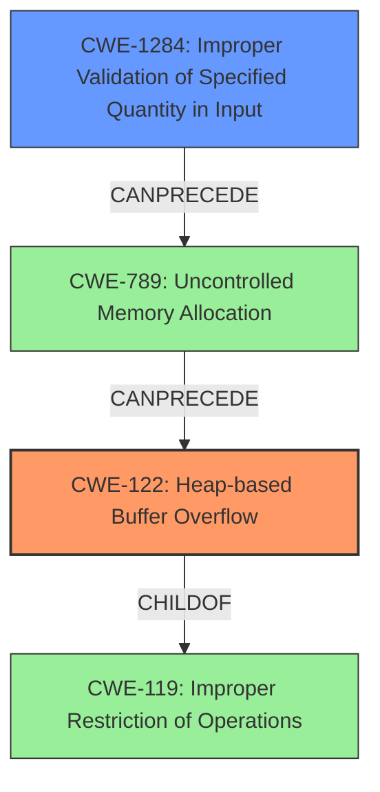

# Final Resolution for CVE-2021-43071

# Summary
| CWE ID | CWE Name | Confidence | CWE Abstraction Level | CWE Vulnerability Mapping Label | CWE-Vulnerability Mapping Notes |
|---|---|---|---|---|---|
| CWE-122 | Heap-based Buffer Overflow | 0.95 | Variant | Primary | Allowed |
| CWE-1284 | Improper Validation of Specified Quantity in Input | 0.80 | Base | Secondary | Allowed |

## Evidence and Confidence

*   **Confidence Score:** 0.90
*   **Evidence Strength:** MEDIUM

## Relationship Analysis
The primary **WEAKNESS** is CWE-122, a *variant* of the broader CWE-119. CWE-122 is more specific because it explicitly identifies the overflow as heap-based. CWE-1284 can precede CWE-789 (Uncontrolled Memory Allocation), which can lead to a heap overflow. Therefore, CWE-1284 is a contributing factor.

## Vulnerability Chain
The vulnerability chain starts with the **ROOTCAUSE** being an improper validation of the input size (CWE-1284). This leads to uncontrolled memory allocation (CWE-789) based on the attacker-controlled size. The uncontrolled memory allocation then results in a heap-based buffer overflow (CWE-122) when the crafted HTTP request data is written to the heap. The impact is the execution of unauthorized code or commands.

## Summary of Analysis
The initial analysis correctly identified CWE-122 as the primary **WEAKNESS**. The criticism suggested considering chained weaknesses, particularly CWE-1284, if the size of the data written to the heap is derived from user-supplied input without proper validation. The vulnerability description states that the issue stems from crafted HTTP requests sent to the LogReport API controller. This implies that the size of the data written to the heap is influenced by the attacker via the HTTP request. Therefore, I am adding CWE-1284 to reflect the lack of input validation on the size of the data. My confidence is slightly lower (0.90 overall) because the exact mechanism of the overflow isn't explicitly detailed in the description.

The selection of CWE-122 is based on the explicit statement of "heap-based buffer overflow". The addition of CWE-1284 is based on the inference that the attacker controls the size of the data, and there is no input validation, which is supported by the use of "crafted HTTP requests." Both **CWEs** are at the appropriate level of specificity.