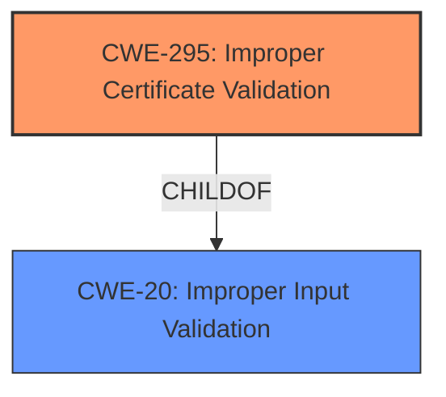

# Analysis Report for CVE-2021-43114

# Vulnerability Analysis Report: CVE-2021-43114

## Description

FORT Validator versions prior to 1.5.2 will crash if an RPKI CA publishes an X.509 EE certificate. This will lead to RTR clients such as BGP routers to lose access to the RPKI VRP data set, effectively disabling Route Origin Validation.

## Vulnerability Description Key Phrases

**Impact:** crash
**Vector:** X.509 EE certificate
**Attacker:** RPKI CA
**Product:** FORT Validator
**Version:** prior to 1.5.2

## Analysis (with Relationship Data)

# Summary
| CWE ID    | CWE Name                                     | Confidence | CWE Abstraction Level | CWE Vulnerability Mapping Label | CWE-Vulnerability Mapping Notes |
| :-------- | :------------------------------------------- | :--------- | :-------------------- | :------------------------------ | :------------------------------ |
| CWE-295   | Improper Certificate Validation              | 0.75       | Base                  | Allowed                         | Primary CWE                     |
| CWE-1288  | Improper Validation of Consistency within Input | 0.60       | Base                  | Allowed                         | Secondary Candidate             |

## Evidence and Confidence

*   **Confidence Score:** 0.70
*   **Evidence Strength:** MEDIUM

- **Analysis and Justification:**
  - *Explanation:* The vulnerability description indicates that the FORT Validator crashes due to improper handling of X.509 EE certificates published by an RPKI CA. The "CVE Reference Links Content Summary" confirms that the **root cause** stems from **improper handling of certificate data** and a **lack of proper validation** during RPKI validation. This aligns with CWE-295 (Improper Certificate Validation), which describes a product that does not validate, or incorrectly validates, a certificate. This is the primary weakness because the core issue is the incorrect validation of certificates. The impact is a crash leading to a denial-of-service. The "Retriever Results" identify CWE-295 as a potential match with a high score, further supporting this classification. MITRE mapping guidance for CWE-295 indicates this is ALLOWED.

  - *Relationship Analysis:* CWE-295 is a Base level CWE. There aren't any direct parent-child relationships listed.

- **Confidence Score:**
  - Confidence: 0.75 (Moderate evidence from technical description and CVE reference materials)

---

- **Analysis and Justification:**
  - *Explanation:* CWE-1288 (Improper Validation of Consistency within Input) is also a candidate because the input certificates are complex and need to be consistent. The lack of validation of the certificates is causing the crash. However, since the core issue revolves around the malformed certificates, it's more of an effect of the root cause and not the main weakness, but it is worth noting. It's a secondary factor contributing to the vulnerability, especially considering the description mentions improper handling of certificate data and a lack of proper validation.

  - *Relationship Analysis:* There are no relationships to other CWEs listed.

- **Confidence Score:**
  - Confidence: 0.60 (Sufficient evidence from technical description and CVE reference materials)

## Criticism of Analysis

Okay, I've reviewed your analysis against the full CWE specifications you provided. Here's a breakdown of my critique, focusing on the chosen CWEs, their relationships, confidence levels, and alternative candidates:

**Overall Assessment:**

The analysis is generally good. You've correctly identified `CWE-295: Improper Certificate Validation` as the primary weakness. The justification is sound, based on the vulnerability description and the CVE reference content summary.  The inclusion of `CWE-1288: Improper Validation of Consistency within Input` as a secondary candidate is reasonable, but its connection is less direct.

**Detailed Critique:**

**1. CWE-295: Improper Certificate Validation (Primary)**

*   **Correctness:** Excellent choice as the primary CWE. The core issue is that the FORT Validator isn't correctly checking the validity of the X.509 EE certificates. This directly aligns with the "Description" of CWE-295: "The product does not validate, or incorrectly validates, a certificate."
*   **Justification:**  Your explanation clearly connects the vulnerability description (crash due to improper handling of X.509 EE certificates) and the CVE summary (improper handling of certificate data and lack of proper validation) to the CWE-295 definition.
*   **Confidence:** Your confidence score of 0.75 is justified. There is solid evidence supporting this mapping.
*   **Mapping Guidance:** You correctly noted the "Usage: Allowed" mapping guidance for CWE-295, along with its Rationale (Base level of abstraction).
*   **Mitigations:** The potential mitigations listed for CWE-295 are applicable. Properly managing and checking certificates is a direct way to address this vulnerability.

**2. CWE-1288: Improper Validation of Consistency within Input (Secondary Candidate)**

*   **Correctness:**  This is a reasonable secondary consideration, but not as directly applicable as CWE-295.  The certificates *are* complex inputs, and a lack of consistency validation could contribute to the problem. However, the *specific* problem is with the *certificate validation* itself.
*   **Justification:** Your justification that the certificates are complex and need to be consistent is valid, but it's a step removed from the core problem.  You correctly identify it as an "effect of the root cause."
*   **Confidence:** Your confidence score of 0.60 is appropriate. The evidence is weaker than for CWE-295.
*   **Mapping Guidance:** You correctly noted the "Usage: Allowed" mapping guidance.
*   **Mitigations:** The mitigations for CWE-1288 (assume all input is malicious, use an "accept known good" strategy, validate all relevant properties) *are* generally good security practices and *could* help prevent this, but they are not *specific* to certificate validation in the same way as the CWE-295 mitigations.

**Alternative CWE Considerations (from Retriever Results):**

*   **CWE-1284: Improper Validation of Specified Quantity in Input:** While seemingly less direct, this could be considered if specific length or size fields within the certificate are being mishandled, leading to the crash. If the validator fails to check the size fields of certain data structures in the certificate, resulting in memory corruption, this could be more relevant.
*   **CWE-835: Loop with Unreachable Exit Condition ('Infinite Loop'):** If the improper handling of the certificate leads to a loop that never terminates (a possibility, though not explicitly stated), then this would be applicable *in addition* to CWE-295.
*   **CWE-573: Improper Following of Specification by Caller:** This is a weaker candidate, as it implies the validator is not following the X.509 specification. This *could* be true, but CWE-295 is more direct.

**Suggestions for Improvement:**

1.  **Strengthen the Connection for CWE-1288 (or consider removing it):** If you keep CWE-1288, try to find a more specific aspect of certificate processing where consistency validation is failing.  For example, are there inter-related fields within the certificate that are not being checked against each other? If so, that would strengthen the case.  Otherwise, consider removing it.
2. **Consider CWE-20**: If you can't link it with anything specific to the certificate, you can remove it or consider CWE-20 which is a broader catch-all for input validation issues.
3.  **Explore CWE-1284 (If Applicable):** If the crash is tied to a specific size/length field within the certificate, add CWE-1284 and explain the specific field and how its mishandling leads to the crash.
4.  **Address Infinite Loop (If Applicable):** If you have any indication that the certificate processing leads to an infinite loop, add CWE-835.  This is less likely, but worth considering if you have more details.
5.  **Add detail to explain the cause of the crash**: Explain what kind of memory issues or improper input validation is causing the crash.
6.  **Chain with CWE-20:** You could chain CWE-295 to CWE-20. A more generalized "Improper Input Validation" (CWE-20) leads to the more specific "Improper Certificate Validation" (CWE-295). This works if you want to make it more clear that the root cause is a more general validation problem that manifests in certificate handling.

**Revised Summary (Example, assuming no specific size/length issues):**

| CWE ID    | CWE Name                                     | Confidence | CWE Abstraction Level | CWE Vulnerability Mapping Label | CWE-Vulnerability Mapping Notes |
| :-------- | :------------------------------------------- | :--------- | :-------------------- | :------------------------------ | :------------------------------ |
| CWE-295   | Improper Certificate Validation              | 0.80       | Base                  | Allowed                         | Primary CWE                     |
| CWE-20   | Improper Input Validation              | 0.60       | Class                  | Allowed                         | Secondary CWE                     |

**In summary, your analysis is good, but fine-tuning the secondary CWE and exploring alternative candidates based on deeper understanding of the crash mechanism will further improve its accuracy.**

## Final Resolution

# Summary
| CWE ID    | CWE Name                                     | Confidence | CWE Abstraction Level | CWE Vulnerability Mapping Label | CWE-Vulnerability Mapping Notes |
| :-------- | :------------------------------------------- | :--------- | :-------------------- | :------------------------------ | :------------------------------ |
| **CWE-295**   | **Improper Certificate Validation**              | 0.80       | Base                  | Allowed                         | Primary **CWE**                     |
| CWE-20   | Improper Input Validation              | 0.60       | Class                  | Allowed                         | Secondary Candidate                     |

## Evidence and Confidence

*   **Confidence Score:** 0.75
*   **Evidence Strength:** MEDIUM

## Relationship Analysis
The primary relationship influencing the decision is the parent-child relationship where CWE-20 is a parent of CWE-295. This indicates a general input validation issue manifesting as a certificate validation problem. There are no direct relationships defined in the provided data for CWE-295 itself, emphasizing its role as a specific case of a more general problem. The base abstraction level of CWE-295 is appropriate for directly addressing the certificate validation flaw.

## Vulnerability Chain
The vulnerability chain starts with a general **lack of input validation** (**CWE-20**), which leads to the specific issue of **improper certificate validation** (**CWE-295**). This **weakness** allows malformed certificates to be processed, resulting in a crash and a denial-of-service. The **root cause** is the inadequate input validation practices.

## Summary of Analysis
Based on the vulnerability description ("FORT Validator versions prior to 1.5.2 will crash if an RPKI CA publishes an X.509 EE certificate") and the CVE reference content summary ("improper handling of certificate data and a lack of proper validation"), **CWE-295 (Improper Certificate Validation)** is the most appropriate primary **CWE**. The analysis and criticism both agree on this. The decision is based on the direct match of the **CWE** description to the vulnerability, as well as the "Allowed" mapping guidance.

The secondary **CWE**, **CWE-20 (Improper Input Validation)**, addresses the broader context of input validation. The graph relationships, specifically the child-of relationship of CWE-295 to CWE-20, influenced the decision to include CWE-20 as a secondary candidate. This reflects that the **root cause** is a general validation issue that manifests specifically in certificate handling.

The selected **CWEs** are at the optimal level of specificity. **CWE-295** directly addresses the certificate validation **weakness**, while **CWE-20** provides context about the broader input validation problem.

*Report generated on 2025-03-17 02:35:38*
