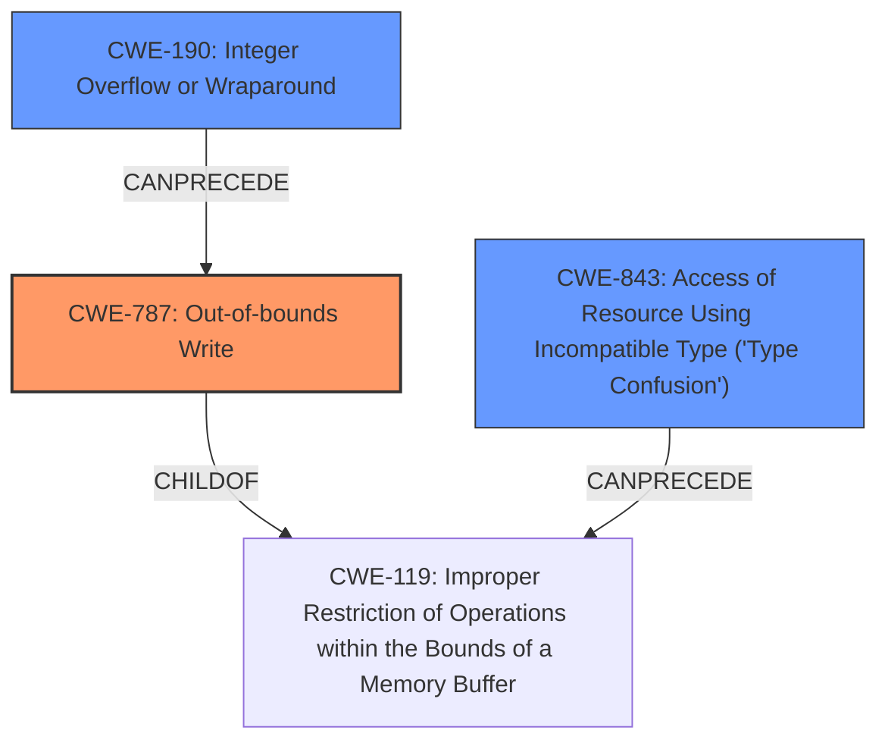

# Final Resolution for CVE-2021-43215

# Summary
| CWE ID | CWE Name | Confidence | CWE Abstraction Level | CWE Vulnerability Mapping Label | CWE-Vulnerability Mapping Notes |
|---|---|---|---|---|---|
| CWE-787 | Out-of-bounds Write | 0.85 | Base | Primary | Allowed. Memory corruption with RCE impact points to this CWE. |
| CWE-190 | Integer Overflow or Wraparound | 0.65 | Base | Secondary | Allowed. Integer overflow can cause undersized buffer, followed by CWE-787. |
| CWE-843 | Access of Resource Using Incompatible Type ('Type Confusion') | 0.50 | Base | Secondary | Allowed. Type confusion can lead to incorrect memory access and exploitable corruption. |

## Evidence and Confidence

*   **Confidence Score:** 0.80
*   **Evidence Strength:** MEDIUM

## Relationship Analysis
The primary weakness is **CWE-787 (Out-of-bounds Write)**, which is a child of **CWE-119 (Improper Restriction of Operations within the Bounds of a Memory Buffer)**. This parent-child relationship indicates that **CWE-787** provides a more specific description of the vulnerability than **CWE-119**. **CWE-190 (Integer Overflow or Wraparound)** can precede **CWE-787**, as an integer overflow might lead to an undersized buffer allocation. **CWE-843 (Access of Resource Using Incompatible Type ('Type Confusion'))** can also precede **CWE-119** if the type confusion leads to incorrect memory access. These chain relationships help to build a more complete picture of the vulnerability.

## Vulnerability Chain
The vulnerability chain starts with either **CWE-190 (Integer Overflow or Wraparound)** or **CWE-843 (Access of Resource Using Incompatible Type ('Type Confusion'))**.

*   If **CWE-190** occurs, it leads to an undersized buffer allocation. This is then followed by **CWE-787 (Out-of-bounds Write)** when data is written beyond the allocated buffer.
*   If **CWE-843** occurs, it leads to incorrect memory access, which can result in **CWE-119 (Improper Restriction of Operations within the Bounds of a Memory Buffer)**. This could then be followed by **CWE-787** due to the memory corruption.

The final impact is remote code execution due to the memory corruption caused by the out-of-bounds write.

## Summary of Analysis
The initial analysis correctly identified **CWE-787 (Out-of-bounds Write)** as the primary **WEAKNESS** due to the memory corruption mentioned in the vulnerability description and the resulting remote code execution. The criticism suggested improvements, particularly in detailing the potential vulnerability chains involving **CWE-190 (Integer Overflow or Wraparound)** and **CWE-843 (Access of Resource Using Incompatible Type ('Type Confusion'))**.

The assessment is based on the provided evidence, specifically the phrase "**memory corruption**" in the vulnerability description, which aligns well with **CWE-787**. The relationship analysis confirms that **CWE-787** is a more specific description than its parent, **CWE-119**. The chain relationships involving **CWE-190** and **CWE-843** further support their inclusion as secondary **WEAKNESSES**.

The selected CWEs are at the optimal level of specificity, with **CWE-787** being a Base-level CWE that directly addresses the memory corruption issue.