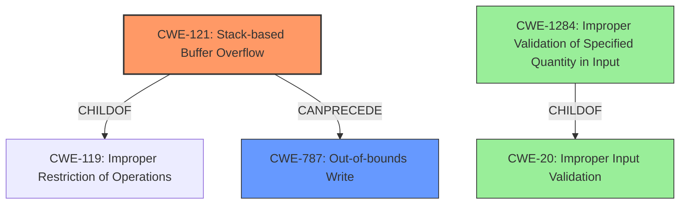

# Analysis Report for CVE-2021-43299

# Vulnerability Analysis Report: CVE-2021-43299

## Description

Stack overflow in PJSUA API when calling pjsua_player_create. An attacker-controlled filename argument may cause a buffer overflow since it is copied to a fixed-size stack buffer without any size validation.

## Vulnerability Description Key Phrases

**Weakness:** stack overflow
**Attacker:** attacker
**Product:** PJSUA
**Component:** pjsua_player_create

## Analysis (with Relationship Data)

# Summary
| CWE ID | CWE Name | Confidence | CWE Abstraction Level | CWE Vulnerability Mapping Label | CWE-Vulnerability Mapping Notes |
|---|---|---|---|---|---|
| CWE-121 | Stack-based Buffer Overflow | 1.0 | Variant | Primary | Allowed |
| CWE-787 | Out-of-bounds Write | 0.7 | Base | Secondary | Allowed |

## Evidence and Confidence

*   **Confidence Score:** 0.9
*   **Evidence Strength:** HIGH

- **Analysis and Justification:**  
  - *Explanation:* The vulnerability description clearly states a "**stack overflow**" occurs in the PJSUA API's `pjsua_player_create` function because the `filename` argument is copied to a fixed-size stack buffer without size validation. This directly matches the definition of CWE-121 (Stack-based Buffer Overflow), which involves writing beyond the boundaries of a buffer allocated on the stack. The "**attacker** controlled filename argument" further confirms the untrusted source of the oversized data. The CVE Reference Links Content Summary corroborates the stack buffer overflow due to missing size validation. While other CWEs like CWE-120 (Buffer Copy without Checking Size of Input) and CWE-787 (Out-of-bounds Write) are relevant, CWE-121 is the most specific variant due to the stack allocation context. The MITRE mapping guidance for CWE-121 indicates that this mapping is ALLOWED. The CVSS score of 9.8 (Critical) highlights the severe impact of this weakness. CWE-787 is also listed by the CVE as weakness/vulnerabilities present, indicating that the overflow leads to out-of-bounds write.

  - *Relationship Analysis:* CWE-121 is a variant of CWE-119 (Improper Restriction of Operations within the Bounds of a Memory Buffer), providing a more specific classification. It can also be viewed as a specific instance of CWE-787 (Out-of-bounds Write).

- **Confidence Score:**
  - Confidence: 1.0 (Strong evidence from vulnerability description, CVE summary, and direct CWE mapping)

---

## Criticism of Analysis

Okay, I've reviewed the provided analysis against the full CWE specifications. Here's my critique:

**Overall Assessment:**

The analysis is generally good and arrives at the correct primary CWE (CWE-121). The justification is well-reasoned and uses relevant information from the vulnerability description and CVE summary. The inclusion of CWE-787 as a secondary CWE is also appropriate. However, the retriever results contain several CWEs that are not fully applicable, and it may be useful to explain why they are not so that the analysis is more precise.

**Specific Points:**

*   **CWE-121 (Stack-based Buffer Overflow):**
    *   **Confidence:** The assigned confidence of 1.0 is justified. The description explicitly mentions a stack overflow due to copying an attacker-controlled filename to a fixed-size stack buffer without validation. This aligns perfectly with the definition of CWE-121.
    *   **Mapping Guidance:** The analysis correctly acknowledges that the mapping to CWE-121 is "Allowed" according to CWE's mapping guidance.
    *   **Potential Mitigations:** The analysis could have briefly mentioned the relevance of mitigations such as using compiler-provided buffer overflow detection mechanisms (e.g., /GS flag, FORTIFY_SOURCE) as a defense-in-depth measure. Also, it is worth noting in the justification that higher level languages with memory management will prevent this vulnerability from occurring.
*   **CWE-787 (Out-of-bounds Write):**
    *   **Confidence:** A confidence score of 0.7 is appropriate. CWE-787 is a broader category than CWE-121, but the stack overflow certainly leads to out-of-bounds write. The CVE references CWE-787 directly.
    *   **Mapping Guidance:** The analysis correctly states that the mapping to CWE-787 is "Allowed."
    *   **Potential Mitigations:** As with CWE-121, mentioning language selection or compiler-based protections would be relevant.
*   **Retriever Results Critique:** The retriever results contain several CWEs that should have been further analyzed in the primary report:
    *   **CWE-120 (Buffer Copy without Checking Size of Input):** While closely related, CWE-120 is more general than CWE-121. Since the overflow occurs specifically on the *stack*, CWE-121 is a better fit. The analysis is correct not to make this the primary CWE, but it *should* explicitly explain *why* CWE-121 is preferred.
    *   **CWE-190 (Integer Overflow or Wraparound), CWE-1325 (Improperly Controlled Sequential Memory Allocation), CWE-789 (Memory Allocation with Excessive Size Value), CWE-193 (Off-by-one Error), CWE-1284 (Improper Validation of Specified Quantity in Input), CWE-131 (Incorrect Calculation of Buffer Size), CWE-770 (Allocation of Resources Without Limits or Throttling), CWE-126 (Buffer Over-read):** These CWEs are less directly related to the core vulnerability. While an integer overflow or incorrect buffer size calculation *could* be a contributing factor in *some* buffer overflows, there's no indication of that in the vulnerability description provided. Unless there's evidence to suggest that one of these CWEs is involved, they should not be included as a primary or secondary CWE. The high retriever scores for these CWEs may be a result of their association with buffer overflows in general, rather than a specific characteristic of this specific vulnerability.

**Recommendations:**

1.  **Strengthen Justification:** While the primary CWE selection is correct, explicitly explain why the other *highly ranked* CWEs from the retriever results (especially CWE-120) were *not* chosen as the primary CWE. This demonstrates a thorough understanding of the nuances of each CWE.
2.  **Refine Confidence Scores:** Ensure that the confidence scores accurately reflect the strength of the evidence for each CWE. If there's no direct evidence for a particular CWE, it should not be included.
3.  **Expand on Mitigations:** Briefly mention a few relevant mitigation strategies, even if they are general, to provide a more comprehensive analysis.
4.  **Remove Inapplicable retriever results:** Remove CWEs that aren't applicable to the specific vulnerability. For example, the integer overflow CWEs (CWE-190, CWE-131, CWE-789) aren't relevant given the provided information.
5.  **Add CWE-20 and CWE-1284 as tertiary CWEs.** Although no input validation occurs, this is a direct result of a failure to provide said input validation. Input is taken from the attacker, but not validated as to the length of the filename.

By incorporating these suggestions, the analysis can be even more precise and demonstrate a deeper understanding of the CWE specifications and their application to this specific vulnerability.

## Final Resolution

# Summary

| CWE ID | CWE Name | Confidence | CWE Abstraction Level | CWE Vulnerability Mapping Label | CWE-Vulnerability Mapping Notes |
|---|---|---|---|---|---|
| CWE-121 | Stack-based Buffer Overflow | 1.0 | Variant | Primary | Allowed |
| CWE-787 | Out-of-bounds Write | 0.7 | Base | Secondary | Allowed |
| CWE-20 | Improper Input Validation | 0.4 | Class | Tertiary | Allowed |
| CWE-1284 | Improper Validation of Specified Quantity in Input | 0.4 | Base | Tertiary | Allowed |

## Evidence and Confidence

*   **Confidence Score:** 0.9
*   **Evidence Strength:** HIGH

## Relationship Analysis
The primary CWE is CWE-121, which is a variant of CWE-119 (Improper Restriction of Operations within the Bounds of a Memory Buffer), providing a more specific classification because the overflow occurs on the stack. It is also related to CWE-787 (Out-of-bounds Write), as the overflow leads to writing beyond the buffer's boundaries. CWE-20 and CWE-1284 are added as tertiary CWEs because the root cause stems from a lack of input validation on the filename length which is attacker controlled. CWE-1284 is a child of CWE-20, further specifying the lack of validation of a specified quantity (filename length) in the input.

## Vulnerability Chain
The vulnerability chain starts with the lack of input validation (**CWE-20** and **CWE-1284**) on the attacker-controlled filename argument. This leads to a **buffer copy** operation without checking the size of the input. Because a fixed-size buffer is allocated on the stack, a stack-based buffer overflow (**CWE-121**) occurs when the filename exceeds the buffer's capacity. This, in turn, results in an out-of-bounds write (**CWE-787**), potentially allowing the attacker to overwrite adjacent stack variables or control the program's execution flow.

## Summary of Analysis
The initial analysis correctly identified **CWE-121** as the primary weakness. The vulnerability description explicitly states a "**stack overflow**" due to copying an attacker-controlled filename to a fixed-size stack buffer without validation. This aligns perfectly with the definition of **CWE-121**. The secondary weakness, **CWE-787**, is also correctly identified as an out-of-bounds write resulting from the overflow.

The criticism suggested adding **CWE-20** and **CWE-1284** as tertiary CWEs due to the lack of input validation. The vulnerability description states the "**attacker** controlled filename argument" and that the filename is copied "**without any size validation**." This is the root cause, and failing to validate the attacker controlled input length can be described by **CWE-20** and more specifically by **CWE-1284**.

Other retriever results such as **CWE-120, CWE-190, CWE-1325, CWE-789, CWE-193, CWE-131, CWE-770, and CWE-126** are not directly applicable because the vulnerability description does not provide evidence to support these. For example, there is no mention of integer overflow in the description, so including those would not be evidence based.

The final selection of CWEs reflects the optimal level of specificity because **CWE-121** describes the exact type of buffer overflow (stack-based), **CWE-787** describes the resulting out-of-bounds write, and **CWE-20** and **CWE-1284** capture the root cause of the lack of input validation on the attacker-controlled length of the filename.

*Report generated on 2025-03-18 03:07:53*
