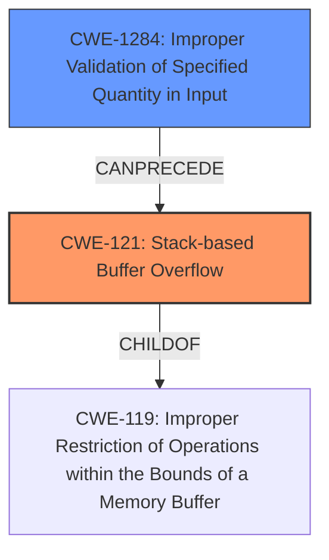

# Analysis Report for CVE-2021-43301

# Vulnerability Analysis Report: CVE-2021-43301

## Description

Stack overflow in PJSUA API when calling pjsua_playlist_create. An attacker-controlled file_names argument may cause a buffer overflow since it is copied to a fixed-size stack buffer without any size validation.

## Vulnerability Description Key Phrases

**Rootcause:** stack overflow
**Attacker:** attacker
**Product:** PJSUA
**Component:** pjsua_playlist_create API

## Analysis (with Relationship Data)

# Summary
| CWE ID | CWE Name | Confidence | CWE Abstraction Level | CWE Vulnerability Mapping Label | CWE-Vulnerability Mapping Notes |
|---|---|---|---|---|---|
| CWE-121 | Stack-based Buffer Overflow | 0.95 | Variant | Primary | Allowed |
| CWE-1284 | Improper Validation of Specified Quantity in Input | 0.6 | Base | Secondary | Allowed |

## Evidence and Confidence

*   **Confidence Score:** 0.85
*   **Evidence Strength:** HIGH

- **Analysis and Justification:**
  - *Explanation:* The vulnerability description clearly states a "**stack overflow**" occurs in the `pjsua_playlist_create` API due to an attacker-controlled `file_names` argument being copied to a fixed-size stack buffer without size validation. This aligns directly with CWE-121 (Stack-based Buffer Overflow), which is a Variant-level CWE. The CVE Reference Links Content Summary further reinforces this by stating the **root cause** is a stack overflow due to insufficient size validation, and the **weakness** is the missing size checks. CWE-121 is therefore selected as the primary CWE. CWE-1284 (Improper Validation of Specified Quantity in Input) is selected as a secondary weakness because the root cause includes missing validation of the filenames size.
  
  - *Relationship Analysis:* CWE-121 is a variant of CWE-119 (Improper Restriction of Operations within the Bounds of a Memory Buffer). CWE-1284 is related to CWE-121 because the buffer overflow is caused by the lack of validation of the input size.

- **Confidence Score:**
  - Confidence: 0.95 (Strong evidence from the vulnerability description and CVE reference summary.)
---

## Criticism of Analysis

Okay, I've reviewed your analysis of the PJSUA API stack overflow vulnerability (CVE-2021-43301) along with the full CWE specifications you've provided. Here's a breakdown of my critique:

**Overall Assessment:**

The analysis is generally good, and the primary CWE mapping to CWE-121 (Stack-based Buffer Overflow) is correct and well-justified. The inclusion of CWE-1284 (Improper Validation of Specified Quantity in Input) as a secondary CWE is also a reasonable addition, providing more context to the root cause. The confidence score of 0.95 is appropriate given the clear evidence.

**Specific Comments and Suggestions:**

1.  **Primary CWE: CWE-121 (Stack-based Buffer Overflow)**

    *   **Strengths:** The rationale for choosing CWE-121 is strong. The vulnerability description explicitly mentions a "stack overflow" due to missing size validation during a memory copy operation. This aligns perfectly with the definition of CWE-121.
    *   **Mapping Guidance Compliance:** CWE-121 is an Allowed CWE and is at the Variant level of abstraction, which is a preferred level.
    *   **Mitigation Considerations:**
        *   The analysis could be slightly improved by mentioning some of the mitigations described in the CWE-121 specification. For example:
            *   "Use automatic buffer overflow detection mechanisms offered by compilers or compiler extensions (e.g., /GS flag in Visual Studio, FORTIFY\_SOURCE in GCC)." This is a good, practical suggestion.
            *   "Implement and perform bounds checking on input." This reinforces the importance of validating the length of the file names.
    *   **Observed Examples:** It may be helpful to list some Observed Examples like CVE-2021-35395 to connect this vulnerability to real-world instances and demonstrate the widespread nature of this weakness.

2.  **Secondary CWE: CWE-1284 (Improper Validation of Specified Quantity in Input)**

    *   **Strengths:** Including CWE-1284 provides valuable context. The stack overflow occurs because the *quantity* (length) of the input file names is not validated before being copied to the stack buffer.
    *   **Mapping Guidance Compliance:** CWE-1284 is an Allowed CWE and is at the Base level of abstraction.
    *   **Relationship Analysis:** The explanation of the relationship between CWE-121 and CWE-1284 is accurate.  The lack of validation (CWE-1284) directly *causes* the buffer overflow (CWE-121).
    *   **Mitigation Considerations:**
        *   Highlight the importance of using an "accept known good" input validation strategy, as described in the CWE-1284 specification.  This means explicitly defining the maximum allowed length for file names and rejecting any input that exceeds this limit.
    *   **CWE-20 as a superset:** Since CWE-1284 is a specific case of improper input validation, it's better to map to CWE-1284 than the more general CWE-20. CWE-20's mapping guidance states that it should be avoided when lower-level CWEs are available.

3.  **Other CWEs Considered (and Rejected)**

    *   The Retriever Results listed several other CWEs. It's good to implicitly consider these, even if you don't explicitly mention them. Here's a brief analysis of some of the top ones:
        *   **CWE-190 (Integer Overflow or Wraparound):** While *possible* if the length calculation involved an integer overflow, it's not the primary cause. The root cause is the missing validation, not necessarily a calculation error.
        *   **CWE-1325 (Improperly Controlled Sequential Memory Allocation):** This is less relevant.  The problem isn't about allocating *multiple* buffers without limits; it's about overflowing a *single*, fixed-size buffer.
        *   **CWE-120 (Buffer Copy without Checking Size of Input):** While related, CWE-121 is a *variant* of a buffer overflow, explicitly highlighting that it is stack-based.
        *   **CWE-789 (Memory Allocation with Excessive Size Value):**  This is not about excessively allocating memory. It is about writing to a fixed size allocated space beyond its size.
        *   **CWE-193 (Off-by-one Error):** Less likely, unless the size calculation is off by one.

4. **Confidence Score:**
   * The 0.95 confidence score is appropriate. The primary CWE is very clear from the description.

**Revised Summary Table**

| CWE ID | CWE Name | Confidence | CWE Abstraction Level | CWE Vulnerability Mapping Label | CWE-Vulnerability Mapping Notes |
|---|---|---|---|---|---|
| CWE-121 | Stack-based Buffer Overflow | 0.95 | Variant | Primary | Allowed |
| CWE-1284 | Improper Validation of Specified Quantity in Input | 0.6 | Base | Secondary | Allowed |

**In summary, the analysis is strong, and the CWE mappings are accurate. The suggestions above are aimed at further strengthening the analysis by explicitly connecting it to the CWE specifications' mitigation guidance and observed examples.**

## Final Resolution

# Summary
| CWE ID | CWE Name | Confidence | CWE Abstraction Level | CWE Vulnerability Mapping Label | CWE-Vulnerability Mapping Notes |
|---|---|---|---|---|---|
| CWE-121 | Stack-based Buffer Overflow | 0.95 | Variant | Primary | Allowed |
| CWE-1284 | Improper Validation of Specified Quantity in Input | 0.6 | Base | Secondary | Allowed |

## Evidence and Confidence

*   **Confidence Score:** 0.95
*   **Evidence Strength:** HIGH

## Relationship Analysis
The primary CWE, CWE-121 (**Stack-based Buffer Overflow**), is a variant of CWE-119 (**Improper Restriction of Operations within the Bounds of a Memory Buffer**). This parent-child relationship confirms that CWE-121 is at an appropriate level of specificity. The secondary CWE, CWE-1284 (**Improper Validation of Specified Quantity in Input**), is a contributing factor to the stack overflow, as the lack of input validation allows an excessively large input to be copied to the stack buffer. Thus CWE-1284 can precede CWE-121.

## Vulnerability Chain
The vulnerability chain starts with CWE-1284 (**Improper Validation of Specified Quantity in Input**), where the size of the input `file_names` argument is not validated. This leads to CWE-121 (**Stack-based Buffer Overflow**) when the oversized input is copied to a fixed-size stack buffer. The lack of input validation is the **ROOTCAUSE**, and the resulting stack overflow is the **WEAKNESS** that can be exploited.

## Summary of Analysis
The initial analysis and the criticism both agree that the primary CWE should be CWE-121 (**Stack-based Buffer Overflow**). The vulnerability description explicitly mentions a stack overflow due to missing size validation, providing strong evidence for this classification. The secondary CWE, CWE-1284 (**Improper Validation of Specified Quantity in Input**), is included because the root cause includes missing validation of the filenames size.

The graph relationships confirm the appropriateness of the CWE selections. CWE-121 is a variant of CWE-119, indicating the right level of specificity. CWE-1284 precedes CWE-121, showing how the lack of input validation leads to the stack overflow.

The selected CWEs are at the optimal level of specificity. CWE-121 accurately describes the stack-based nature of the buffer overflow, and CWE-1284 identifies the lack of input validation as the root cause.

*Report generated on 2025-03-18 03:09:27*
