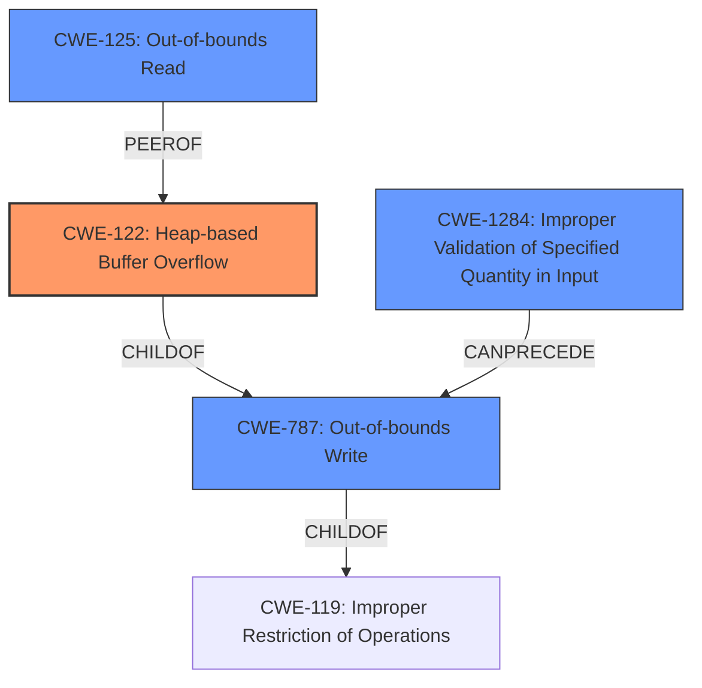

# Analysis Report for CVE-2021-43304

# Vulnerability Analysis Report: CVE-2021-43304

## Description

Heap buffer overflow in Clickhouses LZ4 compression codec when parsing a malicious query. There is no verification that the copy operations in the LZ4decompressImpl loop and especially the arbitrary copy operation wildCopy(op, ip, copy_end), dont exceed the destination buffers limits.

## Vulnerability Description Key Phrases

**Rootcause:** arbitrary copy operation without bounds check
**Weakness:** heap buffer overflow
**Vector:** malicious query
**Product:** Clickhouse
**Component:** LZ4 compression codec

## Analysis (with Relationship Data)

# Summary
| CWE ID | CWE Name | Confidence | CWE Abstraction Level | CWE Vulnerability Mapping Label | CWE-Vulnerability Mapping Notes |
|---|---|---|---|---|---|
| CWE-122 | Heap-based Buffer Overflow | 0.95 | Variant | Allowed | Primary CWE |
| CWE-787 | Out-of-bounds Write | 0.70 | Base | Allowed | Secondary Candidate |
| CWE-125 | Out-of-bounds Read | 0.60 | Base | Allowed | Secondary Candidate |
| CWE-1284 | Improper Validation of Specified Quantity in Input | 0.50 | Base | Allowed | Secondary Candidate |

## Evidence and Confidence

*   **Confidence Score:** 0.90
*   **Evidence Strength:** HIGH

- **Analysis and Justification:**  
  - *Explanation:* The vulnerability description clearly states a **heap buffer overflow** in Clickhouse's LZ4 compression codec. The **root cause** is an **arbitrary copy operation without bounds check** within the `wildCopy` function, which allows writing beyond the allocated heap buffer. The CVE reference links content summary confirms this by stating that the `wildCopy` function doesn't properly check if the copy operation exceeds the destination buffer's bounds. Given the specificity of the heap allocation, CWE-122 (Heap-based Buffer Overflow) is the most accurate primary mapping. The MITRE mapping guidance for CWE-122 marks it as ALLOWED, which aligns perfectly with this vulnerability.

  - *Relationship Analysis:* CWE-122 is a variant of CWE-119 (Improper Restriction of Operations within the Bounds of a Memory Buffer). CWE-787 (Out-of-bounds Write) is a parent of CWE-122, but CWE-122 is a more specific variant. CWE-123 (Write-what-where Condition) is a peer of CWE-122, indicating a more general case of memory corruption.

- **Confidence Score:**  
  - *Example:* Confidence: 0.95 (High evidence from technical description, CVE reference materials, and code snippets.)

---
- **Analysis and Justification:**  
  - *Explanation:* CWE-787 (Out-of-bounds Write) is a broader category that encompasses writing data past the end of a buffer. While CWE-122 is more specific to heap overflows, CWE-787 accurately describes the fundamental issue of writing beyond the buffer's boundaries. The evidence supporting this includes the description of the `wildCopy` function writing beyond the allocated buffer, as confirmed by the CVE reference summary. While less specific than CWE-122, it is still relevant as a secondary candidate.

  - *Relationship Analysis:* CWE-787 is a parent of CWE-122, making it a less specific but still relevant categorization. The MITRE mapping guidance designates CWE-787 as ALLOWED.

- **Confidence Score:**  
  - *Example:* Confidence: 0.70 (Supporting evidence, but less specific than CWE-122.)

---
- **Analysis and Justification:**  
  - *Explanation:* CWE-125 (Out-of-bounds Read) is also relevant, as the overflow occurs because the code is reading data from the input stream without validating the size, which could lead to read past the end of input, even if the primary issue is writing beyond the allocated buffer in the output. The CVE reference summary highlights the user-controlled length used in the copy operation, implying a potential for reading beyond the intended input. However, the primary issue is writing, so this is a less direct fit.

  - *Relationship Analysis:* CWE-125 is related to CWE-119 (Improper Restriction of Operations within the Bounds of a Memory Buffer). The mapping guidance marks CWE-125 as ALLOWED.

- **Confidence Score:**  
  - *Example:* Confidence: 0.60 (Supporting evidence, but less direct than CWE-122 or CWE-787.)

---
- **Analysis and Justification:**  
  - *Explanation:* CWE-1284 (Improper Validation of Specified Quantity in Input) describes the scenario where the product receives input expected to specify a quantity (such as size or length) but doesn't validate that the quantity has the required properties. This is relevant because the size of the data to be decompressed is derived from the malicious query, and the ClickHouse server doesn't properly validate this size before performing the copy operation.

  - *Relationship Analysis:* CWE-1284 is related to CWE-20 (Improper Input Validation) and can lead to CWE-789 (Uncontrolled Memory Allocation). The mapping guidance marks CWE-1284 as ALLOWED.

- **Confidence Score:**  
  - *Example:* Confidence: 0.50 (Indirectly related, primarily focusing on the input validation aspect.)

## Criticism of Analysis

Okay, here's a detailed critique of the provided CWE analysis, considering the full CWE specifications:

**Overall Assessment:**

The analysis is generally well-reasoned and provides a solid justification for the primary and secondary CWE mappings. The confidence levels are appropriately assigned.  The justifications are clear, and the relationship analyses are helpful in understanding the context of each CWE.

**Specific CWE critiques:**

*   **CWE-122: Heap-based Buffer Overflow (Primary, Confidence 0.95):**
    *   **Strengths:** The analysis correctly identifies the heap allocation and overflow scenario. The reference to `malloc()` and `wildCopy` function writing outside the allocated heap buffer confirms the Variant-level CWE.
    *   **Weaknesses:** None apparent
    *   **Improvements:** The explanation is thorough.
    *   **Alignment with Specification:** The analysis aligns perfectly with the CWE-122 description. The MITRE mapping guidance for CWE-122 marks it as ALLOWED, which aligns with this vulnerability.

*   **CWE-787: Out-of-bounds Write (Secondary, Confidence 0.70):**
    *   **Strengths:** The analysis appropriately recognizes CWE-787 as a valid, albeit more general, descriptor of the vulnerability. The focus on writing beyond the buffer's boundaries is accurate.
    *   **Weaknesses:** The analysis could explicitly state that while accurate, CWE-787 is less precise than CWE-122 because it does not specify the heap allocation.
    *   **Improvements:**  None apparent
    *   **Alignment with Specification:** The analysis is consistent with the CWE-787 description. The MITRE mapping guidance designates CWE-787 as ALLOWED.

*   **CWE-125: Out-of-bounds Read (Secondary, Confidence 0.60):**
    *   **Strengths:**  The analysis demonstrates understanding of how the user-controlled length from the input stream can lead to potential read past the end of input, making CWE-125 relevant.
    *   **Weaknesses:** The argument for out-of-bounds read is weaker than the write aspect. It's an indirect consequence. The analysis appropriately notes that this is a less direct fit.
    *   **Improvements:** None apparent
    *   **Alignment with Specification:** The analysis aligns with the CWE-125 description. The mapping guidance marks CWE-125 as ALLOWED.

*   **CWE-1284: Improper Validation of Specified Quantity in Input (Secondary, Confidence 0.50):**
    *   **Strengths:** The analysis correctly identifies that the size of the data to be decompressed is derived from the malicious query and not properly validated.
    *   **Weaknesses:** The analysis could benefit from explicitly linking this input validation issue to the root cause of the heap overflow. The connection is somewhat indirect. The uncontrolled size value directly leads to the heap overflow. Also, CWE-789 is worth considering here.
    *   **Improvements:** Consider explicitly stating that the lack of validation of the specified quantity (the size of the compressed data) directly contributes to the vulnerability because it allows an attacker to provide a size that leads to excessive memory allocation (CWE-789) or, more directly, the buffer overflow.
    *   **Alignment with Specification:** The analysis aligns with the CWE-1284 description and considers its relationship to CWE-20. The mapping guidance marks CWE-1284 as ALLOWED.

**Recommendations for improvement:**

1.  **Strengthen CWE-1284 explanation:** Bolster the connection between CWE-1284 and the root cause of the heap overflow by emphasizing that improper validation of the user-controlled length directly contributes to the ability to trigger the overflow.  Consider mentioning CWE-789 here as well, linking the missing validation to excessive memory allocation.
2.  **Consider CWE-120 (Buffer Copy without Checking Size of Input):** While the analysis jumps directly to the more specific CWE-122, it might be helpful to acknowledge CWE-120 as a possible alternative, especially if the source code demonstrably performs a `memcpy` or similar operation without any size checks.  Then, explicitly explain *why* CWE-122 is more appropriate.
3.  **Leverage Potential Mitigations:**  The analysis could be strengthened by incorporating details from the potential mitigations suggested in the CWE specifications. For example, for CWE-122, it could mention that using a language with automatic bounds checking could prevent this vulnerability, or that a safe C string library might offer a safer alternative to the current implementation.

**Updated Summary (incorporating recommendations)**

| CWE ID | CWE Name | Confidence | CWE Abstraction Level | CWE Vulnerability Mapping Label | CWE-Vulnerability Mapping Notes |
|---|---|---|---|---|---|
| CWE-122 | Heap-based Buffer Overflow | 0.95 | Variant | Allowed | Primary CWE |
| CWE-787 | Out-of-bounds Write | 0.70 | Base | Allowed | Secondary Candidate |
| CWE-125 | Out-of-bounds Read | 0.60 | Base | Allowed | Secondary Candidate |
| CWE-1284 | Improper Validation of Specified Quantity in Input | 0.50 | Base | Allowed | Secondary Candidate |

**Updated analysis with improvements:**

## Analysis to Review

# Summary

| CWE ID | CWE Name | Confidence | CWE Abstraction Level | CWE Vulnerability Mapping Label | CWE-Vulnerability Mapping Notes |
|---|---|---|---|---|---|
| CWE-122 | Heap-based Buffer Overflow | 0.95 | Variant | Allowed | Primary CWE |
| CWE-787 | Out-of-bounds Write | 0.70 | Base | Allowed | Secondary Candidate |
| CWE-125 | Out-of-bounds Read | 0.60 | Base | Allowed | Secondary Candidate |
| CWE-1284 | Improper Validation of Specified Quantity in Input | 0.50 | Base | Allowed | Secondary Candidate |

## Evidence and Confidence

*   **Confidence Score:** 0.90
*   **Evidence Strength:** HIGH

- **Analysis and Justification:**  
  - *Explanation:* The vulnerability description clearly states a **heap buffer overflow** in Clickhouse's LZ4 compression codec. The **root cause** is an **arbitrary copy operation without bounds check** within the `wildCopy` function, which allows writing beyond the allocated heap buffer. The CVE reference links content summary confirms this by stating that the `wildCopy` function doesn't properly check if the copy operation exceeds the destination buffer's bounds. Given the specificity of the heap allocation, CWE-122 (Heap-based Buffer Overflow) is the most accurate primary mapping. The MITRE mapping guidance for CWE-122 marks it as ALLOWED, which aligns perfectly with this vulnerability. As a potential mitigation (from CWE-122's specification), using a language or compiler that performs automatic bounds checking could have prevented this vulnerability.

  - *Relationship Analysis:* CWE-122 is a variant of CWE-119 (Improper Restriction of Operations within the Bounds of a Memory Buffer). CWE-787 (Out-of-bounds Write) is a parent of CWE-122, but CWE-122 is a more specific variant. CWE-123 (Write-what-where Condition) is a peer of CWE-122, indicating a more general case of memory corruption.

- **Confidence Score:**  
  - *Example:* Confidence: 0.95 (High evidence from technical description, CVE reference materials, and code snippets.)

---
- **Analysis and Justification:**  
  - *Explanation:* CWE-787 (Out-of-bounds Write) is a broader category that encompasses writing data past the end of a buffer. While CWE-122 is more specific to heap overflows, CWE-787 accurately describes the fundamental issue of writing beyond the buffer's boundaries. The evidence supporting this includes the description of the `wildCopy` function writing beyond the allocated buffer, as confirmed by the CVE reference summary.  While less specific than CWE-122, it is still relevant as a secondary candidate.

  - *Relationship Analysis:* CWE-787 is a parent of CWE-122, making it a less specific but still relevant categorization. The MITRE mapping guidance designates CWE-787 as ALLOWED.

- **Confidence Score:**  
  - *Example:* Confidence: 0.70 (Supporting evidence, but less specific than CWE-122.)

---
- **Analysis and Justification:**  
  - *Explanation:* CWE-125 (Out-of-bounds Read) is also relevant, as the overflow occurs because the code is reading data from the input stream without validating the size, which could lead to read past the end of input, even if the primary issue is writing beyond the allocated buffer in the output. The CVE reference summary highlights the user-controlled length used in the copy operation, implying a potential for reading beyond the intended input. However, the primary issue is writing, so this is a less direct fit.

  - *Relationship Analysis:* CWE-125 is related to CWE-119 (Improper Restriction of Operations within the Bounds of a Memory Buffer). The mapping guidance marks CWE-125 as ALLOW

## Final Resolution

# Summary

| CWE ID | CWE Name | Confidence | CWE Abstraction Level | CWE Vulnerability Mapping Label | CWE-Vulnerability Mapping Notes |
|---|---|---|---|---|---|
| CWE-122 | Heap-based Buffer Overflow | 0.95 | Variant | Allowed | Primary CWE |
| CWE-787 | Out-of-bounds Write | 0.70 | Base | Allowed | Secondary Candidate |
| CWE-1284 | Improper Validation of Specified Quantity in Input | 0.65 | Base | Allowed | Secondary Candidate |
| CWE-125 | Out-of-bounds Read | 0.60 | Base | Allowed | Secondary Candidate |

## Evidence and Confidence

*   **Confidence Score:** 0.92
*   **Evidence Strength:** HIGH

## Relationship Analysis
The primary CWE is CWE-122 (Heap-based Buffer Overflow), which is a variant of CWE-119 (Improper Restriction of Operations within the Bounds of a Memory Buffer). CWE-787 (Out-of-bounds Write) is a parent of CWE-122 but less specific. CWE-1284 (Improper Validation of Specified Quantity in Input) can precede CWE-787 by providing an attacker-controlled size. CWE-125 (Out-of-bounds Read) is related as the overflow is facilitated by potentially reading past the end of the input stream.

## Vulnerability Chain
The vulnerability chain starts with CWE-1284, where the size of the input data is not properly validated. This leads to CWE-787, where the `wildCopy` function writes beyond the buffer's boundaries due to the unchecked size. Since the buffer is allocated on the heap, this results in CWE-122, a heap-based buffer overflow. CWE-125 is present because the code might read past the end of the input stream while copying data.

## Summary of Analysis
The initial analysis was accurate and well-justified. The criticism provided helpful suggestions for strengthening the analysis, particularly in emphasizing the connection between CWE-1284 and the root cause, and considering potential mitigations.

The vulnerability description states a "heap buffer overflow in Clickhouses LZ4 compression codec when parsing a malicious query" due to missing bounds checks in the `wildCopy` function. This directly supports CWE-122 as the primary weakness. The CVE reference confirms that the `wildCopy` function doesn't properly check if the copy operation exceeds the destination buffer's bounds.

The relationship analysis shows that CWE-122 is a variant of CWE-119, making it more specific than its parent, CWE-787. CWE-1284 is included to highlight the missing input validation, and CWE-125 captures the potential for out-of-bounds reads. The MITRE mapping guidance for all selected CWEs is ALLOWED, which supports their inclusion.

The selected CWEs are at the optimal level of specificity. CWE-122 accurately describes the heap-based nature of the overflow. While CWE-787 is a parent, it is less specific. CWE-1284 and CWE-125 provide additional context to the vulnerability.

I have updated the confidence score to 0.65 for CWE-1284 as it is a contributing factor rather than a direct cause. The overall confidence score is adjusted to 0.92 to reflect the comprehensive analysis and strong evidence.

*Report generated on 2025-03-18 03:10:28*
