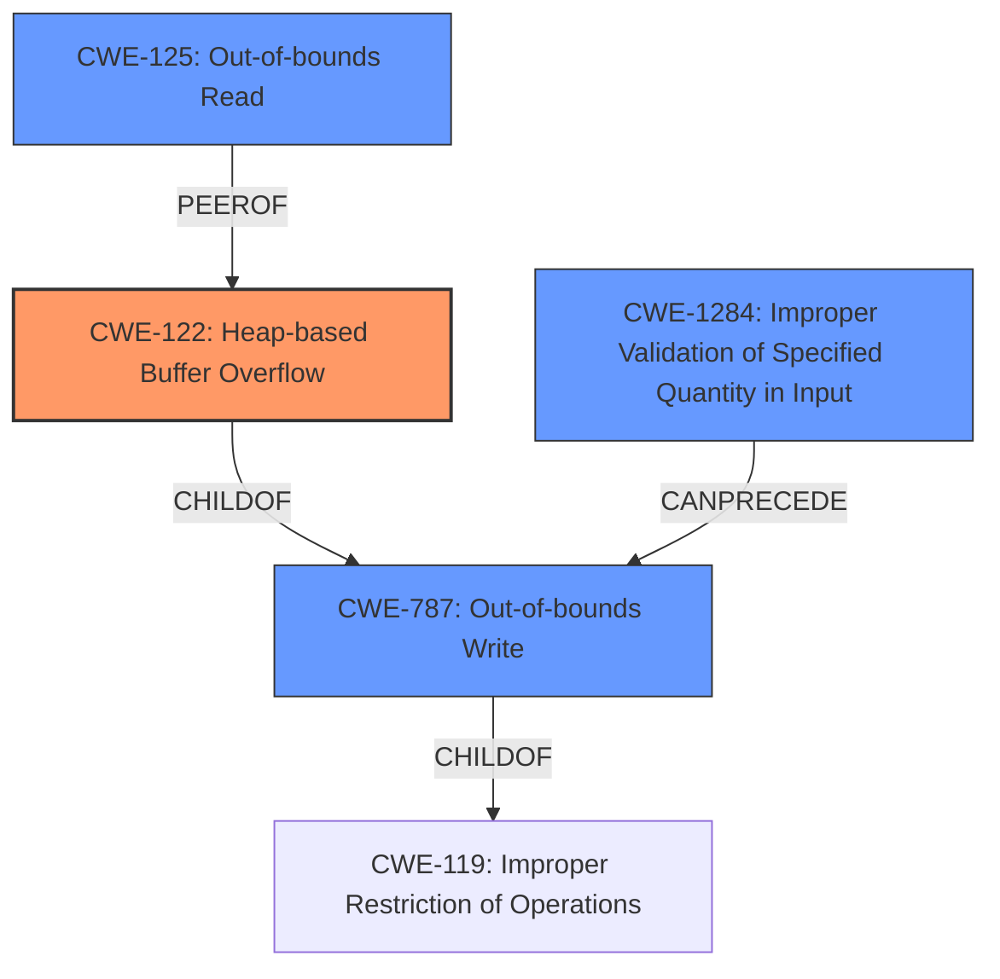

# Final Resolution for CVE-2021-43304

# Summary

| CWE ID | CWE Name | Confidence | CWE Abstraction Level | CWE Vulnerability Mapping Label | CWE-Vulnerability Mapping Notes |
|---|---|---|---|---|---|
| CWE-122 | Heap-based Buffer Overflow | 0.95 | Variant | Allowed | Primary CWE |
| CWE-787 | Out-of-bounds Write | 0.70 | Base | Allowed | Secondary Candidate |
| CWE-1284 | Improper Validation of Specified Quantity in Input | 0.65 | Base | Allowed | Secondary Candidate |
| CWE-125 | Out-of-bounds Read | 0.60 | Base | Allowed | Secondary Candidate |

## Evidence and Confidence

*   **Confidence Score:** 0.92
*   **Evidence Strength:** HIGH

## Relationship Analysis
The primary CWE is CWE-122 (Heap-based Buffer Overflow), which is a variant of CWE-119 (Improper Restriction of Operations within the Bounds of a Memory Buffer). CWE-787 (Out-of-bounds Write) is a parent of CWE-122 but less specific. CWE-1284 (Improper Validation of Specified Quantity in Input) can precede CWE-787 by providing an attacker-controlled size. CWE-125 (Out-of-bounds Read) is related as the overflow is facilitated by potentially reading past the end of the input stream.

## Vulnerability Chain
The vulnerability chain starts with CWE-1284, where the size of the input data is not properly validated. This leads to CWE-787, where the `wildCopy` function writes beyond the buffer's boundaries due to the unchecked size. Since the buffer is allocated on the heap, this results in CWE-122, a heap-based buffer overflow. CWE-125 is present because the code might read past the end of the input stream while copying data.

## Summary of Analysis
The initial analysis was accurate and well-justified. The criticism provided helpful suggestions for strengthening the analysis, particularly in emphasizing the connection between CWE-1284 and the root cause, and considering potential mitigations.

The vulnerability description states a "heap buffer overflow in Clickhouses LZ4 compression codec when parsing a malicious query" due to missing bounds checks in the `wildCopy` function. This directly supports CWE-122 as the primary weakness. The CVE reference confirms that the `wildCopy` function doesn't properly check if the copy operation exceeds the destination buffer's bounds.

The relationship analysis shows that CWE-122 is a variant of CWE-119, making it more specific than its parent, CWE-787. CWE-1284 is included to highlight the missing input validation, and CWE-125 captures the potential for out-of-bounds reads. The MITRE mapping guidance for all selected CWEs is ALLOWED, which supports their inclusion.

The selected CWEs are at the optimal level of specificity. CWE-122 accurately describes the heap-based nature of the overflow. While CWE-787 is a parent, it is less specific. CWE-1284 and CWE-125 provide additional context to the vulnerability.

I have updated the confidence score to 0.65 for CWE-1284 as it is a contributing factor rather than a direct cause. The overall confidence score is adjusted to 0.92 to reflect the comprehensive analysis and strong evidence.