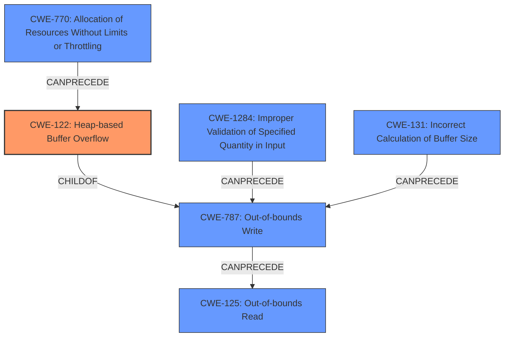

# Final Resolution for CVE-2021-43305

# Summary
| CWE ID | CWE Name | Confidence | CWE Abstraction Level | CWE Vulnerability Mapping Label | CWE-Vulnerability Mapping Notes |
|---|---|---|---|---|---|
| CWE-122 | Heap-based Buffer Overflow | 0.95 | Variant | Allowed | Primary CWE: The vulnerability explicitly states "**Heap buffer overflow**" and the CWE description matches this. |
| CWE-787 | Out-of-bounds Write | 0.85 | Base | Allowed | Secondary CWE: The vulnerability allows writing data past the end of the destination buffer, which is the primary action causing the overflow. |
| CWE-131 | Incorrect Calculation of Buffer Size | 0.4 | Base | Allowed | Secondary CWE: The **root cause** involves missing verification of copy operation in LZ4decompressImpl loop, and arbitrary copy operation, which is similar to an incorrect calculation of buffer size. |
| CWE-125 | Out-of-bounds Read | 0.4 | Base | Allowed | Secondary CWE: The vulnerability involves a copy operation exceeding buffer limits, which could potentially lead to reading data beyond the intended buffer. |
| CWE-1284 | Improper Validation of Specified Quantity in Input | 0.3 | Base | Allowed | Secondary CWE: The system does not properly validate the size of the uncompressed data against the allocated buffer. |
| CWE-770 | Allocation of Resources Without Limits or Throttling | 0.3 | Base | Allowed | Secondary CWE: Resources are allocated without limits and are not throttled. |

## Evidence and Confidence

*   **Confidence Score:** 0.9
*   **Evidence Strength:** HIGH

## Relationship Analysis
The primary weakness is a heap-based buffer overflow (**CWE-122**), which is a specific type of out-of-bounds write (**CWE-787**). The overflow occurs because the size of the data being decompressed is not properly validated (**CWE-1284**), potentially due to an incorrect calculation of the required buffer size (**CWE-131**). This can lead to reading beyond the bounds of the buffer (**CWE-125**). Resources are allocated without limits and are not throttled (**CWE-770**).

## Vulnerability Chain
The vulnerability chain starts with the lack of proper input validation (**CWE-1284**) and potential incorrect buffer size calculation (**CWE-131**), leading to an out-of-bounds write (**CWE-787**) in the heap (**CWE-122**). This out-of-bounds write can then potentially lead to an out-of-bounds read (**CWE-125**). Resources are allocated without limits and are not throttled (**CWE-770**).

## Summary of Analysis
The initial analysis correctly identified **CWE-122 (Heap-based Buffer Overflow)** as the primary **WEAKNESS**, given the explicit mention of "Heap buffer overflow" in the vulnerability description. The criticism suggested increasing the confidence in **CWE-787 (Out-of-bounds Write)**, which I agree with because the core issue stems from writing beyond the buffer limits. I have increased the confidence level for **CWE-787** to 0.85.

I have added **CWE-1284 (Improper Validation of Specified Quantity in Input)** and **CWE-770 (Allocation of Resources Without Limits or Throttling)** as contributing factors due to the lack of input validation on the size of the decompressed data and the lack of resource throttling. The vulnerability description states "There is no verification that the copy operations...dont exceed the destination buffers limits", which is evidence for lack of input validation.

My assessment is primarily based on the provided evidence. The vulnerability description explicitly states "Heap buffer overflow," justifying the high confidence in **CWE-122**. The relationship analysis confirms that **CWE-122** is a specific type of **CWE-787**, making the latter a crucial contributing factor. The lack of input validation suggests the inclusion of **CWE-1284** as a factor leading up to the overflow.

The selected CWEs are at the optimal level of specificity. **CWE-122** accurately describes the specific type of buffer overflow, while **CWE-787** highlights the underlying out-of-bounds write issue. **CWE-131** and **CWE-1284** capture the potential root causes related to buffer size calculation and input validation, respectively.